# Learn Pi 第一版课程计划

本计划以 Pi `v0.80.6` 为固定教学基线，第一版只维护简体中文。

课程目标不是复刻完整 Pi，而是让读者沿真实公开 API 和源码调用链，逐步理解一个 Coding Agent 如何从一次可交互的 Agent 运行发展到可嵌入的 SDK、终端界面和 RPC 服务。

## 推荐前置与分工

建议先学习 [learn-claude-code](https://github.com/shareAI-lab/learn-claude-code)。它负责建立通用 Agent Harness 心智模型，Learn Pi 负责解释 Pi 的工程实现和设计取舍。

| `learn-claude-code` 已覆盖 | Learn Pi 不再重复 | Learn Pi 继续深入 |
| --- | --- | --- |
| 智能体循环（Agent Loop）、工具调用（Tool Use） | 不从零实现 `while` 循环和工具注册表 | `AgentEvent`、`AgentState`、类型校验、并行执行和终止语义 |
| 权限（Permission）、钩子（Hooks） | 不再解释为什么需要执行前后钩子 | Pi 的 `beforeToolCall`、`afterToolCall` 与扩展运行时边界 |
| 技能（Skills）、系统提示（System Prompt） | 不重新实现简单目录扫描和字符串拼接 | `ResourceLoader` 的作用域、优先级、诊断和运行时注入 |
| 上下文压缩（Context Compact）、记忆（Memory） | 不再解释 token 为什么会满 | 会话树中的压缩条目、切点和上下文重建 |
| 错误恢复（Error Recovery） | 不重复通用重试策略 | Pi 的 error/aborted 事件协议和空闲状态收束 |
| 综合 Agent | 不再生成一个包含全部机制的巨型文件 | SDK、终端界面（TUI）、运行模式与 RPC 的模块化组装 |

## 学习路线

```mermaid
flowchart LR
    S01[s01 Pi Agent 一轮运行] --> S02[s02 运行状态]
    S02 --> S03[s03 工具执行管线]
    S02 --> S04[s04 消息边界]
    S02 --> S05[s05 消息队列]
    S02 --> S06[s06 平稳停止]
    S02 --> S07[s07 编码智能体 SDK]
    S07 --> S08[s08 会话树]
    S08 --> S09[s09 会话压缩]
    S07 --> S10[s10 资源加载器]
    S07 --> S11[s11 扩展运行时]
    S08 --> S12[s12 嵌入式运行框架]
    S10 --> S12
    S11 --> S12
    S12 --> S13[s13 运行模式路由]
    S13 --> S14[s14 终端差分渲染]
    S13 --> S15[s15 RPC 逐行 JSON 通道]
```

## 课程矩阵

| 课程 | 核心问题 | 可运行交付物 | 主要上游包 | 状态 |
| --- | --- | --- | --- | --- |
| [s01 Pi 运行管理器](lessons/s01-pi-agent-turn/README.md) | Pi 怎样接管手写 Agent Loop，并连续处理终端输入？ | 真实交互式 `code.ts` 的四步运行观察；离线连续输入测试 | `pi-agent-core`、`pi-ai` | 已完成 |
| [s02 运行状态](lessons/s02-agent-runtime-state/README.md) | Pi 怎样把模型事件转换成界面可读取的运行状态？ | 真实 Agent 事件时间线与状态快照；离线生命周期测试 | `pi-agent-core` | 已完成 |
| [s03 工具执行管线](lessons/s03-tool-execution-pipeline/README.md) | 工具的及时完成与稳定历史怎样同时成立？ | 真实工具批次；离线顺序、拦截和停止测试 | `pi-agent-core`、`pi-ai` | 已完成 |
| [s04 消息边界](lessons/s04-message-boundary/README.md) | Agent 保存的消息为什么不等于实际发送给模型的上下文（Context）？ | 真实模型请求前的两层转换；离线消息边界测试 | `pi-agent-core` | 已完成 |
| [s05 消息队列](lessons/s05-message-queues/README.md) | 引导消息（steering）与后续消息（follow-up）为什么有不同的取出时机？ | 真实模型队列注入；离线时序和清理测试 | `pi-agent-core` | 已完成 |
| [s06 平稳停止](lessons/s06-graceful-stop/README.md) | 中止（abort）或失败（error）后怎样仍得到可保存的结束状态和空闲运行器？ | 真实模型中止路径；离线 abort/error/idle 测试 | `pi-agent-core`、`pi-ai` | 已完成 |
| [s07 编码智能体 SDK](lessons/s07-coding-agent-sdk/README.md) | CLI 背后的 Agent、工具、资源和会话怎样被装配？ | 真实模型的受控 `AgentSession`；离线 SDK 测试 | `pi-coding-agent` | 已完成 |
| [s08 会话树](lessons/s08-session-tree/README.md) | 为什么 Pi 会话是追加日志和树，而不是聊天数组？ | 本地创建分支并从当前末端重建模型上下文 | `pi-coding-agent` | 已完成 |
| [s09 会话压缩](lessons/s09-session-compaction/README.md) | Pi 怎样用压缩条目（compaction entry）改变上下文（Context），同时保留原始会话树？ | 阈值、完整回合切点、摘要条目和上下文重建 | `pi-agent-core`、`pi-coding-agent` | 已完成 |
| [s10 资源加载器](lessons/s10-resource-loader/README.md) | Pi 怎样处理上下文文件、技能（Skills）、提示词（Prompt）的作用域、优先级与诊断？ | 临时项目目录的资源发现、冲突和禁用选项 | `pi-coding-agent` | 已完成 |
| [s11 扩展运行时](lessons/s11-extension-runtime/README.md) | Pi 的扩展（Extension）如何注册事件、工具和命令并隔离处理函数错误？ | inline extension、事件分发、工具拦截和诊断 | `pi-coding-agent` | 已完成 |
| [s12 嵌入式运行框架](lessons/s12-embedded-harness/README.md) | 怎样把模型、会话、资源、扩展和只读工具组合成应用？ | 可嵌入的离线研究助手 | `pi-coding-agent` | 已完成 |
| [s13 运行模式路由](lessons/s13-runtime-modes/README.md) | 参数与终端环境怎样选择正确入口？ | CLI 参数与运行模式路由器 | `pi-coding-agent` | 已完成 |
| [s14 终端差分渲染](lessons/s14-tui-diff-render/README.md) | 终端为什么只重绘发生变化的行？ | 内存终端的两帧差分渲染 | `pi-tui` | 已完成 |
| [s15 RPC 逐行 JSON 通道](lessons/s15-rpc-jsonl/README.md) | 外部程序怎样让响应与事件不串线？ | 真实模型的 `RpcClient` 与隔离 RPC 子进程；离线协议测试 | `pi-coding-agent` | 已完成 |

## 每课实现要求

每节课程必须同时交付：

1. `README.md`：采用“问题 -> 解决方案 -> 工作原理 -> 试一下 -> 接下来 -> 深入 Pi 源码”结构
2. `code.ts`：唯一面向读者的教学入口；涉及模型调用时默认走真实模型，核心调用链能按文件顺序直接阅读
3. `code.test.ts`：离线运行，至少覆盖一个正常路径和一个失败或边界路径
4. `images/*.svg`：至少一张中文主图，复杂机制增加事件或源码调用图
5. 固定源码链接：指向 Pi commit `2b3fda9921b5590f285165287bd442a25817f17b`
6. 明确边界：区分教学简化、公开 API、内部实现和实验性能力

## 课程详细设计

### s01 Pi Agent 一轮运行

- 前置映射：`learn-claude-code/s01_agent_loop`。
- 核心结论：不再手写 Agent Loop；终端只读取问题和订阅事件，Pi `Agent` 管理一轮运行与会话历史。
- 公开 API：`Agent`、`Agent.prompt()`、`Agent.subscribe()`、`Agent.state.messages`。
- `code.ts`：真实模型交互循环，输入 `/exit` 退出；每轮明确显示收到输入、Agent 开始、分段输出和本轮结束。
- `code.test.ts`：faux Provider 验证四步输出、同一个 Agent 的连续两轮历史和失败收束。
- 主图：终端输入、Pi Agent、模型事件、完整历史和下一轮输入之间的关系。

### s02 运行状态（Agent Runtime State）

- 前置映射：`learn-claude-code/s01_agent_loop`。
- 核心结论：本课不再实现最小循环，而是研究 `Agent` 怎样把模型事件流组织成 agent、turn、message 三层生命周期，并同步维护 state。
- 公开 API：`Agent`、`Agent.prompt()`、`Agent.subscribe()`、`Agent.state`、`AgentEvent`。
- `code.ts`：默认使用真实模型，输出从 `agent_start` 到 `agent_end` 的完整顺序，并观察 `isStreaming`、`streamingMessage` 和最终 transcript。
- `code.test.ts`：faux stream 验证事件顺序、user/assistant 消息和错误响应仍产生 `agent_end`。
- 主图：prompt、事件 reducer 和 AgentState 的关系。

### s03 工具执行管线（Tool Execution Pipeline）

- 前置映射：`learn-claude-code/s02_tool_use`、`s03_permission`、`s04_hooks`。
- 核心结论：不再讲 Tool Loop 基础，直接研究 Pi 如何组合 typed validation、`beforeToolCall`、并行/串行执行、`afterToolCall` 和 terminate。
- 公开 API：`AgentTool`、`Type`、`toolExecution`、`beforeToolCall`、`afterToolCall`。
- `code.ts`：真实模型按提示请求两个并行工具和一个串行/被阻断工具，记录 preflight、完成顺序、结果顺序与拦截结果。
- `code.test.ts`：faux stream 验证非法参数不执行、parallel 完成事件按实际顺序、toolResult 保持源码顺序，以及全部 terminate 才提前结束。
- 主图：prepare、validate、hook、execute、finalize、toolResult 六阶段管线。

### s04 消息边界（Message Boundary）

- 核心结论：Agent transcript 可以包含 UI 消息和完整历史，Provider 只接收转换后的 LLM Context。
- 公开 API：`transformContext`、`convertToLlm`、`AgentMessage`。
- `code.ts`：默认真实模型；保留 UI-only notice 和旧消息，在模型请求边界观察裁剪、过滤后的上下文。
- `code.test.ts`：state 保留完整记录，离线 faux provider 只看到允许发送的消息。
- 主图：完整 transcript 经过两道过滤进入 Provider 的漏斗。

### s05 消息队列（Message Queues）

- 核心结论：steering 在当前工作过程的 drain point 注入，follow-up 等 Agent 本应停止时再开始。
- 公开 API：`Agent.steer()`、`Agent.followUp()`、队列状态与清理方法。
- `code.ts`：默认真实模型；首个文字增量后同时排入两类消息，显示它们进入运行的先后。
- `code.test.ts`：验证调用次数、消息顺序、队列清理和流式中直接 `prompt()` 被拒绝。
- 主图：turn、steering drain point 和 idle/follow-up drain point 时间线。

### s06 平稳停止（Graceful Stop）

- 核心结论：abort 不应留下半截运行，而应产生 `stopReason="aborted"` 并恢复 idle state。
- 公开 API：`Agent.abort()`、`Agent.waitForIdle()`、`Agent.signal`。
- `code.ts`：默认真实模型；在第一个文字增量后中止，观察 `agent_end` 与真正 idle 的先后。
- `code.test.ts`：慢速 faux stream 验证最终状态、`agent_end`、失败收束与空闲时 abort no-op。
- 主图：正常完成与 abort 收束的两条路径。

### s07 编码智能体 SDK（Coding Agent SDK）

- 核心结论：`createAgentSession()` 是模型、Agent、工具、资源和 SessionManager 的装配入口。
- 公开 API：`createAgentSession()`、`AgentSession`、`SessionManager.inMemory()`。
- `code.ts`：显式 in-memory 宿主依赖和真实模型，不读取用户 `~/.pi`。
- `code.test.ts`：faux model 验证事件与最终文本，`dispose` 后无动态注册残留。
- 主图：SDK options 到 AgentSession 的装配图。

### s08 会话树（Session Tree）

- 核心结论：Pi 持久化 append-only entry tree，当前 Context 只是从 leaf 回溯的一条分支。
- 公开 API：`SessionManager`、`getTree()`、`getBranch()`、`branch()`、`buildSessionContext()`。
- Demo：创建 `A -> B -> C`，回到 B 分叉 D，再比较树与当前 Context。
- 测试：原分支保留、Context 只包含选中分支、非法节点失败。
- 主图：JSONL 追加序列与会话树的对应关系。

### s09 会话压缩（Session Compaction）

- 前置映射：`learn-claude-code/s08_context_compact`、`s09_memory`。
- 核心结论：不再解释为什么需要压缩，而是研究 Pi 如何新增摘要 entry、选择 cut point 并从 Session Tree 重建后续 Context。
- 公开 API：`shouldCompact()`、`findCutPoint()`、`prepareCompaction()`、`compact()`。
- `code.ts`：构造固定会话，展示阈值、切点、摘要条目和压缩后的 Context；不调用模型。
- `code.test.ts`：短上下文不压缩、切点保持完整 turn、摘要失败与分裂回合保护。
- 主图：token threshold 到 compaction entry 的流水线。

### s10 资源加载器（ResourceLoader）

- 前置映射：`learn-claude-code/s07_skill_loading`、`s10_system_prompt`。
- 核心结论：不再实现简单 Skill 扫描，而是研究 Pi 如何按 scope、precedence 和 diagnostics 加载上下文文件、Skills 与 Prompt Templates。
- 公开 API：`DefaultResourceLoader`、`loadProjectContextFiles()`、`loadSkillsFromDir()`、`formatSkillsForPrompt()`。
- `code.ts`：在临时目录构造多层 AGENTS.md、同名技能与提示词模板，打印加载顺序、冲突诊断和禁用结果。
- `code.test.ts`：父子顺序、去重、坏 frontmatter 和禁用选项。
- 主图：项目文件树经过 discovery 和 precedence 进入 ResourceLoader。

### s11 扩展运行时（Extension Runtime）

- 前置映射：`learn-claude-code/s04_hooks`、`s19_mcp_plugin`。
- 核心结论：不再解释 hook 概念，而是研究 Pi Extension Runtime 怎样统一注册生命周期事件、工具、命令和错误诊断。
- 公开 API：`discoverAndLoadExtensions()`、`ExtensionRunner`、`ExtensionAPI`。
- `code.ts`：临时 inline extension 记录事件、阻止危险 bash 调用，并将 lifecycle handler 错误转为 diagnostic。
- `code.test.ts`：事件顺序、拦截生效和 handler 错误形成 diagnostic。
- 主图：AgentSession 主链上的 hook 切入点。

### s12 嵌入式运行框架（Embedded Harness）

- 核心结论：SDK 通过依赖注入组合模型、会话、资源、扩展和工具，不需要重新实现 CLI。
- 公开 API：`createAgentSession()`、`DefaultResourceLoader`、`SessionManager.inMemory()`、`ExtensionFactory`。
- `code.ts`：临时 cwd、in-memory session、fixture AGENTS/Skill、审计 extension 和只读工具组成确定性研究助手。
- `code.test.ts`：不读取用户目录/API Key、工具保持只读、资源与 extension 实际生效。
- 主图：Host App 到 Runtime/Services/Session 的完整装配图。

### s13 运行模式路由

- 核心结论：Pi 先按命令行参数和 TTY 状态选择 interactive、print、JSON 或 RPC 入口；完整运行时怎样接到入口由上游源码和后续课程说明。
- 公开 API：`parseArgs()`、`runPrintMode()`、`InteractiveMode`、`runRpcMode()`。
- Demo：根据参数和 TTY 状态输出选择的 mode 与输出协议。
- 测试：非 TTY 自动进入 print、RPC 拒绝文件参数等边界。
- 主图：参数与 TTY 经过模式路由器选择入口；生产运行时怎样接到入口只在源码对照中说明。

### s14 终端差分渲染（TUI Diff Render）

- 核心结论：Component 将状态投影为 `string[]`，TUI 比较前后两帧，只写入变化区间。
- 公开 API：`Component`、`Container`、`TUI`、`Terminal`、`visibleWidth()`。
- Demo：内存 RecordingTerminal 渲染“等待 -> 完成”两帧。
- 测试：首次完整渲染、单行差分、相同状态零写入、中文宽度。
- 主图：旧帧、新帧、变化区间和 ANSI 写入范围。

### s15 RPC 的逐行 JSON 通道（JSONL）

- 核心结论：RPC 用 JSONL 跨进程传输，`id` 关联响应，无 `id` 的 Agent 事件异步广播。
- 公开 API：`RpcClient`、`RpcCommand`、`RpcResponse`、`RpcSessionState`。
- Demo：隔离配置目录，拉起 RPC 子进程，完成 `getState -> promptAndWait -> getLastAssistantText`。
- 测试：响应与事件分流、Unicode 行分隔符、错误 model、子进程清理。
- 主图：宿主进程与 Pi RPC 子进程之间的两条 JSONL 通道。

## 附录

### Provider 与 Auth 深入

补充真实 Provider factory、模型发现、API Key/OAuth 解析和 provider-specific options。该内容不作为主线前置，避免第一版课程依赖真实账号。

### 实验性 Orchestrator

只解释 `CLI -> Unix socket -> orchestrator daemon -> Pi RPC child` 架构、实例状态和持久化。Pi `v0.80.6` 明确将该包标记为 experimental，API 可能变化或删除，因此不提供主线联网 Demo，也不作为其他课程的依赖。
