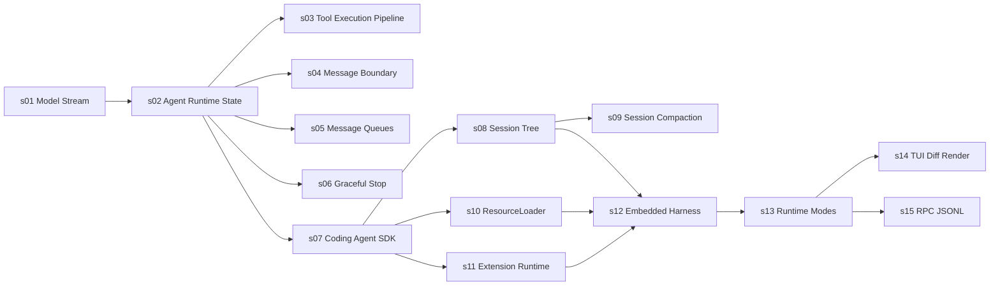

# Learn Pi 第一版课程计划

本计划以 Pi `v0.80.6` 为固定教学基线，第一版只维护简体中文。

课程目标不是复刻完整 Pi，而是让读者沿真实公开 API 和源码调用链，逐步理解一个 Coding Agent 如何从模型事件流发展到可嵌入的 SDK、终端界面和 RPC 服务。

## 推荐前置与分工

建议先学习 [learn-claude-code](https://github.com/shareAI-lab/learn-claude-code)。它负责建立通用 Agent Harness 心智模型，Learn Pi 负责解释 Pi 的工程实现和设计取舍。

| `learn-claude-code` 已覆盖 | Learn Pi 不再重复 | Learn Pi 继续深入 |
| --- | --- | --- |
| Agent Loop、Tool Use | 不从零实现 while loop 和工具注册表 | `AgentEvent`、`AgentState`、typed validation、并行执行和 terminate 语义 |
| Permission、Hooks | 不再解释为什么需要执行前后 hook | Pi 的 `beforeToolCall`、`afterToolCall` 与 Extension Runtime 边界 |
| Skills、System Prompt | 不重新实现简单目录扫描和字符串拼接 | `ResourceLoader` 的 scope、precedence、diagnostic 和 runtime 注入 |
| Context Compact、Memory | 不再解释 token 为什么会满 | Session Tree 中的 compaction entry、cut point 和 Context 重建 |
| Error Recovery | 不重复通用重试策略 | Pi 的 error/aborted 事件协议和 idle state 收束 |
| 综合 Agent | 不再生成一个包含全部机制的巨型文件 | SDK、TUI、Runtime Modes 与 RPC 的模块化组装 |

## 学习路线

## 课程矩阵

| 课程 | 核心问题 | 可运行交付物 | 主要上游包 | 状态 |
| --- | --- | --- | --- | --- |
| [s01 Model Stream](lessons/s01-model-stream/README.md) | 同一次模型调用怎样同时提供实时事件和最终消息？ | 三段 `text_delta` 与完整 `AssistantMessage` | `pi-ai` | 已完成 |
| s02 Agent Runtime State | Pi 怎样把模型流转换成 AgentEvent、AgentState 和严格生命周期？ | 离线 Agent 事件时间线与 state 快照 | `pi-agent-core` | 计划中 |
| s03 Tool Execution Pipeline | Pi 的 typed validation、hooks、并行执行和 terminate 怎样组成工具管线？ | 多工具批次的执行顺序与拦截结果 | `pi-agent-core`、`pi-ai` | 计划中 |
| s04 Message Boundary | Agent 保存的消息为什么不等于实际发送给模型的 Context？ | `transformContext` 与 `convertToLlm` 双层过滤 | `pi-agent-core` | 计划中 |
| s05 Message Queues | steering 与 follow-up 为什么有不同的 drain point？ | 两类消息队列的注入时间线 | `pi-agent-core` | 计划中 |
| s06 Graceful Stop | abort 或 error 后怎样仍得到可保存的结束状态和 idle runtime？ | 慢速 faux stream 的 abort 收束 | `pi-agent-core`、`pi-ai` | 计划中 |
| s07 Coding Agent SDK | CLI 背后的 Agent、工具、资源和 Session 怎样被装配？ | 完全 in-memory 的 `AgentSession` | `pi-coding-agent` | 计划中 |
| s08 Session Tree | 为什么 Pi 会话是追加日志和树，而不是聊天数组？ | 创建分支并从 leaf 重建 Context | `pi-coding-agent` | 计划中 |
| s09 Session Compaction | Pi 怎样用 compaction entry 改变 Context，同时保留原始 Session Tree？ | cut point、summary 和 compaction entry | `pi-agent-core`、`pi-coding-agent` | 计划中 |
| s10 ResourceLoader | Pi 怎样处理上下文文件、Skills、Prompt 的 scope、优先级与诊断？ | 临时项目目录的资源发现与 precedence | `pi-coding-agent` | 计划中 |
| s11 Extension Runtime | Pi 的 Extension 如何注册事件、工具和命令并隔离 handler 错误？ | inline extension、事件总线和工具拦截 | `pi-coding-agent` | 计划中 |
| s12 Embedded Harness | 怎样把模型、会话、资源、扩展和只读工具组合成应用？ | 可嵌入的离线研究助手 | `pi-coding-agent` | 计划中 |
| s13 Runtime Modes | interactive、text、JSON 和 RPC 为什么能共用同一 Runtime？ | CLI 参数与运行模式路由器 | `pi-coding-agent` | 计划中 |
| s14 TUI Diff Render | 终端为什么只重绘发生变化的行？ | 内存 Terminal 的两帧差分渲染 | `pi-tui` | 计划中 |
| s15 RPC JSONL | 外部程序怎样通过严格 JSONL 控制 Pi？ | `RpcClient` 与隔离的 RPC 子进程 | `pi-coding-agent` | 计划中 |

## 每课实现要求

每节课程必须同时交付：

1. `README.md`：采用“问题 -> 解决方案 -> 工作原理 -> 试一下 -> 接下来 -> 深入 Pi 源码”结构
2. `demo.ts`：默认离线运行，核心调用链能按文件顺序直接阅读
3. `demo.test.ts`：至少覆盖一个正常路径和一个失败或边界路径
4. `images/*.svg`：至少一张中文主图，复杂机制增加事件或源码调用图
5. 固定源码链接：指向 Pi commit `2b3fda9921b5590f285165287bd442a25817f17b`
6. 明确边界：区分教学简化、公开 API、内部实现和实验性能力

## 课程详细设计

### s02 Agent Runtime State

- 前置映射：`learn-claude-code/s01_agent_loop`。
- 核心结论：本课不再实现最小循环，而是研究 `Agent` 怎样把模型事件流组织成 agent、turn、message 三层生命周期，并同步维护 state。
- 公开 API：`Agent`、`Agent.prompt()`、`Agent.subscribe()`、`Agent.state`、`AgentEvent`。
- Demo：faux 文本响应，输出从 `agent_start` 到 `agent_end` 的完整顺序，并观察 `isStreaming`、`streamingMessage` 和最终 transcript。
- 测试：事件顺序、user/assistant 消息、错误响应仍产生 `agent_end`。
- 主图：prompt、事件 reducer 和 AgentState 的关系。

### s03 Tool Execution Pipeline

- 前置映射：`learn-claude-code/s02_tool_use`、`s03_permission`、`s04_hooks`。
- 核心结论：不再讲 Tool Loop 基础，直接研究 Pi 如何组合 typed validation、`beforeToolCall`、并行/串行执行、`afterToolCall` 和 terminate。
- 公开 API：`AgentTool`、`Type`、`toolExecution`、`beforeToolCall`、`afterToolCall`。
- Demo：同一 assistant 消息请求两个可并行工具和一个 sequential 工具，记录 preflight、完成顺序、结果顺序与拦截结果。
- 测试：非法参数不执行；parallel 完成事件按实际顺序；toolResult 仍按源码顺序；全部 terminate 才提前结束。
- 主图：prepare、validate、hook、execute、finalize、toolResult 六阶段管线。

### s04 Message Boundary

- 核心结论：Agent transcript 可以包含 UI 消息和完整历史，Provider 只接收转换后的 LLM Context。
- 公开 API：`transformContext`、`convertToLlm`、`AgentMessage`。
- Demo：保留 UI-only notice 和旧消息，但在 Provider 边界裁剪、过滤。
- 测试：state 保留完整记录，faux response factory 只看到允许发送的消息。
- 主图：完整 transcript 经过两道过滤进入 Provider 的漏斗。

### s05 Message Queues

- 核心结论：steering 在当前工作过程的 drain point 注入，follow-up 等 Agent 本应停止时再开始。
- 公开 API：`Agent.steer()`、`Agent.followUp()`、队列状态与清理方法。
- Demo：首个 delta 后同时排入两种消息，用三次 faux 响应观察顺序。
- 测试：调用次数、消息顺序、队列最终为空；流式中直接 `prompt()` 被拒绝。
- 主图：turn、steering drain point 和 idle/follow-up drain point 时间线。

### s06 Graceful Stop

- 核心结论：abort 不应留下半截运行，而应产生 `stopReason="aborted"` 并恢复 idle state。
- 公开 API：`Agent.abort()`、`Agent.waitForIdle()`、`Agent.signal`。
- Demo：慢速 faux stream 在第一个 delta 后中止。
- 测试：最终状态、`agent_end`、空闲时 abort no-op。
- 主图：正常完成与 abort 收束的两条路径。

### s07 Coding Agent SDK

- 核心结论：`createAgentSession()` 是模型、Agent、工具、资源和 SessionManager 的装配入口。
- 公开 API：`createAgentSession()`、`AgentSession`、`SessionManager.inMemory()`。
- Demo：显式 in-memory 依赖和 faux model，不读取用户 `~/.pi`。
- 测试：事件与最终文本确定、dispose 后无残留。
- 主图：SDK options 到 AgentSession 的装配图。

### s08 Session Tree

- 核心结论：Pi 持久化 append-only entry tree，当前 Context 只是从 leaf 回溯的一条分支。
- 公开 API：`SessionManager`、`getTree()`、`getBranch()`、`branch()`、`buildSessionContext()`。
- Demo：创建 `A -> B -> C`，回到 B 分叉 D，再比较树与当前 Context。
- 测试：原分支保留、Context 只包含选中分支、非法节点失败。
- 主图：JSONL 追加序列与会话树的对应关系。

### s09 Session Compaction

- 前置映射：`learn-claude-code/s08_context_compact`、`s09_memory`。
- 核心结论：不再解释为什么需要压缩，而是研究 Pi 如何新增摘要 entry、选择 cut point 并从 Session Tree 重建后续 Context。
- 公开 API：`shouldCompact()`、`findCutPoint()`、`prepareCompaction()`、`compact()`。
- Demo：构造长对话，展示 cut point、summary 和压缩后的 Context。
- 测试：短上下文不压缩、切点保持完整 turn、summary 失败路径。
- 主图：token threshold 到 compaction entry 的流水线。

### s10 ResourceLoader

- 前置映射：`learn-claude-code/s07_skill_loading`、`s10_system_prompt`。
- 核心结论：不再实现简单 Skill 扫描，而是研究 Pi 如何按 scope、precedence 和 diagnostics 加载上下文文件、Skills 与 Prompt Templates。
- 公开 API：`DefaultResourceLoader`、`loadProjectContextFiles()`、`loadSkillsFromDir()`、`formatSkillsForPrompt()`。
- Demo：在临时目录构造多层 AGENTS.md、一个 Skill 和 Prompt，打印加载顺序和诊断。
- 测试：父子顺序、去重、坏 frontmatter、禁用选项。
- 主图：项目文件树经过 discovery 和 precedence 进入 ResourceLoader。

### s11 Extension Runtime

- 前置映射：`learn-claude-code/s04_hooks`、`s19_mcp_plugin`。
- 核心结论：不再解释 hook 概念，而是研究 Pi Extension Runtime 怎样统一注册生命周期事件、工具、命令和错误诊断。
- 公开 API：`createExtensionRuntime()`、`ExtensionRunner`、`ExtensionAPI`、`defineTool()`。
- Demo：inline extension 记录事件，并阻止一条危险工具调用。
- 测试：事件顺序、拦截生效、handler 错误形成 diagnostic。
- 主图：AgentSession 主链上的 hook 切入点。

### s12 Embedded Harness

- 核心结论：SDK 通过依赖注入组合模型、会话、资源、扩展和工具，不需要重新实现 CLI。
- 公开 API：`createAgentSessionServices()`、`createAgentSessionFromServices()`、`createReadOnlyTools()`。
- Demo：临时 cwd、in-memory session、fixture AGENTS/Skill、审计 extension 和只读工具组成研究助手。
- 测试：无 home/API Key、工具保持只读、资源与 extension 实际生效。
- 主图：Host App 到 Runtime/Services/Session 的完整装配图。

### s13 Runtime Modes

- 核心结论：interactive、text、JSON 和 RPC 是同一个 AgentSessionRuntime 的不同 adapter。
- 公开 API：`parseArgs()`、`runPrintMode()`、`InteractiveMode`、`runRpcMode()`。
- Demo：根据参数和 TTY 状态输出选择的 mode 与输出协议。
- 测试：非 TTY 自动进入 print、RPC 拒绝文件参数等边界。
- 主图：参数与 TTY 经过 mode router 连接到同一个 runtime。

### s14 TUI Diff Render

- 核心结论：Component 将状态投影为 `string[]`，TUI 比较前后两帧，只写入变化区间。
- 公开 API：`Component`、`Container`、`TUI`、`Terminal`、`visibleWidth()`。
- Demo：内存 RecordingTerminal 渲染“等待 -> 完成”两帧。
- 测试：首次完整渲染、单行差分、相同状态零写入、中文宽度。
- 主图：旧帧、新帧、变化区间和 ANSI 写入范围。

### s15 RPC JSONL

- 核心结论：RPC 用 JSONL 跨进程传输，`id` 关联响应，无 `id` 的 Agent 事件异步广播。
- 公开 API：`RpcClient`、`RpcCommand`、`RpcResponse`、`RpcSessionState`。
- Demo：隔离配置目录，拉起 RPC 子进程，完成 `getState -> promptAndWait -> getLastAssistantText`。
- 测试：响应与事件分流、Unicode 行分隔符、错误 model、子进程清理。
- 主图：宿主进程与 Pi RPC 子进程之间的两条 JSONL 通道。

## 并行实施边界

### Core Track：s02-s06

- 只编辑 `lessons/s02-*` 至 `lessons/s06-*` 和 `src/tracks/core/`。
- s02 先建立最小 scripted Agent fixture；s03-s06 在该契约稳定后可以并行。

### Harness Track：s07-s12

- 只编辑 `lessons/s07-*` 至 `lessons/s12-*` 和 `src/tracks/harness/`。
- s07 先建立完全离线的 AgentSession fixture；s08、s10、s11 可并行，s09 依赖 s08，s12 最后组合。

### Runtime/UI Track：s13-s15

- 只编辑 `lessons/s13-*` 至 `lessons/s15-*` 和 `src/tracks/runtime-ui/`。
- 三课在 `pi-coding-agent` 和 `pi-tui` 依赖锁定后可分别实现，不修改根级运行器。

### Integration Owner

主任务独占以下文件：

- `package.json`、`package-lock.json`
- `README.md`、`COURSE_PLAN.md`、`SOURCES.md`、`AGENTS.md`
- `scripts/run-lesson.ts`、`scripts/check-lessons.ts`
- Git 提交、GitHub Actions 与最终导航

各 agent 不创建 commit，不修改其他 track 的课程目录。所有课程合并后由主任务统一执行 `npm run verify`、渲染 SVG 并检查文档导航。

## 附录

### Provider 与 Auth 深入

补充真实 Provider factory、模型发现、API Key/OAuth 解析和 provider-specific options。该内容不作为主线前置，避免第一版课程依赖真实账号。

### 实验性 Orchestrator

只解释 `CLI -> Unix socket -> orchestrator daemon -> Pi RPC child` 架构、实例状态和持久化。Pi `v0.80.6` 明确将该包标记为 experimental，API 可能变化或删除，因此不提供主线联网 Demo，也不作为其他课程的依赖。
