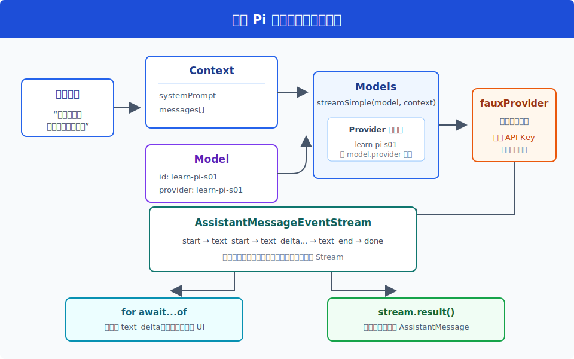
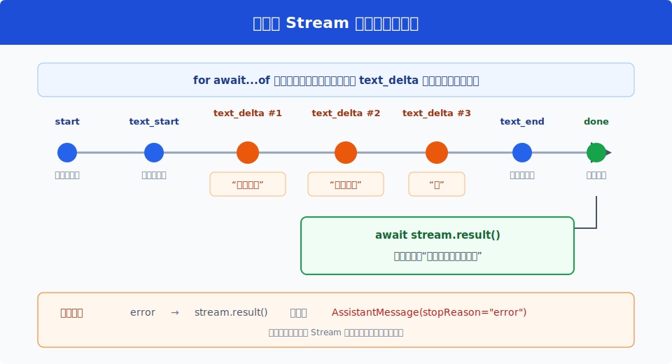
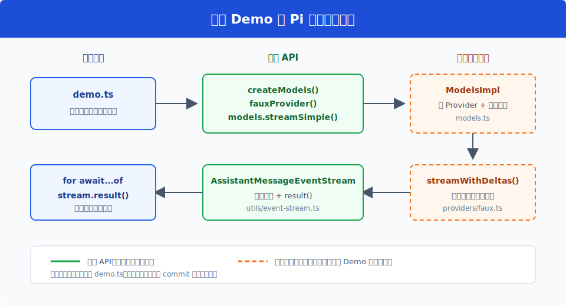

# s01：Model Stream — 一次调用，两种读取方式

[返回首页](../../README.md)

`s01` → s02 Agent Runtime → s03 Tool Pipeline → ...

> *“一次模型调用，两种读取方式”* —— 事件流负责实时更新，`result()` 负责给出最终完整消息。
>
> **pi-ai 层**：先统一“怎样调用模型”，下一课再解决“怎样让模型持续行动”。

推荐前置：已完成 `learn-claude-code`，了解最小 Agent Loop。本课不重复 Agent Loop，而是解释 Pi 在模型调用边界新增的 Provider、Model 和事件协议。

---

## 问题

你调用一个大模型，让它回答：

> 模型响应是一次性返回的吗？

如果把响应理解成普通 Promise，代码只能等模型全部生成完，最后一次性拿到完整字符串。回答较长时，终端会安静几秒，然后突然出现全部内容。

但 Pi 的终端界面需要边生成边显示文字，同时还要在请求结束后保存一条结构完整的 assistant 消息。

同一次模型调用，怎样同时满足这两个需求？

---

## 解决方案



Pi 返回的不是一个字符串 Promise，而是 `AssistantMessageEventStream`：

| 读取方式 | 得到什么 | 用在哪里 |
| --- | --- | --- |
| `for await...of` | `text_delta` 等实时事件 | 边生成边更新终端或 UI |
| `await stream.result()` | 完整 `AssistantMessage` | 保存消息、检查结束原因和统计 usage |

关键点只有一个：**这不是两次模型请求，而是观察同一个 Stream 的两种方式。**

---

## 工作原理

本课完整实现位于 [`demo.ts`](demo.ts)。下面严格按它的执行顺序来看。

### 第 1 步：创建 Models，并注册 Provider

```ts
const faux = fauxProvider({
  provider: "learn-pi-s01",
  models: [{ id: "learn-pi-s01" }],
  tokenSize: { min: 1, max: 1 },
});

const models = createModels();
models.setProvider(faux.provider);
```

`Models` 是 Provider 注册表和调用入口。`fauxProvider()` 是 Pi 官方提供的离线 Provider，本课用它生成确定结果，不需要 API Key，也不会访问网络。

### 第 2 步：准备一条确定的模型响应

```ts
faux.setResponses([
  fauxAssistantMessage("事件流会分段到达。", { timestamp: 0 }),
]);
```

真实 Provider 会从网络读取模型响应。faux Provider 则从预设队列读取下一条响应，但后面的 Provider 路由、事件流和最终消息协议都是真实的 Pi 实现。

### 第 3 步：构造 Context

```ts
const context: Context = {
  systemPrompt: "只回复预设内容。",
  messages: [
    { role: "user", content: "模型响应是一次性返回的吗？", timestamp: 0 },
  ],
};
```

`Context` 是交给模型的输入快照。本课只有 system prompt 和一条 user message；后续课程会逐步加入历史消息和工具定义。

### 第 4 步：开始一次模型调用

```ts
const stream = models.streamSimple(faux.getModel(), context);
```

`Models` 读取 `model.provider`，在注册表中找到 `learn-pi-s01` Provider，再把 `Context` 交给它的 `streamSimple()`。

调用立即返回一个 Stream。此时最终消息还没有生成完成。

### 第 5 步：实时消费事件

```ts
const deltas: string[] = [];

for await (const event of stream) {
  if (event.type === "text_delta") {
    deltas.push(event.delta);
    console.log(`text_delta #${deltas.length}: ${event.delta}`);
  }
}
```

本课将响应固定拆成三段：

```text
text_delta #1: 事件流会
text_delta #2: 分段到达
text_delta #3: 。
```

真实终端不会给每段加编号，而是收到一段就追加到屏幕。本课打印编号，是为了让流式过程可以被直接观察。



### 第 6 步：取得最终完整消息

```ts
const message = await stream.result();

const finalText = message.content
  .filter((block) => block.type === "text")
  .map((block) => block.text)
  .join("");
```

事件迭代结束后，`result()` 返回完整 `AssistantMessage`。三段 delta 被组合成：

```text
事件流会分段到达。
```

这就是本课最重要的心智模型：

```text
同一个 Stream
├── for await...of  → 实时过程
└── stream.result() → 最终结果
```

---

## 试一下

本课需要 Node.js `>=22.19.0`，不需要模型账号或 API Key。

首次运行：

```bash
npm install --ignore-scripts
```

运行课程：

```bash
npm run lesson -- s01
```

你会看到：

```text
用户消息: 模型响应是一次性返回的吗？
调用模型: learn-pi-s01/learn-pi-s01
text_delta #1: 事件流会
text_delta #2: 分段到达
text_delta #3: 。
最终消息: 事件流会分段到达。
事件序列: start -> text_start -> text_delta -> text_delta -> text_delta -> text_end -> done
结束原因: stop
```

观察重点：

1. `text_delta` 出现了三次，但最终只有一条完整 assistant 消息
2. `for await...of` 结束后仍然可以读取 `stream.result()`
3. 从头到尾只调用了一次 Provider

再运行测试：

```bash
npm run test:lesson -- s01
```

可以尝试：

1. 修改 `DEFAULT_RESPONSE`，观察 delta 数量怎样变化
2. 把 `tokenSize` 从 `1` 改成 `2`，观察每个 delta 是否变长
3. 将 `response` 设置为 `null`，观察成功路径怎样变成 `error`

---

## 接下来

现在我们已经能完成一次模型调用，并实时显示它的输出。

但模型回答结束后，程序也结束了。即使模型说“我需要读取一个文件”，当前代码也不会执行工具，更不会把工具结果交回模型继续思考。

s02 Agent Runtime → 不再重写最小循环，而是观察 Pi 怎样把模型流转换成 AgentEvent、AgentState 和严格的生命周期。

<details>
<summary>深入 Pi 源码</summary>

### 从课程代码读到上游实现



推荐按图中箭头阅读：先看课程 `demo.ts` 使用的公开 API，再进入固定 commit 的内部实现。

以下链接全部固定在 Pi `v0.80.6` 对应提交 `2b3fda9921b5590f285165287bd442a25817f17b`：

- [包根公开导出](https://github.com/earendil-works/pi/blob/2b3fda9921b5590f285165287bd442a25817f17b/packages/ai/src/index.ts#L1-L30)
- [`Provider` 与 `Models` 接口](https://github.com/earendil-works/pi/blob/2b3fda9921b5590f285165287bd442a25817f17b/packages/ai/src/models.ts#L24-L136)
- [`ModelsImpl.streamSimple()` 与 `createModels()`](https://github.com/earendil-works/pi/blob/2b3fda9921b5590f285165287bd442a25817f17b/packages/ai/src/models.ts#L259-L294)
- [`Context` 与事件协议](https://github.com/earendil-works/pi/blob/2b3fda9921b5590f285165287bd442a25817f17b/packages/ai/src/types.ts#L375-L465)
- [`fauxProvider()` 与脚本响应](https://github.com/earendil-works/pi/blob/2b3fda9921b5590f285165287bd442a25817f17b/packages/ai/src/providers/faux.ts#L37-L138)
- [faux Provider 如何拆分 delta](https://github.com/earendil-works/pi/blob/2b3fda9921b5590f285165287bd442a25817f17b/packages/ai/src/providers/faux.ts#L308-L401)
- [`EventStream` 与 `AssistantMessageEventStream`](https://github.com/earendil-works/pi/blob/2b3fda9921b5590f285165287bd442a25817f17b/packages/ai/src/utils/event-stream.ts#L4-L88)
- [上游相同用法的测试](https://github.com/earendil-works/pi/blob/2b3fda9921b5590f285165287bd442a25817f17b/packages/ai/test/providers.test.ts#L300-L312)

### 为什么不使用 compat API

Pi `v0.80.6` 的包根导出以 `createModels()` 和 Provider factory 为主。旧代码还可以通过 `@earendil-works/pi-ai/compat` 使用全局注册方式，但新课程不以兼容层作为主线。

本课显式创建 `Models` 实例，因此测试之间不会共享全局 Provider 状态，后续也更容易同时注册多个 Provider。

### 错误也是事件协议

如果 faux Provider 的响应队列为空，它不会让 `stream.result()` reject，而是发出 `error` 事件，并返回：

```text
AssistantMessage {
  stopReason: "error",
  errorMessage: "No more faux responses queued"
}
```

因此调用方应检查最终消息的 `stopReason`。本课的第二个测试覆盖了这条负向路径。

### 教学实现与真实 Provider 的差异

| 本课 | 真实 Provider |
| --- | --- |
| 响应内容提前写入队列 | 通过网络请求模型服务 |
| 不需要认证 | 解析 API Key、OAuth 或环境凭据 |
| token usage 是估算值 | 使用供应商返回的 usage |
| 固定拆成三段文本 | delta 大小和顺序由上游协议决定 |

这些差异只替换了“响应从哪里来”，没有替换本课研究的 `Models` 路由、事件流和最终消息协议。

</details>
