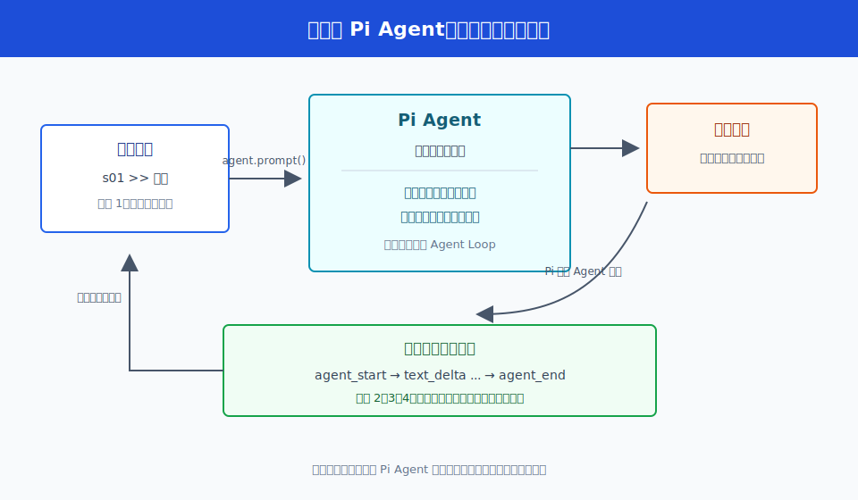
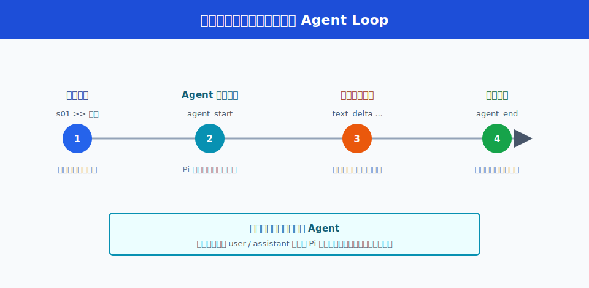
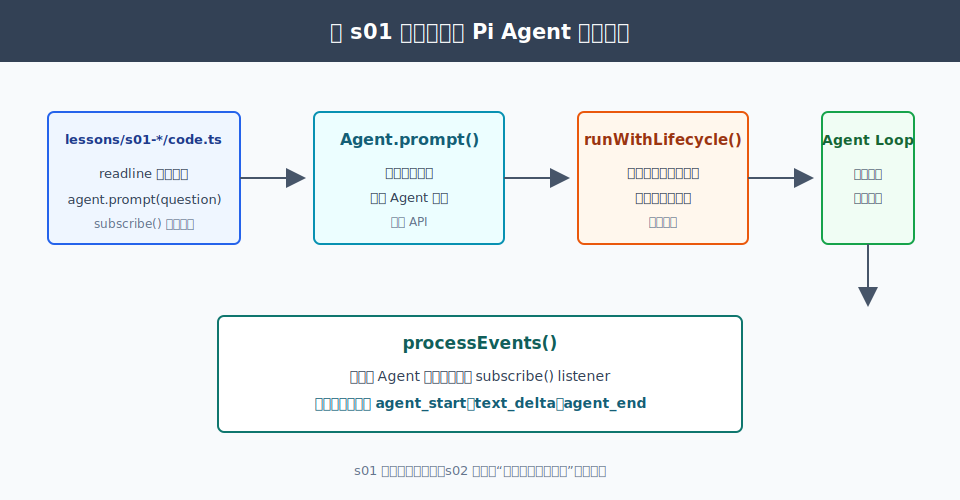

# s01：Pi 运行管理器（Agent）- 不再手写循环

[返回首页](../../README.md)

`s01` → [s02 运行状态](../s02-agent-runtime-state/) → s03 工具执行管线 → ...

> **核心结论**：在 `learn-claude-code` 中你手写 `while True` 驱动 Agent；在 Pi 中，把一条问题交给 `Agent`，Pi 负责这轮运行、消息历史和事件通知。

推荐前置：已完成 `learn-claude-code/s01_agent_loop`。本课不再实现 Bash 工具循环，而是观察 Pi 如何把那段循环封装成可连续交互的 `Agent` 对象。

---

## 这节只学什么

这一课只解决一件事：**终端程序怎样把用户连续输入的问题交给 Pi，并看见每一轮从开始到结束的过程。**

| 本课会看到 | 本课暂不展开 |
| --- | --- |
| `Agent` 接收问题、调用模型、保留本次对话 | 工具调用、权限、钩子和并发执行 |
| `agent_start`、文本增量、`agent_end` 这类事件 | UI 状态怎样归约，留给 s02 |
| 同一个 Agent 连续回答多个问题 | 模型服务如何把 HTTP 响应变成事件流 |

`Agent` 可以先理解为 **Pi 的运行管理器**：它持有会话历史，负责开始一轮运行，并在过程中发出事件。代码里的 `Agent` 是 API 名，正文中的“运行管理器”描述它在这一课承担的职责。

---

## 问题

在 `learn-claude-code` 的首课中，你写过类似的循环：

```text
读用户问题 -> 调模型 -> 执行模型要求的动作 -> 把结果放回历史 -> 继续或结束
```

这段循环很重要，但每个使用 Pi 的终端程序都重新写一遍它，会马上遇到三个重复问题：

1. 第二个问题怎样带上第一轮已经完成的对话？
2. 模型正在生成时，终端什么时候该显示“正在回答”？
3. 一轮结束后，谁来保证完整回复已经进入会话历史？

Pi 的回答不是再提供一份更长的 `while True` 模板，而是提供 `Agent`。终端只负责读输入和显示输出；Pi 负责这一轮怎样开始、怎样调用模型、怎样结束。

---

## 解决方案



*图：同一个 `Agent` 被连续复用。每次输入都会开始一轮运行，过程中发出事件；完整回复和历史由 Pi 管理，终端只显示它关心的步骤。*

本课把一次提问固定为四个可观察步骤：

| 步骤 | 终端显示什么 | 说明什么 |
| --- | --- | --- |
| 1 | 收到用户输入 | 终端把问题交给同一个 Agent |
| 2 | Agent 接手本轮 | Pi 开始维护这轮的消息和模型调用 |
| 3 | 模型分段输出 | 终端只订阅事件，不自己拼运行循环 |
| 4 | 本轮结束 | Pi 已把完整回复写入会话历史，可以继续提问 |

关键不是“Pi 少了一层循环”，而是：**循环从教学程序移到了 Pi 的 `Agent` 内部；宿主程序改为观察事件和提供输入。**

---

## 工作原理

完整教学代码在 [`code.ts`](code.ts)。模型配置放在共享模块中，避免把 API Key、Provider 和模型声明重复写进每一课；这里先只读终端真正发生的五步。

### 第 1 步：创建一个真实 Agent，并在整个终端会话中复用它

```ts
const agent = createAnthropicAgent();
return await runInteractiveLesson({
  agent,
  readQuestion: (prompt) => terminal.question(prompt),
  output,
});
```

`createAnthropicAgent()` 从 `.env` 读取真实模型配置，返回一个没有工具的 Pi `Agent`。它只创建一次：用户的第二个问题仍交给同一个对象，所以第一轮完成的 user/assistant 消息会保留在 Pi 管理的历史中。

### 第 2 步：读取一个问题；输入 `/exit` 才结束整个终端会话

```ts
while (true) {
  const input = await readQuestion("s01 >> ");
  if (input === undefined) break;
  const question = input.trim();
  if (EXIT_COMMANDS.has(question.toLowerCase())) break;
  if (!question) continue;

  await runAgentTurn(agent, question, output);
}
```

这里的 `while` 不是 Agent Loop。它只负责“继续问下一题”。真正的模型调用和消息历史更新发生在下一步的 `agent.prompt()` 中。

### 第 3 步：把问题交给 Agent，而不是手工维护 messages 数组

```ts
output.writeLine("");
output.writeLine(`[步骤 1/4] 收到用户输入：${question}`);
await agent.prompt(question);
```

在 `learn-claude-code` 中，教学代码会自己把 user 消息追加到 `messages`。这里不做这件事。`Agent.prompt()` 会开始一轮 Pi 运行，并在适当时机把 user 消息、assistant 消息和后续事件放进自己的状态。

### 第 4 步：订阅事件，看到本轮已经开始和正在输出的文字

```ts
const unsubscribe = agent.subscribe((event) => {
  if (event.type === "agent_start") {
    output.writeLine("[步骤 2/4] Pi Agent 接手本轮：维护消息历史并开始调用模型。");
  }

  if (event.type === "message_update" && event.assistantMessageEvent.type === "text_delta") {
    output.writeLine("[步骤 3/4] 模型正在分段输出：");
    writeDelta(output, event.assistantMessageEvent.delta);
  }
});
```

`agent.subscribe()` 是“订阅事件”：Pi 每发生一个阶段变化，就通知终端。教学代码只显示文本增量；它不判断模型是否完成，也不自己把增量组成最终消息。s02 会解释这些事件怎样进一步变成适合 UI 直接读取的状态。



*图：`agent_start` 表示 Pi 接手这一轮；文本增量到达时终端立即显示；`agent_end` 后完整回复已经可从 Agent 的会话历史读取。*

### 第 5 步：`prompt()` 返回后，读取 Pi 已保存的完整回复

```ts
await agent.prompt(question);

const finalAssistant = [...agent.state.messages]
  .reverse()
  .find((message) => message.role === "assistant");
const finalText = assistantText(finalAssistant);
```

`prompt()` 返回表示这轮运行已经收束。完整回复已经在 `agent.state.messages` 中；课程只读出最后一条 assistant 消息用于显示。

把本课压缩成一条链：

```text
终端读取问题
  -> Agent.prompt()
  -> Pi 管理本轮和消息历史
  -> 终端订阅事件并显示文字
  -> 完整回复留在 Agent 中
  -> 继续读取下一题
```

---

## 试一下

本课需要 Node.js `>=22.19.0` 和有效的 Anthropic-compatible 配置。首次运行：

```bash
npm install --ignore-scripts
cp .env.example .env
# 编辑 .env，填写 ANTHROPIC_API_KEY
npm run lesson -- s01
```

在终端中连续输入问题：

```text
s01：Pi 接管手写 Agent Loop
输入问题后观察四个步骤；输入 /exit 退出。

s01 >> Pi 和手写 Agent Loop 的分工有什么不同？
[步骤 1/4] 收到用户输入：Pi 和手写 Agent Loop 的分工有什么不同？
[步骤 2/4] Pi Agent 接手本轮：维护消息历史并开始调用模型。
[步骤 3/4] 模型正在分段输出：
Pi 将循环、消息历史和事件通知封装进 Agent。
[步骤 4/4] 本轮结束：Pi 已把完整回复写入当前会话历史。
完整回复：Pi 将循环、消息历史和事件通知封装进 Agent。

s01 >> 刚才的回答里，Pi 保存了什么？
...
s01 >> /exit
s01 已结束。
```

观察重点：第二个问题没有手工带上第一轮回复；同一个 `Agent` 已经保留了会话历史。真实模型会产生费用。只想验证步骤、连续输入和失败收束时，运行离线测试：

```bash
npm run test:lesson -- s01
```

在不适合交互输入的环境中，可以用单次问题运行：

```bash
LEARN_PI_PROMPT="用一句话说明 Pi Agent 的职责。" npm run lesson -- s01
```

---

## 接下来

现在我们知道终端只需提供输入、订阅事件，Pi 就能管理一轮 Agent 运行。

但终端界面不该根据每个事件手工猜测“是否仍在运行”、正在生成的消息和已完成历史。[s02 运行状态](../s02-agent-runtime-state/) 会继续解释：Pi 怎样先更新 **运行状态**，再通知订阅者，使界面直接读取“现在应该画什么”。

<details>
<summary>深入 Pi 源码</summary>

以下链接固定在 Pi `v0.80.6` 对应提交 [`2b3fda9921b5590f285165287bd442a25817f17b`](https://github.com/earendil-works/pi/tree/2b3fda9921b5590f285165287bd442a25817f17b)。



*图：课程只调用公开的 `Agent` API；真正的循环、生命周期收束和事件处理由 Pi 内部完成。*

### 与 learn-claude-code 的分工对照

| 你在 learn-claude-code s01 手写的事 | 本课交给 Pi 的事 |
| --- | --- |
| `while True` 决定下一轮是否继续 | [`Agent.prompt()`](https://github.com/earendil-works/pi/blob/2b3fda9921b5590f285165287bd442a25817f17b/packages/agent/src/agent.ts#L269-L281) 启动并等待一轮运行 |
| 追加 user、assistant、tool result 消息 | [`runAgentLoop()`](https://github.com/earendil-works/pi/blob/2b3fda9921b5590f285165287bd442a25817f17b/packages/agent/src/agent-loop.ts#L65-L152) 管理消息和后续模型调用 |
| 自己决定何时打印输出 | [`processEvents()`](https://github.com/earendil-works/pi/blob/2b3fda9921b5590f285165287bd442a25817f17b/packages/agent/src/agent.ts#L527-L580) 先更新 Agent 状态，再通知订阅者 |
| 自己决定一轮何时可结束 | [`runWithLifecycle()`](https://github.com/earendil-works/pi/blob/2b3fda9921b5590f285165287bd442a25817f17b/packages/agent/src/agent.ts#L469-L525) 收束运行、等待监听器、清理运行态 |

教学代码没有重新实现这些内部函数，只调用公开的 `Agent`、`prompt()` 和 `subscribe()`。因此它能保留最小交互界面，同时仍然走 Pi 的真实运行路径。

### 课程代码省略了什么

| 本课只保留 | Pi 生产实现还会处理 |
| --- | --- |
| 连续文本提问 | 工具调用、权限、钩子、队列和中止 |
| `text_delta` 的终端显示 | reasoning、图片、工具进度和错误细节 |
| `node:readline` 输入 | Pi 完整 TUI 的编辑器、历史、快捷键和组件树 |

底层模型响应确实先变成事件流，但这是 `Agent` 之下的机制。读者先能交互地看见“一轮运行”，再在 s02 研究事件与状态的边界，避免第一课被 Provider 和流协议细节淹没。

</details>
