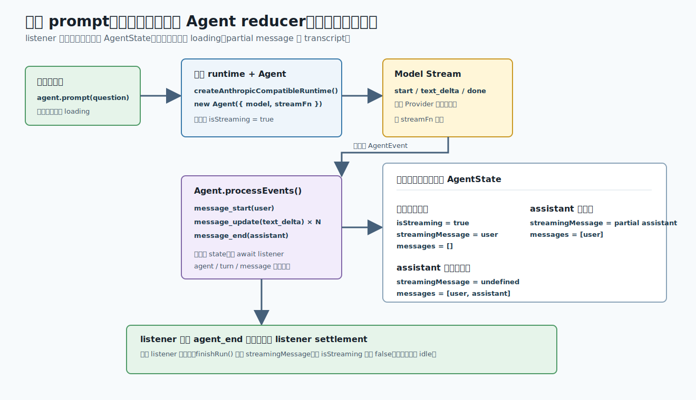
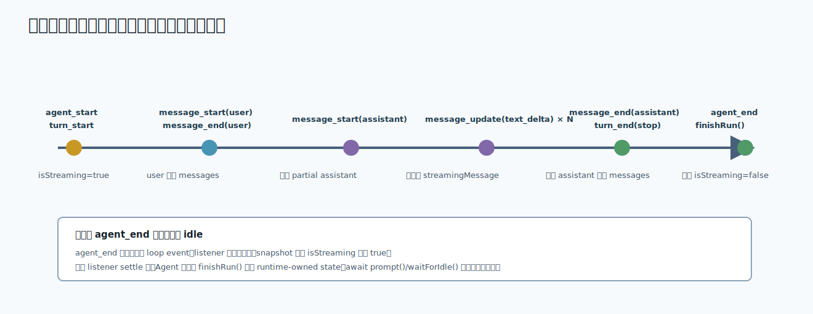

# s02：Agent Runtime State — UI 不必自己拼运行状态

[返回首页](../../README.md)

[s01 Model Stream](../s01-model-stream/) → `s02` → [s03 Tool Execution Pipeline](../s03-tool-execution-pipeline/) → ...

> *“收到事件时，Pi 的 AgentState 已经更新。”*
>
> **pi-agent-core 层**：模型 Stream 解决“模型刚输出了什么”；`Agent` 再解决“这次运行走到哪里、界面现在该显示什么”。

推荐前置：已完成 `learn-claude-code/s01_agent_loop`，知道一次 prompt 会驱动模型与后续工作。本课不重写 Agent Loop，而是只看 Pi 为 UI、SDK 和宿主程序提供的 lifecycle/state 契约。

---

## 问题

想象一个终端对话界面。用户按下发送后，界面至少要在三个时刻做对不同的事：

```text
刚发送        -> 显示用户消息，按钮进入运行中
模型持续输出  -> 更新一条尚未完成的 assistant 气泡
整轮结束      -> 固化完整回复，按钮恢复可用
```

如果 UI 自己根据底层 `text_delta` 拼出这些状态，很容易犯错：把每个 delta 当成一条新消息、在完整回复前写入历史，或在模型已经结束后仍让发送按钮处于 loading。

Pi 的 `Agent` 如何把底层模型事件变成让界面直接消费的 agent、turn、message 生命周期和状态快照？

---

## 解决方案



*图：模型事件进入 Agent reducer 后，listener 读取的 `AgentState` 已经可以直接驱动 loading、partial message 和 transcript。*

`Agent` 的关键约定是：**先归约 `agent.state`，再通知 `subscribe()` listener。** 因此 listener 收到的不是“请你自己更新状态”的命令，而是“状态已经变化”的通知。

| 你想驱动的界面 | 读取什么 |
| --- | --- |
| 发送按钮是否 loading | `agent.state.isStreaming` |
| 正在生成的气泡 | `agent.state.streamingMessage` |
| 已完成的聊天历史 | `agent.state.messages` |
| 本次运行是否失败 | `agent.state.errorMessage` 的存在性 |

一句话结论：**事件描述发生了什么，state 描述现在应该画什么。**

---

## 工作原理

完整教学代码在 [`code.ts`](code.ts)。文件开头创建真实 Model，只回答“这次请求发给谁”；本课真正要读的是 `observeAgentRun()`：它不维护第二份 UI 状态，只在每次事件到达时读取 Pi 已经归约好的 `agent.state`。

### 第 1 步：订阅时，只读取已经更新的 state

```ts
const unsubscribe = agent.subscribe((event) => {
  const entry = {
    type: event.type,
    detail: describeEvent(event),
    snapshot: snapshotState(agent.state),
  };
  timeline.push(entry);
});
```

这段代码没有一份手写的 `loading`、partial text 或历史数组。每收到一个 `AgentEvent`，它只做一件事：记录**此刻**的 `agent.state`。因此终端、TUI 和嵌入式宿主可以各自渲染同一个状态，而不必分别猜测某个事件会怎样改写历史。

### 第 2 步：一次 `prompt()` 先把运行态打开

```ts
await agent.prompt(prompt);
```

调用开始后，第一条关键观察不是模型文字，而是 `agent_start` 的 snapshot：`isStreaming` 已经为 `true`。随后 user 消息先经过临时区，再进入 history：



*图：事件和状态成对变化；`agent_end` 表示 loop 停止，真正 idle 要等 `finishRun()` 清理运行态。*

按 `code.ts` 记录的真实顺序，界面能看到这些变化：

1. `agent_start`：`isStreaming` 已经是 `true`，界面可进入 loading。
2. `message_start(user)`：`streamingMessage` 暂时指向 user；还没有写进 transcript。
3. `message_end(user)`：user 被追加到 `messages`，临时消息清空。
4. `message_start(assistant)`：临时区换成一条 partial assistant。

### 第 3 步：delta 只改临时消息，完整消息才进入 transcript

`snapshotState()` 故意只读下面四个 UI 需要的字段：

```ts
return {
  isStreaming: state.isStreaming,
  streamingMessageRole: state.streamingMessage?.role,
  transcript: state.messages.map((message) => message.role),
  hasError: state.errorMessage !== undefined,
};
```

因此 `message_update(text_delta)` 再多，`transcript` 仍只有 user；它们只持续替换 `streamingMessage`。直到 `message_end(assistant)`，完整 assistant 才被追加到 `messages`。这正是页面同时显示“正在回答”和“已完成历史”时不需要自己拼 delta 的原因。

底层的 `AssistantMessageEvent` 仍挂在 Agent 的 `message_update` 事件上。需要画 token/delta 的 UI 可以读取它；只需要画气泡的 UI 则只需读这两个 state 区域。

### 第 4 步：`agent_end` 不是按钮恢复可用的边界

`code.ts` 在 `agent_end` listener 中记录 `isStreaming`。你会看到它仍然是 `true`：

```text
agent_end(...) | isStreaming=true, streamingMessage=-, transcript=user -> assistant
```

这不是延迟更新。`agent_end` 的含义是“loop 不会再发事件”；Pi 还会等待所有异步 listener 完成，最后才清理运行态：

```text
finishRun()
├── isStreaming = false
├── streamingMessage = undefined
└── pendingToolCalls = empty
```

所以 `observeAgentRun()` 先 `await agent.prompt(...)`，再读取最终 snapshot。让按钮恢复可用的可靠边界是这个 Promise 返回后，或 `await agent.waitForIdle()` 完成后；不要只看见 `agent_end` 就判定 idle。

### 第 5 步：失败也要收束为可画的状态

当 Provider 没有完成响应时，Agent 仍会保留一条 assistant 消息，并走到 `turn_end`、`agent_end`。状态快照只暴露 `hasError=true`，课程输出不会把 Provider 原始细节写到终端或日志。

这让 UI 能同时做到两件事：保留用户刚问过的问题和失败位置；用通用的“本次模型调用未完成”提示替代一个停不下来的 loading。

> **可复述的规则**：Pi 的 Agent reducer 负责先决定“现在是什么状态”，listener 负责读取它；只有运行收束后，`isStreaming` 才会回到 `false`。

---

## 试一下

本课默认需要 Node.js `>=22.19.0` 和有效的 Anthropic-compatible 配置。可用环境变量与 s01/s03 一致：

```bash
export ANTHROPIC_API_KEY="你的密钥"
export MODEL_ID="claude-haiku-4-5"          # 可选
export ANTHROPIC_BASE_URL="https://你的端点" # 可选
npm run lesson -- s02
```

真实模型输出的文字和 delta 数量会不同，但事件形状应类似：

```text
模型: learn-pi-anthropic-compatible/claude-haiku-4-5
开始前: isStreaming=false, streamingMessage=-, transcript=(空)
用户提问: 请用两句中文解释：Pi Agent 怎样把模型流变成界面可观察的状态？
agent_start                        | isStreaming=true, streamingMessage=-, transcript=(空)
turn_start                         | isStreaming=true, streamingMessage=-, transcript=(空)
message_start(user)                | isStreaming=true, streamingMessage=user, transcript=(空)
message_end(user)                  | isStreaming=true, streamingMessage=-, transcript=user
message_start(assistant)           | isStreaming=true, streamingMessage=assistant, transcript=user
message_update(text_delta)          | isStreaming=true, streamingMessage=assistant, transcript=user
message_end(assistant)             | isStreaming=true, streamingMessage=-, transcript=user -> assistant
turn_end(stop)                     | isStreaming=true, streamingMessage=-, transcript=user -> assistant
agent_end(本次新增 2 条消息)        | isStreaming=true, streamingMessage=-, transcript=user -> assistant
结束后: isStreaming=false, streamingMessage=-, transcript=user -> assistant
最终回复: ...
```

观察重点：`message_update` 再多，也不增加 assistant 历史条数；`agent_end` 的 snapshot 仍在运行中，而 `结束后` 已变为 idle。

真实调用可能产生模型费用。无有效配置或模型请求失败时，入口只输出通用中文提示并以非零状态结束，不打印 Provider 原始请求或认证细节。

离线验证不访问网络，也不读取 API Key：

```bash
npm run test:lesson -- s02
```

两个确定性测试覆盖：

1. 多个底层 delta 被归约为一条完整 assistant 和稳定 transcript。
2. faux Provider 错误仍走完 `agent_end`，观察输出不泄露原始错误内容。

可以尝试：

1. 设置 `LEARN_PI_PROMPT` 为一个更长的问题，观察 `message_update` 的数量。
2. 给 `subscribe()` listener 加一个短暂异步等待，观察 `agent_end` 与真正 idle 的边界。
3. 在开发者工具中分别用 `streamingMessage` 和 `messages` 渲染两块区域，比较 partial 与已完成消息。

---

## 接下来

现在界面知道了“什么时候开始、什么时候更新、什么时候完成”。但 assistant 一旦请求多个工具，`turn_end` 前还会插入参数校验、策略拦截、并行/串行执行和 tool result 的排序。

[s03 Tool Execution Pipeline](../s03-tool-execution-pipeline/) 将沿着这条 message 生命周期之后的支路继续，解释为什么工具完成顺序和 transcript 写入顺序可以不同。

<details>
<summary>深入 Pi 源码</summary>

以下对应均固定在 Pi `v0.80.6` 提交 [`2b3fda9921b5590f285165287bd442a25817f17b`](https://github.com/earendil-works/pi/tree/2b3fda9921b5590f285165287bd442a25817f17b)。先把课程里看得见的状态变化对回生产职责，再展开源码：

| 课程中的一行或观察 | Pi 生产实现中的同一职责 |
| --- | --- |
| `new Agent(...)` 与 `await agent.prompt(prompt)` | [`Agent.prompt()`](https://github.com/earendil-works/pi/blob/2b3fda9921b5590f285165287bd442a25817f17b/packages/agent/src/agent.ts#L269-L281) 启动一次运行；[`runWithLifecycle()`](https://github.com/earendil-works/pi/blob/2b3fda9921b5590f285165287bd442a25817f17b/packages/agent/src/agent.ts#L469-L525) 在结束时协调状态清理。 |
| `agent.subscribe(...)` 中读取 `agent.state` | [`processEvents()`](https://github.com/earendil-works/pi/blob/2b3fda9921b5590f285165287bd442a25817f17b/packages/agent/src/agent.ts#L527-L580) 先把 event 归约进 state，才 `await` listener；这就是本课不手写 UI state 的依据。 |
| `message_start`、`message_update`、`message_end` 的时间线 | [`runAgentLoop()`](https://github.com/earendil-works/pi/blob/2b3fda9921b5590f285165287bd442a25817f17b/packages/agent/src/agent-loop.ts#L65-L152) 和 [`streamAssistantResponse()`](https://github.com/earendil-works/pi/blob/2b3fda9921b5590f285165287bd442a25817f17b/packages/agent/src/agent-loop.ts#L244-L374) 生成 agent / turn / message 事件，并把底层 stream 转成 `message_update`。 |
| `isStreaming` 在 `agent_end` snapshot 中仍为 `true` | [`runWithLifecycle()`、`finishRun()`](https://github.com/earendil-works/pi/blob/2b3fda9921b5590f285165287bd442a25817f17b/packages/agent/src/agent.ts#L469-L525) 等 listener 收束后才清理 runtime-owned state。 |
| `snapshotState()` 的四个字段 | [`AgentState`](https://github.com/earendil-works/pi/blob/2b3fda9921b5590f285165287bd442a25817f17b/packages/agent/src/types.ts#L316-L347) 和 [`AgentEvent`](https://github.com/earendil-works/pi/blob/2b3fda9921b5590f285165287bd442a25817f17b/packages/agent/src/types.ts#L406-L428) 定义宿主可观察的 state 与事件契约。 |

课程代码只依赖表中的公开 `Agent` API；`runAgentLoop()`、`processEvents()` 和 `finishRun()` 是用来解释顺序的内部实现，课程不会深度导入它们。`createAnthropicCompatibleRuntime()` 则只是本仓库的真实模型装配，和 Pi 的 reducer 不是同一个概念。

### 两种失败路径

Provider 按 Stream 协议返回失败时，loop 仍然把最终 assistant 消息写入 context，再发出 `turn_end` 与 `agent_end`。如果注入的 `streamFn` 自身违反契约并抛出，`Agent.runWithLifecycle()` 也会收束这次运行。

两条路径共同的目标不是隐藏失败，而是让 UI 总能从运行态回到 idle，并保留可以展示的 transcript。

### 教学边界

本课的真实入口只做一次文本 prompt，不涵盖工具、队列、取消或会话持久化。它们会在后续课程分别加入；因此这里看到的 `turn_end(stop)` 是无工具成功路径，不应理解为所有 Agent run 的唯一结尾。

</details>
