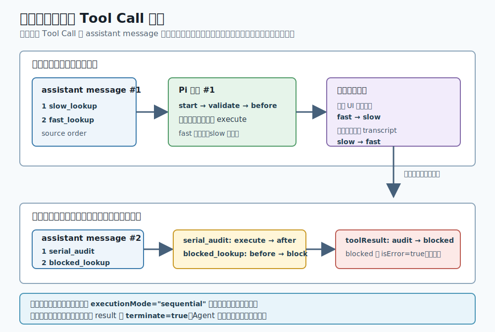
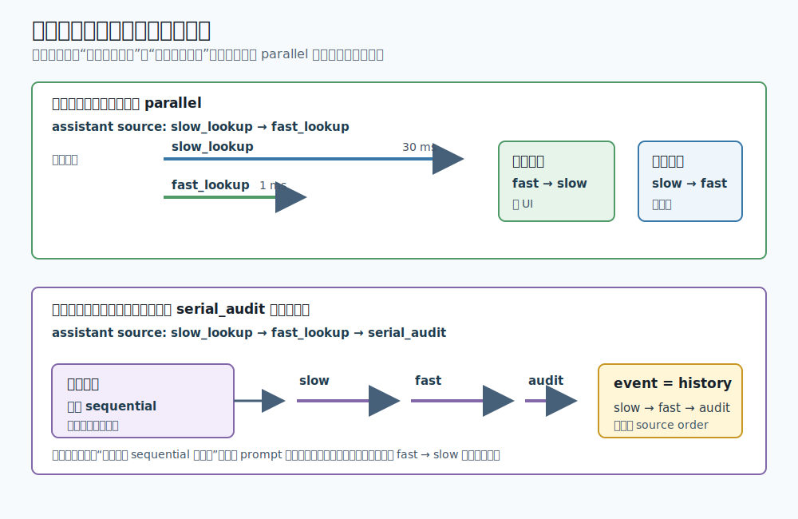

# s03：Tool Execution Pipeline — 工具完成的顺序，不等于历史写入的顺序

[返回首页](../../README.md)

[s01 Model Stream](../s01-model-stream/README.md) → [s02 Agent Runtime State](../s02-agent-runtime-state/README.md) → `s03` → s04 Message Boundary → ...

> *“Pi 先把每个 Tool Call 预检和执行完成，再把结果按 assistant 原始顺序写回历史。”*
>
> **pi-agent-core 层**：工具调用不是一个 `execute()` 函数；它是一条带校验、策略、并发、事件和终止规则的管线。

推荐前置：已完成 `learn-claude-code` 的 Tool Use、Permission 和 Hooks 课程。本课不再解释模型为什么调用工具，而是只看 Pi 怎样让一整批调用的行为可预测、可审计。

---

## 问题

设想一个代码审查助手要按两个阶段完成工作：

```text
第 1 条 assistant 消息：同时查两个公开资料：slow_lookup、fast_lookup
收到这两个结果后
第 2 条 assistant 消息：写一条审计记录：serial_audit；尝试读取 private:// 资源：blocked_lookup
收到第二批结果后
第 3 条 assistant 消息：用一句话总结
```

第一批的两个查询应该并发。这样快工具会先完成，但历史不能把模型原来先写出的慢查询排到后面。第二批则还要处理审计和策略拦截：

- 缺少必填参数时，不应把坏数据传进工具。
- `private://` 资源必须在执行前被策略阻止。
- 两个查询可以并发；若把审计工具放进同一批，审计工具会要求整批串行。
- 快工具可能先完成，历史记录却必须保持模型原先表达的因果顺序。
- 某个工具请求停止，不应意外掐断同批其他工具或下一步上下文。

这些边界如果散落在每个工具实现里，宿主程序很难正确地展示进度、保存会话或判断是否继续调用模型。

---

## 解决方案



*图 1：默认运行先让两个查询单独组成并行批次，再处理审计与策略拦截；两批之间由下一次模型响应连接。*

Pi 的规则可以压缩成一句：**先为每个 Tool Call 得到一个 finalized result；UI 按完成事件更新，Context 按 assistant source order 保存；只有全批结果都 `terminate` 才停止。**

| 读者需要区分的东西 | Pi 的行为 |
| --- | --- |
| 进入管线 | `tool_execution_start`，此时还可能校验失败或被拦截 |
| 实际完成 | `tool_execution_end`；已执行工具在并行批次按真实完成顺序发出，预检拒绝则在预检时结束 |
| 保存到 transcript | `toolResult` 消息，始终回到 assistant 原始调用顺序 |
| “这一批结束” | 每一条 finalized result 都是 `terminate: true` 才成立 |

---

## 工作原理

本课的主入口是 [`code.ts`](code.ts)。文件开头的真实 Provider 只决定请求发到哪里；本课需要理解的是 `createPipelineRuntime()` 给 Agent 的工具、hook 与观察器。模型每生成一条含 Tool Call 的 assistant message，Pi 就处理一个独立批次。

### 第 1 步：一条 assistant 消息，成为一个工具批次

```ts
await agent.prompt(options.prompt ?? DEFAULT_PROMPT);
```

`code.ts` 不手写 Tool Call；真实模型按提示生成它们。默认提示把 `slow_lookup`、`fast_lookup` 放在第一条 assistant 消息，把 `serial_audit`、`blocked_lookup` 放在拿到第一批结果后的第二条消息。因此第一次运行可以只观察“两个并行查询为何会有两种顺序”，第二次再观察审计与拦截。

批次的边界不是“所有名字相同的工具”，而是**同一条 assistant 消息中的 Tool Call 列表**。模型还没收到第一批的 tool result 前，不能开始第二批。

### 第 2 步：工具声明先决定这一批能否并行

```ts
const lookupParameters = Type.Object({ query: Type.String() });

const slowLookup = createLookupTool("slow_lookup", "慢速查询", 30, executionTrace);
const fastLookup = createLookupTool("fast_lookup", "快速查询", 1, executionTrace);

const serialAudit = {
  name: "serial_audit",
  parameters: auditParameters,
  executionMode: "sequential",
  async execute(...) { /* 写审计记录 */ },
};
```

`slow_lookup` 与 `fast_lookup` 在 `createLookupTool()` 中声明 `executionMode: "parallel"`；`serial_audit` 则声明 `"sequential"`。Pi 会先看完整批次：只要同批存在一个 `sequential` 工具，整批有效调用都走串行分支，不是只把审计工具自己排队。

默认提示刻意把 `serial_audit` 留到第二条 assistant 消息：第一批只有两个 `parallel` 查询，所以你可以直接观察 `fast_lookup` 先完成、但 transcript 仍按 `slow_lookup → fast_lookup` 写入。离线测试会另外把审计工具混入查询批次，验证“同批出现一个 `sequential`，整批串行”的规则。

### 第 3 步：先形成结果，坏调用不进入 `execute()`

```ts
const lookupParameters = Type.Object({ query: Type.String() });

beforeToolCall: async ({ toolCall }) => {
  executionTrace.push(`before:${toolCall.id}`);
  if (toolCall.name === "blocked_lookup") {
    return { block: true, reason: "演示策略：不允许读取 private:// 资源" };
  }
  return undefined;
},
```

Pi 先按 `Type.Object(...)` 校验参数，再调用 `beforeToolCall`。所以两种失败的边界不同：

1. `fast_lookup({})` 缺少 `query`：校验失败，`beforeToolCall` 和 `execute()` 都不会运行。
2. `blocked_lookup({ target: "private://forbidden" })` 参数有效：`beforeToolCall` 收到它并返回 `block: true`，`execute()` 仍然不会运行。

两条路径都会形成一条 `isError=true` 的 tool result，模型能在下一次响应中看到失败原因，而不是只得到一个从 JavaScript 冒出的异常。

### 第 4 步：已执行调用结束后，hook 可以统一改写结果

```ts
afterToolCall: async ({ toolCall, result }) => {
  executionTrace.push(`after:${toolCall.id}`);
  return {
    content: [{ type: "text", text: `[已审计] ${textFromToolResult(result.content)}` }],
    terminate: options.terminateAfterTools ? true : undefined,
  };
},
```

`afterToolCall` 只处理已进入执行阶段的结果。本课给成功结果加上 `[已审计]` 前缀，所以输出里的 `fast_lookup`、`slow_lookup`、`serial_audit` 都有这层统一处理；被校验拒绝或策略拦截的调用没有进入这个 hook。

### 第 5 步：完成事件可以重排，transcript 不能重排

```ts
agent.subscribe((event) => {
  if (event.type === "tool_execution_end") {
    toolEnds.push({ id: event.toolCallId, ... });
  }
  if (event.type === "message_end" && event.message.role === "toolResult") {
    toolResultIds.push(event.message.toolCallId);
  }
});
```

同一个 subscriber 记录两种事实：`tool_execution_end` 是某个工具实际完成的瞬间；`message_end(toolResult)` 是结果写入 Agent transcript 的瞬间。默认第一批只有两个并行工具，因此两个列表有意不同：



*图 2：上半是默认第一批的并行顺序；下半是离线对照测试，把 `serial_audit` 放进同一批后触发的整批串行规则。*

例如 `slow_lookup` 先被模型写出、但比 `fast_lookup` 晚完成：

```text
tool_execution_end: fast -> slow
toolResult transcript: slow -> fast
```

前者适合 UI 立刻更新“哪个工具刚完成”；后者适合下一个模型请求按 assistant 的调用顺序理解结果。两者都正确，不能相互替代。

### 第 6 步：全批都要求终止，才不请求下一次模型响应

本课用同一个 after hook 构造这条边界：

```ts
terminate: options.terminateAfterTools ? true : undefined,
```

Pi 判断的是整批 finalized result：

```text
至少一条 result 不是 terminate=true  -> 写入结果后继续决定下一次模型响应
每一条 result 都是 terminate=true    -> 这一批结束后直接 agent_end
```

因此一个被校验拒绝或 policy block 的调用不会因为另一个工具想停止就被静默丢失。s03 的第五个测试只预置一条模型响应；两个成功工具经 `afterToolCall` 都被标记为 terminate，最终 faux Provider 的调用次数仍为 `1`。

> **可复述的规则**：Pi 先让批次里的每个 Tool Call 得到 finalized result；完成事件按真实完成时间给 UI，tool result 按 assistant 的 source order 给下一次模型请求，且只有全批终止才停止。

---

## 试一下

本课 `code.ts` 的默认路径调用真实 Anthropic 模型。运行脚本会按以下优先级选择**第一个存在**的配置文件：

1. `LEARN_PI_ENV_FILE` 指向的文件
2. 仓库根目录的 `.env`
3. 相邻 `learn-claude-code` 仓库的 `.env`

因此，如果你已在 `learn-claude-code/.env` 配置了 Anthropic-compatible 凭证，通常直接运行即可。下列 `export` 只是在需要临时覆盖或配置文件不在上述位置时使用；不要把任何密钥提交到仓库：

真实模型调用可能产生费用；离线测试不会访问网络。

```bash
export ANTHROPIC_API_KEY="你的密钥"
# 可选：默认 claude-haiku-4-5
export MODEL_ID="claude-haiku-4-5"
# 可选：使用 Anthropic-compatible 网关或自建端点
export ANTHROPIC_BASE_URL="https://你的兼容端点"
npm run lesson -- s03
```

模型会被要求先发出只含两个查询的第一批，收到它们的结果后，再发出审计和受限查询组成的第二批。真实模型输出会随模型版本和响应略有差异，但它遵从提示时，应出现下面的形状：

```text
模型: learn-pi-anthropic-compatible/claude-haiku-4-5
开始: ... slow_lookup {"query":"Pi typed validation"}
开始: ... fast_lookup {"query":"Pi typed validation"}
完成: ... fast_lookup error=false terminate=false
完成: ... slow_lookup error=false terminate=false
写入 transcript: ... slow_lookup
写入 transcript: ... fast_lookup
开始: ... serial_audit {"summary":"检查第一批的工具完成顺序"}
完成: ... serial_audit error=false terminate=false
开始: ... blocked_lookup {"target":"private://forbidden"}
完成: ... blocked_lookup error=true terminate=false
写入 transcript: ... serial_audit
写入 transcript: ... blocked_lookup
完成事件顺序: ... fast_lookup -> ... slow_lookup -> ... serial_audit -> ... blocked_lookup
结果写入顺序: ... slow_lookup -> ... fast_lookup -> ... serial_audit -> ... blocked_lookup
最终回复: ...
```

其中最值得核对的是第一批的两种顺序：`fast_lookup` 比 `slow_lookup` 早完成，但前者不会越过后者写进 transcript。第二批里，`blocked_lookup` 有结束事件和错误结果，却没有 `execute:blocked_lookup:unexpected`。

如果输出“模型请求未完成”，请检查当前 shell 的 `ANTHROPIC_API_KEY`、模型名和 Anthropic-compatible 配置是否有效。程序不会输出密钥或 Provider 原始请求细节。真实模型没有严格遵从工具调用提示时，也应以它实际打印的事件顺序为准。

课程测试不访问网络，也不需要 API Key：

```bash
npm run test:lesson -- s03
```

已覆盖的确定性观察点：

1. 共享 runtime 解析 OAuth 优先级、空白 OAuth 回退、`MODEL_ID` 和自定义 base URL。
2. 两批 faux 响应中，第一批的 `tool_execution_end` 是 `fast -> slow`，toolResult 仍是 `slow -> fast`；第二批再处理审计与策略拦截。
3. 缺失 `query` 和 `beforeToolCall block` 都不执行工具，却各自产生错误结果。
4. 同批出现一个 `sequential` 工具时，三个工具按 source order 串行。
5. 两个 finalized result 都 `terminate=true` 时，不发生第二次模型调用。

可以尝试：

1. 故意把默认提示中的 `serial_audit` 移到第一批，再运行真实模型，比较 `fast_lookup` 是否还会先完成。
2. 将 `blocked_lookup` 的 target 改为普通路径，并修改 `beforeToolCall` 的策略，观察它何时真正进入 `execute()`。
3. 只让 `afterToolCall` 为一个工具设置 `terminate: true`，确认 Agent 仍会继续，而不是过早停止。

---

## 接下来

现在工具结果已经按稳定顺序追加进 Agent transcript。可“追加进 transcript”不等于“下一次模型请求一定看见全部内容”。

s04 Message Boundary 将沿着工具结果写回之后的边界继续：Pi 怎样用 `transformContext` 和 `convertToLlm` 保留 UI/会话需要的消息，同时只把合适的 Context 发送给 Provider。

<details>
<summary>深入 Pi 源码</summary>

以下对应均固定在 Pi `v0.80.6` 提交 [`2b3fda9921b5590f285165287bd442a25817f17b`](https://github.com/earendil-works/pi/tree/2b3fda9921b5590f285165287bd442a25817f17b)。从课程的可观察结果回看生产职责：

| 课程中的一行或观察 | Pi 生产实现中的同一职责 |
| --- | --- |
| 工具的 `parameters`、`executionMode` 与 `toolExecution` | [`AgentTool` 与 `ToolExecutionMode`](https://github.com/earendil-works/pi/blob/2b3fda9921b5590f285165287bd442a25817f17b/packages/agent/src/types.ts#L33-L114) 是公开装配契约；[批次入口](https://github.com/earendil-works/pi/blob/2b3fda9921b5590f285165287bd442a25817f17b/packages/agent/src/agent-loop.ts#L413-L428) 据此选择 parallel 或 sequential。 |
| `Type.Object(...)` 与 `beforeToolCall(...)` | [`prepareToolCall()`](https://github.com/earendil-works/pi/blob/2b3fda9921b5590f285165287bd442a25817f17b/packages/agent/src/agent-loop.ts#L602-L666) 按 source order 查工具、验证参数、执行 before hook，并将 block 变成 error result。 |
| `afterToolCall(...)` 返回 `[已审计]` 和 `terminate` | [`afterToolCall()` 合并结果字段](https://github.com/earendil-works/pi/blob/2b3fda9921b5590f285165287bd442a25817f17b/packages/agent/src/agent-loop.ts#L711-L754)；[终止判断](https://github.com/earendil-works/pi/blob/2b3fda9921b5590f285165287bd442a25817f17b/packages/agent/src/agent-loop.ts#L584-L586) 要求所有 finalized result 都为 `terminate`。 |
| `tool_execution_end` 与 `message_end(toolResult)` 两个记录数组 | [parallel 分支](https://github.com/earendil-works/pi/blob/2b3fda9921b5590f285165287bd442a25817f17b/packages/agent/src/agent-loop.ts#L491-L555) 会在 promise 结束时立即发完成事件，所有 promise settle 后才按 source order 构造和写入 tool result。 |
| 真实 `Agent` 调用与离线 faux 响应 | [`Models.streamSimple()` 路由](https://github.com/earendil-works/pi/blob/2b3fda9921b5590f285165287bd442a25817f17b/packages/ai/src/models.ts#L217-L364) 负责将模型交给 Provider；faux 只固定 assistant 输出的 Tool Call，后续管线仍由真实 Pi Agent 运行。 |

最值得逐行看的不是工具的 `execute()`，而是 `executeToolCallsParallel()`：它先按 source order 完成 preflight，再并发启动有效工具；每个 promise 完成时立即发出 `tool_execution_end`；所有 promise settle 后，才按原数组顺序构造和写入 `toolResult`。

### 两个容易误读的差异

1. `tool_execution_start` 不表示 `execute()` 已经开始。它先于 validate 和 `beforeToolCall` 发出，因此 UI 应把它理解为“开始处理这个请求”。
2. `afterToolCall` 不会处理 validation 或 block 形成的 immediate error；它只包裹已经准备好并被执行的工具路径。想统一审计这些拒绝，应观察 `tool_execution_end` 和 toolResult。

`validateToolArguments()` 在真正校验前会尝试 `Value.Convert()`；例如某些数字可转换为 string。因此“typed validation”不等于所有近似输入都会被拒绝。本课的负向测试故意省略必填 `query`，以稳定验证没有进入 `beforeToolCall` 或 `execute()` 的路径。

### 真实模型与 faux 测试的边界

真实 Anthropic-compatible 模型用于检验 Provider、环境配置、工具 schema 和 Agent 的完整连接；它可以选择不同的合理措辞，甚至在未严格遵从提示时改变调用顺序。faux 测试不模拟 Pi 的工具管线，而是只固定“assistant 输出哪几个 toolCall”；之后的 validation、hook、并发、排序、terminate 和 transcript 都由真实 Pi `Agent` 执行。

</details>
