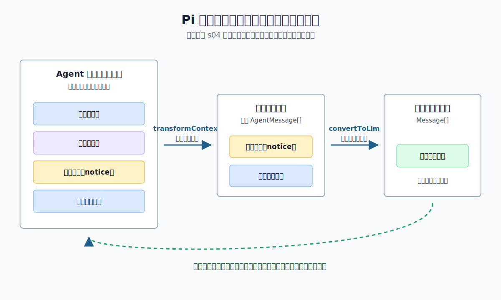

# s04：消息边界（Message Boundary）- 保存的记录不等于模型收到的上下文

[← s03 工具执行管线](../s03-tool-execution-pipeline/README.md) · [返回首页](../../README.md) · [s05 消息队列 →](../s05-message-queues/README.md)

> **核心结论**：Pi 先用上下文转换（`transformContext`）挑选本轮要看的 Agent 记录，再用模型消息转换（`convertToLlm`）生成模型认识的消息；这两步的返回值只服务这次请求，不会被 Pi 自动写回保存的记录（transcript）。

推荐前置：已完成 `learn-claude-code` 的 Agent Loop 与 Context Compact 基础，并读过本项目 [s02 运行状态](../s02-agent-runtime-state/README.md)。本课不再解释模型怎样生成回复，而是看 Pi 在“保存”和“发送”之间设置的两道边界。

---

## 这节只学什么

本课只解决：**如何让界面和会话保留完整记录，同时让本轮模型请求只带必要、可识别的消息。**

| 本课会看到 | 读者已经掌握 | 本课暂不解决 |
| --- | --- | --- |
| 旧历史怎样留在 Agent，当前请求怎样被裁剪 | 一次 `prompt()` 会启动 Agent Loop | 如何设计自动压缩策略，留给会话与压缩课程 |
| 界面提示怎样留给 UI，却不进入模型请求 | 消息可以有 user、assistant、tool result | Provider 怎样把 `Context` 序列化成 HTTP 请求体 |

本课只有一条主规则：**先选择 Agent 记录，再转换成模型消息；“保存”与“发送”是两件不同的事。**

## 问题

想象一个聊天界面刚做完两件事：它保留了一轮旧问答，又在页面上显示“已切换到本课演示”的黄色提示。现在用户提出一个新问题。

```text
保存的记录：旧用户消息 -> 旧助手回复 -> 界面提示 -> 本次用户提问
```

如果每一条保存的记录都原样发送给模型，会有两个问题：

1. 已经不需要的旧历史继续占用本轮上下文窗口。
2. 只供人看的界面提示没有模型协议含义，却被误当作聊天消息发送。

反过来，如果为了缩短请求直接删除这些记录，界面就失去历史、会话也无法再决定怎样展示或恢复它们。

Pi 如何同时做到“完整保存”和“按需发送”？

## 解决方案



*图：完整记录先由 `transformContext` 选择本轮候选，再由 `convertToLlm` 过滤成模型协议消息。两次处理都发生在模型请求前，完整记录仍由 Agent 保留。*

本课的 `code.ts` 故意准备四类记录：旧用户消息、旧助手回复、只给界面看的 `notice`，以及本次用户提问。它采用下面的两层边界：

| 边界 | 输入与输出 | 本课做什么 | 解决的问题 |
| --- | --- | --- | --- |
| 上下文转换（`transformContext`） | `AgentMessage[]` -> `AgentMessage[]` | 只保留最后两条候选记录 | 旧历史不进入本轮请求 |
| 模型消息转换（`convertToLlm`） | `AgentMessage[]` -> `Message[]` | 过滤 `notice`，只保留模型认识的角色 | UI-only 记录不进入模型协议 |

因此，本课真实请求前的形状是：

```text
完整记录：旧用户 -> 旧助手 -> 界面提示 -> 本次用户
第一层后：界面提示 -> 本次用户
第二层后：本次用户
```

这里的“实际模型上下文”指 Pi 交给模型适配器（`streamFn`）的 `Context.messages`，不是某个 Provider 私有的 HTTP JSON。不同 Provider 还会把这份上下文序列化为各自的网络请求格式。

## 工作原理

完整教学代码在 [`code.ts`](code.ts)。其中真实 Anthropic-compatible 模型的装配只是运行准备；本课要观察的是 `Agent` 在发起请求前依次经过的两层回调。代码不会手写 Agent Loop，也不会自己调用模型 SDK。

### 第 1 步：Agent 先保存完整记录

课程先把旧问答与界面提示放进 `initialState.messages`，再用 `agent.prompt(prompt)` 追加本次用户提问。`notice` 是宿主通过 `CustomAgentMessages` 扩展出的消息类型：它有显示价值，却不是模型协议中的 `user`、`assistant` 或 `toolResult`。

```ts
messages: options.initialMessages ?? createInitialTranscript(),
```

运行开始时，步骤 1 会打印完整记录。这不是待发送请求的预览，而是 Agent 持有的 transcript；界面、会话存储和后续逻辑都可以继续使用它。

### 第 2 步：第一层只选择本轮候选记录

```ts
export function selectRequestWindow(messages: AgentMessage[]): AgentMessage[] {
  return messages.slice(-2);
}
```

`transformContext` 调用这个函数，因此它拿到的四条记录只留下最后两条：`notice` 和本次 user。旧问答没有被删除，只是没有参加这一次请求的构造。

```ts
transformContext: async (messages) => {
  trace.transformOutput = selectRequestWindow(messages);
  return trace.transformOutput;
},
```

Pi 的顺序固定为先调用这一步、再调用下一步。课程把选择结果打印为步骤 2，使你能直接看到“旧历史被排除在本轮之外”。

### 第 3 步：第二层把候选记录变成模型消息

```ts
export function convertMessagesForModel(messages: AgentMessage[]): Message[] {
  return messages.filter(isLlmMessage);
}
```

模型适配器只认识 `user`、`assistant`、`toolResult` 三种消息角色。本课的 `notice` 没有被强行伪装成 user，而是在这一步过滤掉。于是模型适配器只收到本次 user。

```ts
streamFn: (model, context, streamOptions) => {
  trace.sentMessages = context.messages.slice();
  return options.streamFn(model, context, streamOptions);
},
```

这层 `streamFn` 只做观察后马上委托给真实模型运行时；它不替 Pi 造回复。步骤 3 会连续打印转换结果和传给模型适配器的 `Context.messages`，两者都应是单条 user。

### 第 4 步：请求完成后再读完整记录

模型回复完成后，Pi 会把新的 assistant 消息追加进 Agent transcript。课程最后读取的是 `agent.state.messages`，而不是第二层的临时数组：

```ts
const transcript = runtime.agent.state.messages.slice();
```

所以步骤 4 的完整记录会是：

```text
旧用户 -> 旧助手 -> 界面提示 -> 本次用户 -> 新助手
```

`transformContext` 和 `convertToLlm` 的**返回数组**不会被 Pi 自动赋回 `agent.state.messages`。这不等于回调可以随意改写输入对象：本课只用 `slice()`、`filter()` 这类纯处理；生产代码也应避免在回调中直接修改传入消息。

> **可复述的规则**：Agent 负责保存完整记录；`transformContext` 负责选择本轮记录；`convertToLlm` 负责产出模型协议消息。三者不是同一份数组，也不应该混成一个职责。

## 试一下

本课需要 Node.js `>=22.19.0` 和有效的 Anthropic-compatible 配置。项目运行器会加载项目 `.env` 或显式指定的 `LEARN_PI_ENV_FILE`；配置格式见根目录 [`.env.example`](../../.env.example)。

```bash
npm run lesson -- s04
```

模型回答会随你配置的服务而变化，但边界输出形状应类似：

```text
[步骤 1/4] Agent 保存的完整记录：user -> assistant -> 界面提示（notice）
[步骤 1/4] 发起本次提问；旧历史和界面提示会保留，但不一定送往模型。
[步骤 2/4] transformContext 选择本轮记录：界面提示（notice） -> user
[步骤 3/4] convertToLlm 过滤界面记录：user
[步骤 3/4] streamFn 实际收到的模型上下文：user
[步骤 4/4] 本轮后完整记录仍为：user -> assistant -> 界面提示（notice） -> user -> assistant
[步骤 4/4] 最终回复：<真实模型生成的中文回答>
```

观察问题：步骤 2 还看得到 `notice`，为什么步骤 3 只剩 user？再比较步骤 3 与步骤 4：模型只看到一条消息，为什么 Agent 却还能保留五条？

真实模型调用可能产生费用。认证、模型名或兼容地址不正确时，课程只输出通用诊断，不会回显密钥、请求地址或 Provider 原始错误。

离线测试不读取 `.env`，也不访问网络：

```bash
npm run test:lesson -- s04
```

测试覆盖两种可验证情形：

1. 有完整旧历史时，Agent 保存五条记录，而 faux Provider 只看到本次 user。
2. 记录很短、只剩一条 `notice` 时，窗口选择不会裁掉当前 user，`notice` 仍不会越过模型边界。

可以设置一个不同的问题后再次运行，观察步骤 1 到 3 的角色形状保持不变：

```bash
LEARN_PI_PROMPT="只用一句话解释 transformContext 的职责。" npm run lesson -- s04
```

## 接下来

现在已经知道“哪些记录可以进入下一次模型请求”。但如果 Agent 正在运行时又收到新消息，还要决定它是插入当前轮次之后，还是等本轮自然结束。

s05 消息队列会继续研究引导消息（steering）和后续消息（follow-up）的不同注入时机；完整课程顺序见 [课程路线图](../../COURSE_PLAN.md#s05-消息队列message-queues)。

<details>
<summary>深入 Pi 源码</summary>

以下对应均固定在 Pi `v0.80.6` 提交 [`2b3fda9921b5590f285165287bd442a25817f17b`](https://github.com/earendil-works/pi/tree/2b3fda9921b5590f285165287bd442a25817f17b)。先将课程里的可见步骤对回生产职责：

| 课程中的观察 | Pi 生产实现中的同一职责 |
| --- | --- |
| `new Agent({ transformContext, convertToLlm })` | [`Agent` 构造函数](https://github.com/earendil-works/pi/blob/2b3fda9921b5590f285165287bd442a25817f17b/packages/agent/src/agent.ts#L210-L214) 保存这两个公开回调；[`createLoopConfig()`](https://github.com/earendil-works/pi/blob/2b3fda9921b5590f285165287bd442a25817f17b/packages/agent/src/agent.ts#L432-L457) 在每次 run 时把它们交给 loop。 |
| 步骤 2 再步骤 3 | [`streamAssistantResponse()`](https://github.com/earendil-works/pi/blob/2b3fda9921b5590f285165287bd442a25817f17b/packages/agent/src/agent-loop.ts#L281-L314) 先以局部变量接住 `transformContext` 的返回值，再调用 `convertToLlm`，最后用结果构造 `llmContext.messages` 并调用 `streamFn`。 |
| `notice` 留在记录中，却不在模型请求中 | [`AgentMessage` 的可扩展契约](https://github.com/earendil-works/pi/blob/2b3fda9921b5590f285165287bd442a25817f17b/packages/agent/src/types.ts#L295-L322) 允许宿主声明额外消息；[`convertToLlm` 契约](https://github.com/earendil-works/pi/blob/2b3fda9921b5590f285165287bd442a25817f17b/packages/agent/src/types.ts#L140-L191) 明确要求过滤模型不认识的 UI-only 消息。 |
| `streamFn` 记录 `context.messages` | 同一段 `streamAssistantResponse()` 在调用 Provider 前构造 `Context`；课程只观察这条公开 `StreamFn` 参数，不深度导入上游内部实现。 |
| 课程的 `slice(-2)` + 过滤测试 | 上游的 [`agent-loop.test.ts`](https://github.com/earendil-works/pi/blob/2b3fda9921b5590f285165287bd442a25817f17b/packages/agent/test/agent-loop.test.ts#L186-L236) 也断言转换在模型转换之前发生；前一段测试验证 UI notification 可以在转换时过滤。 |

上游使用的默认转换器会处理 Pi Coding Agent 自己的扩展消息类型；本课没有复制那套完整规则，只用一个最小 `notice` 证明两层职责。`convertToLlm` 与 `transformContext` 的契约都要求调用方不抛异常或拒绝 Promise；真实产品应在回调中返回安全的回退数组，而不是让低层 loop 中断。

### 教学边界

本课的 `slice(-2)` 不是通用的上下文压缩算法，也没有估算 token、生成摘要、处理工具结果配对或恢复历史分支。它只是让两层边界可被一次真实请求直接观察到。后续会话、压缩和队列课程会分别处理这些生产问题。

</details>
