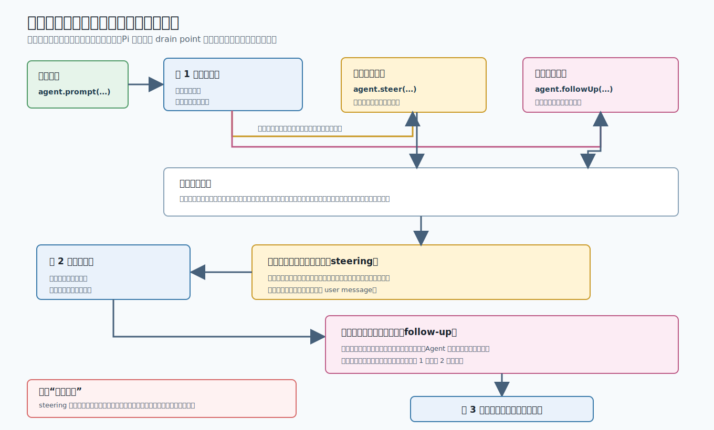

# s05：消息队列（Message Queues）- 同时输入的消息，为什么不是同时进入模型

[返回首页](../../README.md)

[s03 工具执行管线](../s03-tool-execution-pipeline/README.md) → [s04 消息边界](../s04-message-boundary/README.md) → **s05 消息队列** → [s06 平稳停止](../s06-graceful-stop/README.md)

> **Pi 把运行中到来的用户输入先放进两条队列，再在不同的取出点（drain point）送进下一次模型请求。**
>
> 引导消息（`steer`）先等当前助手回合和工具处理结束；后续消息（`followUp`）则等 Agent 本来要停止时才开始。

推荐前置：已经学习 `learn-claude-code` 的 Agent Loop 与 Tool Use。本课不重复解释模型为何逐字生成回复，而是研究 Pi 如何处理“回复尚未结束时，用户又输入了内容”这件事。

---

## 这节只学什么

本课只解决“运行中的新输入应该何时进入下一次模型请求”这个问题。

| 本课会看到 | 读者已经掌握 | 本课暂不解决 |
| --- | --- | --- |
| 引导消息与后续消息的两条队列、两个取出时机、清空未处理消息 | 一次普通 Agent Loop 如何请求模型、执行工具并结束 | 如何取消正在生成的模型流、怎样编辑队列里的内容、终端按键绑定 |

本课唯一主规则：**在运行中入队的引导消息不会打断当前工作；它先于后续消息，在下一次模型请求前进入会话记录。**

## 问题

想象助手正在分析一个文件。它已经开始回复，甚至可能刚准备执行工具。这时你连续想到两件事：

1. “先别沿原方向分析了，改成只检查安全问题。”这件事应该尽快影响下一步。
2. “完成后再给我一条总结。”这件事不该插到眼前的工作中间。

如果两个输入都马上塞进模型上下文，当前回复可能被半途改写，工具结果也不知道该属于哪一轮。如果都等到完全空闲，又失去了“下一步请改方向”的能力。

Pi 不把“用户在运行中又提交了文本”当作第二次 `prompt()`。第二次 `prompt()` 会被拒绝，因为 Agent 已在处理第一轮；正确做法是把消息放入两条有不同取出时机的队列。

## 解决方案



*图 1：本课 Demo 在第 1 次助手回复开始后，分别排入一条引导消息和一条后续消息。Pi 先完成当前回合，再按两个取出点依次送入下一次模型请求。*

先记住这张图的两条规则：

| 需要表达的意图 | 调用的公开 API | 正常运行中的取出时机 |
| --- | --- | --- |
| “下一步请改方向” | `agent.steer(message)` | 当前助手回复和它发起的工具处理都结束后，在下一次模型请求前 |
| “当前任务完全结束后再做” | `agent.followUp(message)` | 没有工具调用，也没有待取的引导消息，Agent 本来要停止时 |

因此，引导消息（steering）不是“立刻中断”。它不会跳过已经开始的工具，也不会取消正在流式生成的回复。后续消息（follow-up）也不是普通历史追加；它必须等前面的工作自然收束，才会成为新的用户消息。

## 工作原理

完整教学入口在 [`code.ts`](code.ts)。它默认创建真实 Anthropic-compatible Agent；离线测试才使用 faux Provider 固定模型回复。为了把时机讲清楚，默认系统提示要求模型不调用工具，但 Pi 的真实规则仍会在有工具时先等待工具批次结束。

### 第 1 步：先开始一轮真实请求，再观察首个助手回复

```ts
await agent.prompt(prompt);
```

`Agent.prompt()` 是第一次输入的入口。它维护本轮运行状态，驱动模型流，并在结束时把完成的 user、assistant 和 tool result 消息写入会话记录（`messages`）。

本课没有在运行中再调用一次 `prompt()`。那样会违反“同一个 Agent 同时只处理一轮”的边界，也无法说明两条队列的差别。

### 第 2 步：助手回复刚开始时，分别排入两种意图

Demo 用订阅事件来稳定模拟“用户正在看流式输出时又提交输入”：

```ts
if (event.type === "message_start" && event.message.role === "assistant" && !queued) {
  queued = true;
  agent.steer(createQueuedMessage(steeringText));
  agent.followUp(createQueuedMessage(followUpText));
  queuedAfterAssistantStart = agent.hasQueuedMessages();
}
```

这段代码只在第一个助手消息开始时执行一次。两条消息都已在 Pi 内部排队，`hasQueuedMessages()` 因而为 `true`；但它们尚未出现在会话记录中。此时当前助手仍在生成，Demo 没有自行把文本插入 `messages`。

真实 CLI 不需要用 `message_start` 事件模拟用户：界面会在用户提交时调用 `steer()` 或 `followUp()`。本课用事件只是为了让每次演示都能在同一个可观察时机入队。

### 第 3 步：引导消息先在当前回合之后被取出

当当前助手回复结束后，Pi 先处理这条回复中的全部工具调用与结果。然后它检查引导消息队列；如果有消息，就把最早的消息作为 user message 加入会话记录，并开始下一次模型请求。

Demo 不直接读取私有队列，而是观察消息真正开始写入的事件：

```ts
if (text === steeringText) {
  deliveries.push({ kind: "steering", text, messageIndex: agent.state.messages.length });
  output.writeLine("[步骤 3/5] 当前助手回合结束后：先取出引导消息，开始下一次模型请求。");
}
```

这里的“当前助手回合”包含它已经请求的工具处理。也就是说，`steer()` 解决的是**下一次请求该带什么输入**，不是“撤销现在已开始的执行”。

### 第 4 步：没有更多工作时，才轮到后续消息

如果当前助手没有更多工具调用，并且引导消息也已取空，Agent 即将结束。此时才检查后续消息队列：

```ts
if (text === followUpText) {
  deliveries.push({ kind: "follow-up", text, messageIndex: agent.state.messages.length });
  output.writeLine("[步骤 4/5] 没有工具调用，也没有引导消息后：才取出后续消息，开始下一次模型请求。");
}
```

这次 user message 之后，Pi 再请求模型，处理“完成后再总结”的问题。Demo 最终应形成三次助手回复，消息顺序如下：

```text
初始问题 -> 第 1 次助手回复
引导消息 -> 第 2 次助手回复
后续消息 -> 第 3 次助手回复
```

> **可复述的规则**：Pi 先完成正在做的回合；引导消息在下一次请求前优先进入，会话本来要结束时才轮到后续消息。

### 第 5 步：需要放弃等待时，清空两条队列

未取出的消息可以显式移除：

```ts
agent.clearAllQueues();
```

这不会回滚已写入会话记录的消息，也不会中止正在执行的模型流或工具。它只删除还在两条队列中的等待项。s05 的第三个离线测试先入队两条消息、调用 `clearAllQueues()`，再验证它们不会混进随后的 `prompt()`。

## 试一下

本课默认调用真实 Anthropic-compatible 模型，并且为了完整演示两条队列，会发起三次模型请求。真实调用可能产生费用。先按根目录的 [模型配置说明](../../README.md#模型配置) 创建 `.env`，再运行：

```bash
npm run lesson -- s05
```

模型回复的措辞不可预测，但在网络和认证正常时，输出的步骤形状应如下：

```text
s05：Pi 消息队列的两个取出时机
[步骤 1/5] 发起首个问题：请用一句中文说明：Pi 正在回答一个问题。
[步骤 2/5] 首个助手回复已开始：分别放入一条引导消息和一条后续消息；它们还不在会话记录中。
[步骤 3/5] 当前助手回合结束后：先取出引导消息，开始下一次模型请求。
[步骤 4/5] 没有工具调用，也没有引导消息后：才取出后续消息，开始下一次模型请求。
[步骤 5/5] 本轮结束：查看队列取出后的会话记录。
取出顺序: steering -> follow-up
会话记录: user: <初始问题> | assistant: <第 1 次真实回复> | user: <引导消息> | assistant: <第 2 次真实回复> | user: <后续消息> | assistant: <第 3 次真实回复>
```

重点不是模型怎样措辞，而是两个观察事实：

1. 第 3 步一定早于第 4 步，且两条排队消息会在对应步骤才出现于会话记录。
2. 三次模型请求依次看到初始问题、初始问题加引导消息、再加后续消息；后续消息不会抢在引导消息前。

可以用 `LEARN_PI_PROMPT` 临时替换首个问题，观察队列时机不变：

```bash
LEARN_PI_PROMPT="请先解释一个复杂任务的当前状态。" npm run lesson -- s05
```

离线测试不读取 API Key，也不会访问网络：

```bash
npm run test:lesson -- s05
```

测试覆盖：

1. 引导消息进入第二次模型请求，后续消息只进入第三次模型请求。
2. 输出中引导消息的可观察步骤先于后续消息。
3. `clearAllQueues()` 后，两条尚未取出的消息不会进入下一次请求。

可尝试把 `code.ts` 中的 `agent.steer(...)` 注释掉，只保留 `followUp(...)`，再运行。你会看到步骤 3 不出现，后续消息会在第一轮本来结束时直接成为第二轮的 user message。这是“引导优先于后续”的另一面。

## 接下来

现在，运行中到来的消息不会互相抢时机，也不会直接插进正在执行的工作。

但当用户不想等待时，单靠清空队列不够：正在运行的模型流与工具还需要有一个能正常收束的停止路径。s06 将继续解释 `abort()` 怎样让 Agent 生成明确的结束状态，而不是留下半截运行。

<details>
<summary>深入 Pi 源码</summary>

以下链接固定到 Pi `v0.80.6` 提交 [`2b3fda9921b5590f285165287bd442a25817f17b`](https://github.com/earendil-works/pi/tree/2b3fda9921b5590f285165287bd442a25817f17b)。课程只使用 `@earendil-works/pi-agent-core` 的公开导出；这里才展开生产实现如何兑现正文中的观察结果。

| 课程中可观察的动作 | Pi 生产实现中的对应职责 |
| --- | --- |
| `agent.steer()`、`agent.followUp()`、`clearAllQueues()` 与 `hasQueuedMessages()` | [`Agent` 的公开队列 API](https://github.com/earendil-works/pi/blob/2b3fda9921b5590f285165287bd442a25817f17b/packages/agent/src/agent.ts#L255-L302) 分别持有两条 `PendingMessageQueue`，并提供清空与只读的“是否仍有消息”判断。 |
| “一条消息先排队，不立刻写入会话记录” | [`PendingMessageQueue.enqueue()` 与 `drain()`](https://github.com/earendil-works/pi/blob/2b3fda9921b5590f285165287bd442a25817f17b/packages/agent/src/agent.ts#L123-L156) 将数组放在 Agent 私有状态里；只有 loop 取出后才成为 `message_start/message_end` 事件。 |
| Demo 的“第 3 步先于第 4 步” | [`runLoop()` 的内层循环](https://github.com/earendil-works/pi/blob/2b3fda9921b5590f285165287bd442a25817f17b/packages/agent/src/agent-loop.ts#L173-L260) 在当前助手消息和工具批次结束后检查 steering；[外层循环](https://github.com/earendil-works/pi/blob/2b3fda9921b5590f285165287bd442a25817f17b/packages/agent/src/agent-loop.ts#L262-L274) 只在它本来要停止时检查 follow-up。 |
| “取出后才写入会话记录” | [`pendingMessages` 的注入路径](https://github.com/earendil-works/pi/blob/2b3fda9921b5590f285165287bd442a25817f17b/packages/agent/src/agent-loop.ts#L181-L194) 先发 `message_start`/`message_end`，再加入本轮上下文与新消息列表，接着请求下一条助手回复。 |
| 默认每次只取一条 | [`QueueMode`](https://github.com/earendil-works/pi/blob/2b3fda9921b5590f285165287bd442a25817f17b/packages/agent/src/types.ts#L43-L49) 默认是 `one-at-a-time`；也可设为 `all`，在一个取出点交付所有等待项。 |

### 两个容易误读的边界

1. **steering 不是取消。**源码会先让当前助手消息完成；若该消息包含工具调用，还会先走完整个工具处理分支，才在内层循环末尾询问 steering 队列。想停止当前工作应使用 `abort()`，不是 `steer()`。
2. **follow-up 不是“下一条一定马上发送”。**只有内层循环已经没有更多工具调用和 steering 后，外层循环才轮询 follow-up。因此它天然不会抢在引导消息前面。

还有一个不在正文主线的细节：`runLoop()` 启动时也会先检查一次 steering 队列，处理“调用 `prompt()` 前就已经排队”的消息。本课刻意在首个 assistant message 开始后才入队，因此稳定演示运行中的取出点，而不是这个初始检查。

### 失败和停止时的队列

如果模型回复以 `error` 或 `aborted` 收束，loop 会发出 `turn_end` 与 `agent_end` 后直接返回，不会继续轮询后续消息。若产品希望用户主动放弃等待项，应在自己的取消流程中调用 `clearSteeringQueue()`、`clearFollowUpQueue()` 或 `clearAllQueues()`；这些 API 不会替代 `abort()`。

### 真实模型与离线测试的边界

真实 `code.ts` 连接 Anthropic-compatible Provider，验证真实 Agent 的事件、消息队列与三次请求连接；模型文本本身可以变化。离线测试只用 faux Provider 固定三条 assistant 回复，之后“何时取出哪条队列、何时写入 user message、下一次模型请求看见什么”仍由真实 Pi `Agent` 和 Agent Loop 执行。

</details>
