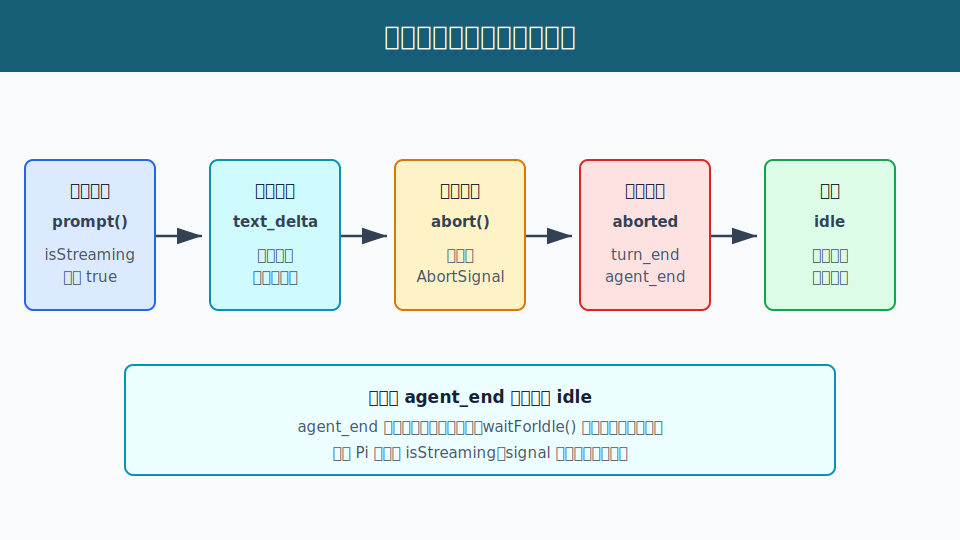

# s06：平稳停止（Graceful Stop）- 中止不该留下半截运行

[← s05 消息队列](../s05-message-queues/README.md) · [返回首页](../../README.md) · [s07 编码智能体 SDK →](../s07-coding-agent-sdk/README.md)

> **核心结论**：`Agent.abort()` 只请求取消当前运行；Pi 仍会把这一轮收束为带 `stopReason="aborted"` 的助手消息、`turn_end` 和 `agent_end`，最后才回到真正空闲的状态。

推荐前置：已完成 `learn-claude-code` 的错误恢复基础，并了解本项目 [s02 运行状态](../s02-agent-runtime-state/README.md)。本课不讨论“要不要取消一次模型请求”，只研究取消之后 Pi 怎样保证会话和界面不会停在半途中。

---

## 这节只学什么

本课只解决“用户停止生成或模型失败后，宿主怎样得到一个可保存、可恢复继续操作的结束状态”这个问题。

| 本课会看到 | 本课暂不展开 |
| --- | --- |
| `abort()` 触发当前运行的取消信号 | 如何选择重试、超时和用户确认策略 |
| `aborted`/`error` 仍产生结束消息与 `agent_end` | 工具执行到一半时如何回滚外部副作用 |
| `agent_end` 与真正 idle 的先后 | 多会话或跨进程的取消协调 |

本课只有一条主规则：**取消的是继续生成，不是取消收尾；Pi 必须先留下结束结果，再释放运行状态。**

## 问题

模型正在流式输出时，用户点击“停止”。如果程序只中断网络请求，却不处理之后的状态，会留下三个问题：

1. 界面可能一直显示“正在生成”。
2. 会话历史不知道这条助手消息是完成、失败还是被中止。
3. 下一次提问可能被误判为“上一轮还在执行”。

因此，`abort()` 不能等同于“什么都不记录地离开”。Pi 如何让中止成为一条正常、可观察的生命周期分支？

## 解决方案



*图：收到首个文字增量后，课程调用 `abort()`。模型流返回中止结果，Pi 仍发出结束事件；最后 `waitForIdle()` 等待真正清理运行状态。*

本课让真实模型先开始回答，第一次收到文字增量（`text_delta`）后立即调用 `agent.abort()`。离线测试用慢速 faux 流复现同样顺序。

| 时刻 | Pi 的职责 | 宿主能观察到什么 |
| --- | --- | --- |
| `prompt()` 开始 | 创建当前运行、设置 `isStreaming` | `agent_start`，运行中 |
| 首个文字增量 | 继续处理模型事件 | `message_update(text_delta)` |
| 调用 `abort()` | 触发当前 `AbortSignal` | 流返回 `stopReason="aborted"` |
| 流结束 | 保存结束助手消息，发出结束事件 | `turn_end`、`agent_end` |
| `waitForIdle()` 返回 | 清理 runtime 专属状态 | `isStreaming=false`，可以再次 `prompt()` |

重点是：`agent_end` 表示循环没有更多事件，并不等于所有监听器和内部清理都已结束。需要等待 `waitForIdle()`，才可以把界面可靠地切回可输入状态。

## 工作原理

完整教学代码在 [`code.ts`](code.ts)。真实模型装配只用于让入口默认可验证；本课真正观察的是同一个 `Agent` 从开始、中止、结束到空闲的状态变化。

### 第 1 步：先订阅，再发起这轮请求

```ts
const unsubscribe = agent.subscribe((event) => {
  eventTypes.push(event.type);
});

await agent.prompt(prompt);
```

订阅必须早于 `prompt()`。这样 `agent_start`、第一个文字增量、结束消息和 `agent_end` 都属于同一次观察。课程不会手写模型循环，也不会直接修改 `agent.state`。

### 第 2 步：首个文字增量后请求中止

```ts
if (event.type === "message_update" && event.assistantMessageEvent.type === "text_delta") {
  agent.abort();
}
```

`abort()` 只对当前活跃运行生效：它触发当前的 `AbortSignal`，由模型流和工具执行路径自行响应。空闲时调用它是 no-op，不会制造一条假的错误消息。

### 第 3 步：中止仍生成结束消息和结束事件

```text
assistant(stopReason="aborted")
  -> message_end
  -> turn_end
  -> agent_end
```

中止的模型流会交回一条 `stopReason="aborted"` 的 assistant 消息。Pi 把它追加到 transcript，并继续发出 `turn_end` 和 `agent_end`。所以宿主不需要猜测“这条半截回复算不算历史的一部分”。

模型服务本身失败时，形状相同，只是结束原因改为 `error`。本课的离线测试覆盖了这条失败路径，证明它同样不会让运行状态悬挂。

### 第 4 步：等待真正空闲，而不是只等 `agent_end`

```ts
await agent.prompt(prompt);
await agent.waitForIdle();

const idle = !agent.state.isStreaming && agent.signal === undefined;
```

在 Pi 内部，`agent_end` 的监听器仍可能异步运行；监听器完成后，`finishRun()` 才将 `isStreaming` 置为 `false`、清空 streaming message 和 active signal。`waitForIdle()` 正是宿主读取最终状态、重新启用输入控件的同步点。

> **可复述的规则**：`abort()` 提出停止请求；结束消息和 `agent_end` 收束这轮语义；`waitForIdle()` 才确认运行状态已释放。

## 试一下

本课需要 Node.js `>=22.19.0` 和有效的 Anthropic-compatible 配置。入口会在模型开始输出后立即中止，因此仍可能产生少量模型费用。

```bash
npm run lesson -- s06
```

模型文本和增量数量会随服务而变化，但输出顺序应类似：

```text
[步骤 1/4] 发起模型请求，并提前订阅本轮生命周期事件。
[步骤 2/4] Pi 开始本轮：运行状态切换为 isStreaming=true。
[步骤 3/4] 首个文字增量到达：调用 Agent.abort() 请求平稳停止。
[步骤 4/4] 收到 agent_end：此时 isStreaming=true，还要等待运行器真正回到空闲。
[步骤 4/4] waitForIdle 完成：isStreaming=false，signal=已释放。
结束原因：aborted
最终文本：<中止前已经收到的少量文本，或中止前没有完整文本>
```

观察重点：为什么 `agent_end` 那一行还是 `isStreaming=true`，而下一行已经是 `false`？这正是“循环结束”与“运行时释放”不同的证据。

离线测试不访问网络，也不读取 API Key：

```bash
npm run test:lesson -- s06
```

测试覆盖：

1. 首个文字增量后中止，仍得到 `aborted` assistant、`turn_end`、`agent_end` 和 idle 状态。
2. faux 模型没有回复时，Pi 仍以 `error` 结束并回到 idle。
3. 空闲时 `abort()` 是 no-op，`waitForIdle()` 立即完成。

## 接下来

现在我们知道单个 `Agent` 如何从取消或失败中恢复为空闲状态。

[s07 编码智能体 SDK](../s07-coding-agent-sdk/README.md) 会把这种 Agent 生命周期放进受控宿主：模型、认证、资源、会话和工具不再从用户目录隐式读取，而是由应用显式提供。

<details>
<summary>深入 Pi 源码</summary>

以下链接固定在 Pi `v0.80.6` 提交 [`2b3fda9921b5590f285165287bd442a25817f17b`](https://github.com/earendil-works/pi/tree/2b3fda9921b5590f285165287bd442a25817f17b)。

| 课程中的动作 | Pi 生产实现中的同一职责 |
| --- | --- |
| `Agent.abort()` 与 `agent.signal` | [`abort()` 和 `signal`](https://github.com/earendil-works/pi/blob/2b3fda9921b5590f285165287bd442a25817f17b/packages/agent/src/agent.ts#L302-L319) 只操作当前活跃运行的 abort controller。 |
| `agent_end` 仍显示运行中 | [`runWithLifecycle()`](https://github.com/earendil-works/pi/blob/2b3fda9921b5590f285165287bd442a25817f17b/packages/agent/src/agent.ts#L469-L492) 在 executor 完成后才进入 `finally` 的 `finishRun()`；[`processEvents()`](https://github.com/earendil-works/pi/blob/2b3fda9921b5590f285165287bd442a25817f17b/packages/agent/src/agent.ts#L514-L566) 先更新状态，再等待 listener。 |
| `aborted` 和 `error` 都发出结束事件 | [`runAgentLoop()`](https://github.com/earendil-works/pi/blob/2b3fda9921b5590f285165287bd442a25817f17b/packages/agent/src/agent-loop.ts#L192-L200) 对这两种结束原因统一发出 `turn_end`、`agent_end`。 |
| `waitForIdle()` 后才读取 idle | [`waitForIdle()`](https://github.com/earendil-works/pi/blob/2b3fda9921b5590f285165287bd442a25817f17b/packages/agent/src/agent.ts#L315-L320) 等待 active run 的 promise；[`finishRun()`](https://github.com/earendil-works/pi/blob/2b3fda9921b5590f285165287bd442a25817f17b/packages/agent/src/agent.ts#L512-L521) 释放 runtime 状态。 |
| 模型流遵守取消信号 | Pi 的 `StreamFn` 契约将当前 `signal` 传给模型流；课程 faux provider 只替换网络响应，不替换 Agent 生命周期。 |

教学代码没有深度导入这些内部函数；只用包根公开的 `Agent`、`abort()`、`waitForIdle()`、`signal` 和事件订阅接口来观察结果。

### 教学边界

本课没有执行真实工具或外部副作用。若工具已经启动，`abort()` 只能传播取消信号；文件写入、网络请求和部分外部命令能否撤销，仍取决于工具自身是否正确响应 signal。生产应用还应决定是否提供确认、重试、补偿或审计记录。

</details>
