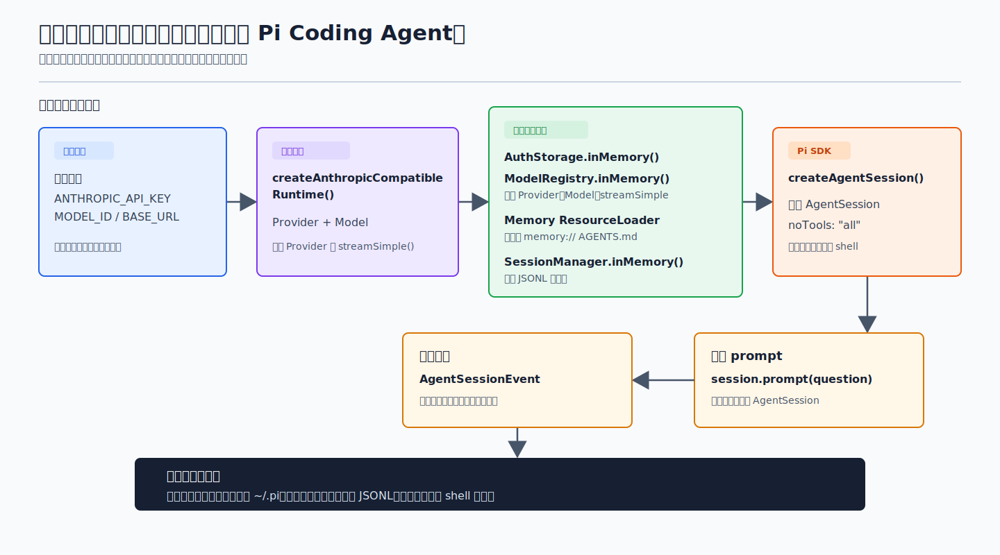

# s07：Coding Agent SDK - 把真实模型嵌入受控宿主

[← s03 Tool Execution Pipeline](../s03-tool-execution-pipeline/README.md) · [返回首页](../../README.md) · [s08 Session Tree →](../s08-session-tree/README.md)

> **核心结论**：`createAgentSession()` 负责装配 Pi 的 Agent 与 Session；宿主通过显式传入模型、资源、会话和设置，决定哪些外部状态可以进入这次运行。

推荐前置：完成 `learn-claude-code` 的 Agent Loop、Tool Use 基础，并了解本项目 s01 的真实模型流与 s03 的工具执行管线。本课不再重写循环，而是研究一个 IDE 插件、桌面应用或后端服务怎样复用 Pi Coding Agent 的装配入口。

---

## 问题

假设你正在做一个编辑器插件。用户点击“解释当前设计”后，宿主只需要发送一条问题、显示模型回复；它不希望顺带继承用户机器上的认证文件、历史会话、`AGENTS.md`、Skills 或默认配置。

直接创建 `Agent` 能发起模型请求，但宿主还得自己拼接系统提示、默认工具、消息 entry、空闲收束和 Session 生命周期。反过来，裸调用 `createAgentSession()` 又会使用 Pi CLI 的默认依赖：文件型认证、默认 `ModelRegistry`、`DefaultResourceLoader` 和会话持久化。

这里真正需要分开的不是“真实模型”和“测试模型”，而是两类边界：

1. 模型请求仍然应该走读者配置的真实 Anthropic-compatible Provider
2. 宿主本地状态必须由调用者明确提供，不能悄悄读取用户目录

Pi 的 SDK 是否能同时做到这两件事？

---

## 解决方案



*图：真实 Provider 仍会收到请求；认证、资源、会话和工具则由宿主逐项传入内存实现。图中顺序就是本课 [`code.ts`](code.ts) 的顺序。*

一句规则：**让模型请求保持真实，让所有宿主状态显式且短生命周期。**

| 关注点 | 本课的选择 | 可观察结果 |
| --- | --- | --- |
| 模型 | 共享 Anthropic-compatible runtime | `session.prompt()` 发起真实请求 |
| 认证与模型路由 | `AuthStorage.inMemory()`、`ModelRegistry.inMemory()` | 不读取 auth 或 models 配置文件 |
| 资源 | 内存 `ResourceLoader` | system prompt 只包含 `memory://` 资源 |
| 会话 | `SessionManager.inMemory()` | `sessionFile` 是 `undefined`，不写 JSONL |
| 工具 | `noTools: "all"` | 本课的真实请求不会读写工作目录或启动 shell |

这不是把 Pi 换成一个自制 Agent。`AgentSession`、事件、消息 entry 和空闲收束仍来自 Pi 的公开 SDK；教学代码只替换了宿主可控的输入边界。

---

## 工作原理

课程入口是 [`code.ts`](code.ts)。`createAnthropicCompatibleRuntime()` 只负责从环境取得“这次真实请求要用哪个模型”；它不会读写用户目录，也不会发请求。本课真正的因果链从 `createCodingAgentSession()` 开始：宿主先交出每一份外部状态的来源，再让 SDK 装配 session。

### 第 1 步：宿主显式交出所有本地状态来源

```ts
const authStorage = AuthStorage.inMemory();
authStorage.setRuntimeApiKey(runtime.model.provider, runtime.apiKey);

const sessionManager = SessionManager.inMemory(COURSE_CWD);
const resourceLoader = createMemoryResourceLoader();
```

这三行分别替换认证、会话和资源发现。`createMemoryResourceLoader()` 只返回 `memory://learn-pi-s07/AGENTS.md`；`SessionManager.inMemory()` 不会写 JSONL。换言之，模型凭据会留在内存，但 Pi CLI 的默认 auth 文件、历史会话、项目 `AGENTS.md` 和 Skills 都不是这次运行的隐式输入。

### 第 2 步：把同一个真实 Provider 桥接进 SDK 的 ModelRegistry

Coding Agent `v0.80.6` 的 SDK 通过自己的 `ModelRegistry` 找模型、取认证、调用兼容层的 `streamSimple()`。因此本课不把模型对象直接塞进一个隐藏 helper，而是把共享 runtime 的 Provider 明确桥接进 registry：

```ts
const provider = runtime.models.getProvider(runtime.model.provider);
if (!provider) {
  throw new Error("共享模型 runtime 中没有可注册的 Provider。");
}

modelRegistry.registerProvider(runtime.model.provider, {
  api: runtime.model.api,
  baseUrl: runtime.model.baseUrl,
  apiKey: runtime.apiKey,
  streamSimple: (model, context, options) => provider.streamSimple(model, context, options),
  models: [{
    id: runtime.model.id,
    name: runtime.model.name,
    api: runtime.model.api,
    baseUrl: runtime.model.baseUrl,
    reasoning: runtime.model.reasoning,
    input: runtime.model.input,
    cost: runtime.model.cost,
    contextWindow: runtime.model.contextWindow,
    maxTokens: runtime.model.maxTokens,
  }],
});
```

这段代码来自 `registerRuntimeModel()`。它不是另一个模型客户端：`streamSimple` 仍委托给同一个真实 Provider。注册完成后，`modelRegistry.find()` 取回 SDK 实际使用的模型。

### 第 3 步：SDK 只得到这些显式依赖

```ts
const { session } = await createAgentSession({
  cwd: COURSE_CWD,
  agentDir: COURSE_AGENT_DIR,
  model,
  thinkingLevel: "off",
  authStorage,
  modelRegistry,
  sessionManager,
  settingsManager: SettingsManager.inMemory({ compaction: { enabled: false } }),
  resourceLoader,
  noTools: "all",
});
```

这里的关键不是临时路径的名字，而是每一个会触碰本机状态的依赖都已替换：认证、模型注册表、设置、资源和 Session 都没有文件后端。

`createMemoryResourceLoader()` 只返回一份 `memory://learn-pi-s07/AGENTS.md` 内容。SDK 仍会把它与所选工具等信息组装为 `session.systemPrompt`，但不会扫描项目目录、用户目录、Skills 或扩展。

本课还传入 `noTools: "all"`。这是一次 SDK 装配课，不是文件工具课；这样真实模型即使误解问题，也没有 `read`、`bash`、`edit`、`write` 可调用。

### 第 4 步：从 AgentSession 发起一次真实 prompt

```ts
const unsubscribe = session.subscribe((event) => eventTypes.push(event.type));
try {
  await session.prompt(prompt);
  await session.waitForIdle();
} finally {
  unsubscribe();
}
```

`AgentSession` 会记录用户消息、转发 Agent 事件，并在请求结束后回到 idle。课程输出的事件类型来自这条真实 SDK 链路，而不是教学代码手写的时间线。

本课问题明确要求“不调用任何工具”；最终文本由你配置的模型生成，因此不把它伪装成固定答案。

### 第 5 步：失败收束后，释放这次动态注册

```ts
if (stopReason === "error" || stopReason === "aborted") {
  return reportFailure(output, setExitCodeOnFailure, result);
}

// ...

finally {
  sessionRuntime?.dispose();
}
```

`reportFailure()` 只输出一条通用诊断，不把 Provider 原始响应、请求 URL 或认证细节写到终端。`dispose()` 先释放 session，再执行 `modelRegistry.unregisterProvider()`，让本课的动态 Provider 不残留到下一次运行。

> **可复述的规则**：`createAgentSession()` 负责把 Pi 的运行部件接起来；宿主负责逐项给出模型、认证、资源、会话和工具边界。没有显式传入的宿主状态，就不应进入这次运行。

---

## 试一下

本课需要 Node.js `>=22.19.0` 和有效的 Anthropic-compatible 配置。运行器依次加载 `LEARN_PI_ENV_FILE` 指定文件、项目 `.env`、同级 `learn-claude-code/.env`；仓库不会提交其中任何密钥。

```bash
npm run lesson -- s07
```

真实模型调用可能产生费用。只想验证装配和边界行为时，直接运行下面的离线测试。

成功时，模型原文与完整事件序列会随 Provider 变化，但输出形状应为：

```text
模型: learn-pi-anthropic-compatible/<你的 MODEL_ID>
会话: 内存（不写入 JSONL）
资源: memory://learn-pi-s07/AGENTS.md
工具: (本课禁用)
问题: 用一段简短中文说明：...
事件: agent_start -> ... -> agent_end
结束原因: stop
最终文本: <真实模型生成的一段中文说明>
```

如果认证、模型名或兼容地址不正确，课程只会输出下面的通用信息，不会回显 Provider 原始错误：

```text
模型请求未完成。请检查模型 ID、认证信息、Base URL 和 Provider 兼容性。
```

再运行离线验证：

```bash
npm run test:lesson -- s07
```

观察重点：

1. `sessionFile` 没有值，但成功请求仍会经过 `AgentSession` 事件和消息 entry
2. `memory://` 资源会进入 `session.systemPrompt`，证明资源来自显式 loader 而不是本机扫描
3. 课程没有激活文件或 shell 工具，模型请求不会改变工作目录
4. 错误断言只比较通用诊断，不把底层 Provider 文本当作公开输出契约

可以设置 `LEARN_PI_PROMPT` 后再次运行，观察宿主只替换用户问题，而不改变模型、资源和会话边界：

```bash
LEARN_PI_PROMPT="用两句话解释 AgentSession 的职责，不要调用工具。" npm run lesson -- s07
```

---

## 接下来

现在已经确认：会话可以完整运行而不写入 JSONL。但“内存会话”还没有回答历史为何是 entry tree、如何从旧节点恢复，或怎样从某一条消息分叉。

s08 Session Tree 将直接操作 `SessionManager`：创建一条分支、切换 leaf，再比较持久化 entry tree 与当前模型 Context 的关系。

<details>
<summary>深入 Pi 源码</summary>

以下对应均固定在 Pi `v0.80.6` 对应提交 [`2b3fda9921b5590f285165287bd442a25817f17b`](https://github.com/earendil-works/pi/tree/2b3fda9921b5590f285165287bd442a25817f17b)。先把 `code.ts` 的每个边界对回生产职责：

| 课程中的一行或观察 | Pi 生产实现中的同一职责 |
| --- | --- |
| `AuthStorage.inMemory()`、`SettingsManager.inMemory()`、`SessionManager.inMemory()` | [`createAgentSession()`](https://github.com/earendil-works/pi/blob/2b3fda9921b5590f285165287bd442a25817f17b/packages/coding-agent/src/core/sdk.ts#L28-L406) 在调用方未提供依赖时才创建默认文件后端；本课显式传入内存实现，避免走这条默认路径。 |
| `registerRuntimeModel()` 中的 `registerProvider(... streamSimple)` | [`ModelRegistry.inMemory()`](https://github.com/earendil-works/pi/blob/2b3fda9921b5590f285165287bd442a25817f17b/packages/coding-agent/src/core/model-registry.ts#L383-L385) 与 [`registerProvider()`](https://github.com/earendil-works/pi/blob/2b3fda9921b5590f285165287bd442a25817f17b/packages/coding-agent/src/core/model-registry.ts#L850-L988) 让 SDK 找到本课传入的模型和同一个 Provider stream。 |
| `createMemoryResourceLoader()` 返回 `memory://.../AGENTS.md` | [`ResourceLoader` 公开契约](https://github.com/earendil-works/pi/blob/2b3fda9921b5590f285165287bd442a25817f17b/packages/coding-agent/src/core/resource-loader.ts#L39-L49) 是课程 loader 实现的接口；[`AgentSession` 重建 system prompt](https://github.com/earendil-works/pi/blob/2b3fda9921b5590f285165287bd442a25817f17b/packages/coding-agent/src/core/agent-session.ts#L983-L1017) 从该 loader 汇合资源与工具信息。 |
| `noTools: "all"` | 同一个 `createAgentSession()` 装配入口根据宿主设置决定 active tools；课程最终打印的 `(本课禁用)` 来自 `session.getActiveToolNames()`。 |
| `session.prompt()`、`waitForIdle()` 与事件数组 | `AgentSession` 把运行交给 Pi Agent，保留事件和内存 entry；这就是课程能在不写 JSONL 的前提下打印 `agent_start -> ... -> agent_end` 的原因。 |
| `sessionRuntime.dispose()` | 课程先释放 session，再用 `unregisterProvider()` 回收动态注册，避免本次内存 ModelRegistry 的 Provider 留到下一次运行。 |

调用链可以压缩成：

```text
共享 Provider/Model
  -> ModelRegistry.registerProvider(... streamSimple)
  -> createAgentSession(... in-memory dependencies)
  -> AgentSession.prompt()
  -> Pi Agent -> 真实 Provider stream
  -> AgentSession event / 内存 entry
```

### 为什么还要注册到 ModelRegistry？

`pi-ai` 的新 API 用 `Models` 持有 Provider；而 Coding Agent `v0.80.6` 的 SDK 请求路径仍由 `ModelRegistry` 解析认证后，经兼容层的 `streamSimple()` 发出请求。本课的桥接只把同一个 Provider 的 `streamSimple` 和模型描述注册到 SDK，不创建第二个网络客户端。

这是上游当前的兼容边界，不建议应用代码深度导入 `pi-ai/compat`。课程只使用两个公开包入口：本项目共享核心中的 `pi-ai` Provider factory，以及 `pi-coding-agent` 的 `ModelRegistry.registerProvider()`。

在 `v0.80.6` 中，动态注册最终会更新兼容层的模块级 Provider 路由。本课只创建一个短生命周期 session，并在 `dispose()` 时注销它；这不等于多个并发宿主实例天然拥有彼此隔离的动态 Provider。需要并发多会话时，应在应用层明确管理 provider 的生命周期和命名。

### 本课与默认 CLI 的差异

| 默认 CLI 可能使用 | 本课传入 | 目的 |
| --- | --- | --- |
| 文件型 auth 与 `models.json` | 内存 auth 与 registry | 不读取用户模型配置 |
| `DefaultResourceLoader` | 单一内存资源 | 不发现 AGENTS、Skills、Prompt、Extension |
| JSONL Session | `SessionManager.inMemory()` | 不写入历史会话 |
| 默认 coding tools | `noTools: "all"` | 不读写项目、不开 shell |
| 真实 Provider | 真实 Provider | 保留实际模型请求和事件路径 |

这些是本课的宿主策略，不是 Pi 对所有嵌入式应用的硬性要求。生产应用可按自己的权限模型传入受限工具、持久化 Session 或受控资源 loader。

### 测试为什么使用 faux？

课程入口默认走真实模型；测试则从 [`s07-coding-agent-sdk-test-fixture.ts`](../../src/testing/s07-coding-agent-sdk-test-fixture.ts) 注入确定性 faux runtime，验证相同的 `createCodingAgentSession()` 装配链，不消耗 API 费用。夹具还构造一次空响应，确保公开输出保持通用失败信息。

faux 只存在于测试夹具与 [`code.test.ts`](code.test.ts)，不参与 `npm run lesson -- s07` 的主路径。

</details>
