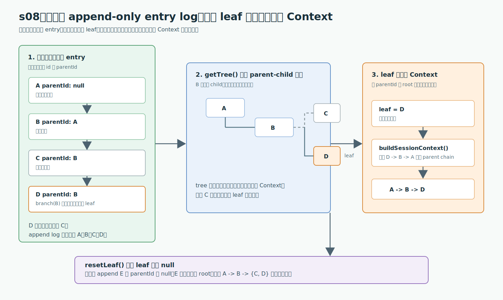

# s08：Session Tree - 历史只追加，leaf 决定当前 Context

[返回首页](../../README.md)

[s07 Coding Agent SDK](../s07-coding-agent-sdk/) -> **s08 Session Tree** -> s09 Session Compaction

> **Pi 不会用数组替换会话历史。**每次操作新增一个 entry，`leaf` 只选择“现在从哪一条根到叶的路径重建 Context”。

推荐前置：已完成 `learn-claude-code` 的上下文压缩与 memory 课程。本课不再解释为什么需要保留历史，而是直接观察 Pi `SessionManager` 怎样用 `id`、`parentId` 和 `leaf` 表示它。

---

## 问题

已有一段对话：用户提出 A，助手回答 B，用户沿这个答案继续提出 C。

后来发现 C 的方向不对，想从 B 重新提出 D。普通聊天数组只能选择覆盖 C，或复制 `A + B` 再开一个数组。这两种做法都无法同时回答两个问题：旧方向还在吗？当前模型会看到哪一段历史？

Pi 的会话不是“当前消息数组”。它是所有 entry 组成的一棵树，外加一个指向当前 entry 的 `leaf`。

## 解决方案



*图：左侧是追加顺序，中间是由 `parentId` 组装出的完整树，右侧是 leaf D 投影得到的当前 Context。*

每个 entry 记录自己的 `id` 和 `parentId`。`branch(B)` 不修改 C，只把 `leaf` 移回 B；随后 append D 时，D 自然成为 B 的第二个 child。

| 操作 | entry 是否新增 | leaf | 当前 Context |
| --- | --- | --- | --- |
| append A -> B -> C | 每次 append 一个 | C | A -> B -> C |
| `branch(B)` | 否 | B | A -> B |
| append D | 新增 D，`parentId = B` | D | A -> B -> D |
| `resetLeaf()` 后 append E | 新增 E，`parentId = null` | E | E |

关键规则：**树保留所有方向；Context 只取从当前 leaf 回溯到 root 的那一条路径。**

## 工作原理

完整教学代码在 [`code.ts`](code.ts)。它不调用模型、不读取 `~/.pi`，只使用 `SessionManager.inMemory()`；因此这是一个可以直接运行的 Session 数据结构课程。

### 第 1 步：创建不落盘的 SessionManager

```ts
const session = SessionManager.inMemory("learn-pi-s08-session-tree");
```

`inMemory()` 仍会创建 session header、分配 entry id、维护 `byId` 索引和 leaf 指针，只是 `persist` 为 `false`。所以 `sessionFile` 是 `undefined`，不会写 JSONL。

### 第 2 步：顺序 append A、B、C

```ts
const a = session.appendMessage({
  role: "user",
  content: "A: 先说明当前方案。",
  timestamp: 0,
});

const b = session.appendMessage(
  fauxAssistantMessage("B: 当前方案已经建立。", { timestamp: 0 }),
);

const c = session.appendMessage({
  role: "user",
  content: "C: 沿原方向继续。",
  timestamp: 0,
});
```

`appendMessage()` 使用当前 leaf 作为新 entry 的 `parentId`，然后把 leaf 推进到刚生成的 entry。因此此时关系是：

```text
A.parentId = null
B.parentId = A
C.parentId = B
```

`fauxAssistantMessage()` 在这里仅构造一条符合 Pi `AssistantMessage` 形状的离线消息，不会注册 provider，也不会发送模型请求。

### 第 3 步：回到 B，新 append D

```ts
session.branch(b);

const d = session.appendMessage({
  role: "user",
  content: "D: 改走另一条方向。",
  timestamp: 0,
});
```

`branch(b)` 的全部行为是把 leaf 设为 B。C 仍然存在；D 的 `parentId` 是 B，因此 C 和 D 成为 sibling。

```text
A
`- B
   |- C   旧方向，仍在树中
   `- D   新方向，也是当前 leaf
```

### 第 4 步：从不同 leaf 重建不同 Context

```ts
const currentContext = session.buildSessionContext();
const originalBranchContext = buildSessionContext(session.getEntries(), c);
```

前者使用当前 leaf D，得到 `A -> B -> D`；后者显式传入 C，得到 `A -> B -> C`。

两次调用都没有修改 tree。`buildSessionContext()` 先从 leaf 沿 `parentId` 回溯，再将路径翻转成 root 到 leaf 的消息序列。s09 会在这条路径上加入 compaction entry；本课先只研究无压缩的基本形态。

### 第 5 步：reset leaf 后创建新的 root

```ts
session.resetLeaf();

const e = session.appendMessage({
  role: "user",
  content: "E: 从空 leaf 开始的新根。",
  timestamp: 0,
});
```

`resetLeaf()` 把 leaf 设为 `null`，不删除 A、B、C、D。紧随其后的 E 的 `parentId` 为 `null`，所以 session 现在有两个 root；当前 Context 只包含 E。

## 试一下

本课需要 Node.js `>=22.19.0`。它不发起模型请求，因此不读取也不需要 `ANTHROPIC_API_KEY`。

运行教学代码：

```bash
npm run lesson -- s08
```

你会看到：

```text
追加顺序: A -> B -> C，再从 B 分叉 D
当前 leaf: D
完整 entry tree:
  A [message]
     `- B [message]
        |- C [message]
        `- D [message] <leaf>
当前 Context: A -> B -> D
指定 C 重建 Context: A -> B -> C
resetLeaf() 后追加: E
新 Context: E
所有 root: A, E
```

运行测试：

```bash
npm run test:lesson -- s08
```

观察重点：

1. C 在 tree 中保留，却不会出现在 leaf 为 D 的 Context
2. `buildSessionContext(entries, c)` 能在不移动当前 leaf 的情况下查看旧方向
3. `resetLeaf()` 不是清空会话，而是让下一条 append 成为新的 root

可以尝试在 [`code.ts`](code.ts) 中把 `session.branch(b)` 改成 `session.branch(a)`。D 会变成 B 的 sibling，两个 Context 的共同前缀也会缩短为 A。

## 接下来

现在我们知道当前 Context 只是 Session Tree 的一条路径。

但当这条路径过长时，Pi 不会删除旧 entry，而是添加 compaction entry，让 Context 投影从摘要和保留区重新开始。s09 Session Compaction 会追踪这个 cut point 如何改变 Context，而树本身为何仍然完整。

<details>
<summary>深入 Pi 源码</summary>

### 课程代码与生产职责的对照

以下链接固定到 Pi `v0.80.6` 对应提交 [`2b3fda9921b5590f285165287bd442a25817f17b`](https://github.com/earendil-works/pi/tree/2b3fda9921b5590f285165287bd442a25817f17b)。

| 课程中看得见的动作 | Pi 生产实现中的同一职责 |
| --- | --- |
| `appendMessage(A -> B -> C)` | `appendMessage()` 以当前 leaf 作为 parent，追加 entry 后更新 leaf；历史不会被覆盖。 |
| `branch(B)` 后追加 D | `branch()` 只移动当前 leaf，下一次 append 因而从 B 生长出新分支。 |
| `getTree()` | 根据每条 entry 的 `parentId` 重新组装完整树；当前 Context 不是这棵树的替代品。 |
| `buildSessionContext(entries, D)` | 从选定 leaf 向 root 回溯，只把该路径投影为给模型的 Context。 |
| `resetLeaf()` | 只清除当前 leaf，让下一次 append 成为新 root；旧 entry 仍保留。 |

一句话：**append log 保存所有可能历史，leaf 只选择其中哪一条路径成为当前 Context。** 下面的固定链接用来核查这五个动作，而不是另一套更复杂的机制：

- [包根公开 Session API](https://github.com/earendil-works/pi/blob/2b3fda9921b5590f285165287bd442a25817f17b/packages/coding-agent/src/index.ts#L220-L245)：`SessionManager`、`SessionEntry`、`SessionTreeNode` 和 `buildSessionContext()` 都从这里导出。
- [`SessionEntry`、`SessionTreeNode` 与 `SessionContext` 类型](https://github.com/earendil-works/pi/blob/2b3fda9921b5590f285165287bd442a25817f17b/packages/coding-agent/src/core/session-manager.ts#L46-L168)：每个 entry 都有 `id` 与 `parentId`。
- [`appendMessage()` 如何使用当前 leaf](https://github.com/earendil-works/pi/blob/2b3fda9921b5590f285165287bd442a25817f17b/packages/coding-agent/src/core/session-manager.ts#L975-L998)：append 后更新 `byId` 和 leaf。
- [`getBranch()` 与实例 `buildSessionContext()`](https://github.com/earendil-works/pi/blob/2b3fda9921b5590f285165287bd442a25817f17b/packages/coding-agent/src/core/session-manager.ts#L1184-L1215)：两者都从 leaf 向 root 回溯。
- [`getTree()` 如何从 append log 组装 tree](https://github.com/earendil-works/pi/blob/2b3fda9921b5590f285165287bd442a25817f17b/packages/coding-agent/src/core/session-manager.ts#L1234-L1277)：child 按 timestamp 排序，孤儿 entry 会显示为 root。
- [`branch()` 与 `resetLeaf()`](https://github.com/earendil-works/pi/blob/2b3fda9921b5590f285165287bd442a25817f17b/packages/coding-agent/src/core/session-manager.ts#L1283-L1303)：两者只移动 leaf，不会删除历史。
- [独立 `buildSessionContext()` 的 path 投影](https://github.com/earendil-works/pi/blob/2b3fda9921b5590f285165287bd442a25817f17b/packages/coding-agent/src/core/session-manager.ts#L321-L465)：它从 entries 与可选 leafId 构建消息 Context。
- [`SessionManager.inMemory()`](https://github.com/earendil-works/pi/blob/2b3fda9921b5590f285165287bd442a25817f17b/packages/coding-agent/src/core/session-manager.ts#L1478-L1481)：传入 `persist = false`，所以不会创建 session 文件。

### 真实持久化与本课的差异

真实 CLI 使用持久化 `SessionManager`，将 header 和 entry 追加到 JSONL；本课选择 `SessionManager.inMemory()`，保留相同的 id、parentId、leaf、branch 和 Context 投影逻辑，但不产生文件。

本课没有使用 `AgentSession`，也没有套用 agent-core 的 harness 类型。它直接调用 `pi-coding-agent` 的公开 `SessionManager` API，避免把“Agent 执行”与“会话树”两个层次混在一起。

### 两条容易混淆的边界

1. `branch("不存在的 id")` 会抛出 `Entry <id> not found`，本课测试覆盖了这条失败路径。
2. 独立 `buildSessionContext(entries, "不存在的 id")` 不会抛错；它会回退到 entries 的最后一项。UI 如果要验证用户选择的 entry，应先调用 `session.getEntry(id)`，不能把这个回退行为当作合法选择。

### 本课尚未涉及的 entry

`model_change`、`thinking_level_change`、`custom`、`branch_summary` 和 `compaction` 也都会成为 tree 节点，但它们对 Context 的投影不同。s09 会继续处理 compaction 与 branch summary；ResourceLoader 与 Extension 写入的 custom entry 则留给后续对应课程。

</details>
