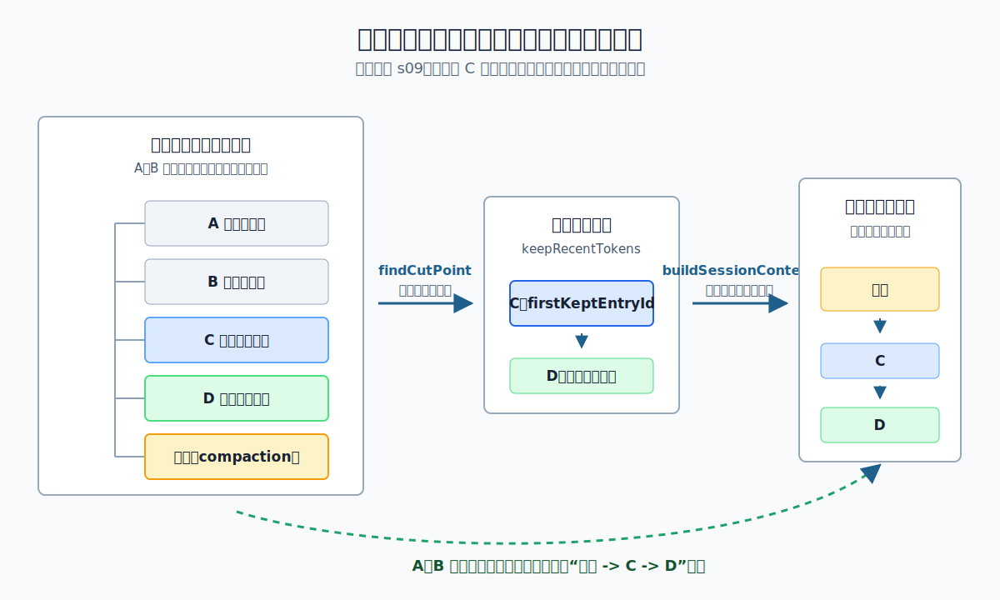

# s09：会话压缩（Session Compaction）- 摘要替代上下文，不删除原始树

[← s08 会话树](../s08-session-tree/README.md) · [返回首页](../../README.md) · [s10 资源加载器 →](../s10-resource-loader/README.md)

> **核心结论**：Pi 不会把旧会话条目删掉；它把一条压缩条目（`compaction entry`）追加到树尾，用摘要代表较早历史，再从 `firstKeptEntryId` 开始保留最近记录，重建下一次模型上下文。

推荐前置：完成 `learn-claude-code` 的 Context Compact，并读过本项目 [s08 会话树](../s08-session-tree/README.md)。本课不重复讲“为什么上下文会变长”，而是只追踪 Pi 怎样在一棵已存在的会话树上新增摘要、选择切点并重建模型可见记录。

---

## 这节只学什么

本课只解决：**一条会话路径过长时，怎样保留原始条目，又让下一次模型请求从摘要和最近回合继续。**

| 本课会看到 | 读者已经掌握 | 本课暂不解决 |
| --- | --- | --- |
| 何时超过阈值、怎样找到保留区起点 | `leaf` 决定当前会话路径 | 摘要文字是否高质量、是否遗漏信息 |
| 怎样追加 `compaction entry` 并重建 `摘要 -> 最近记录` | 会话树不会覆盖旧分支 | 自动重试、取消、扩展 Hook 和溢出恢复 |
| 切点在完整回合与回合中间的不同处理 | user / assistant / tool result 的基本关系 | 分支摘要和多次压缩的合并策略 |

本课只有一条主规则：**压缩是“新增摘要条目并改变当前上下文投影”，不是“删除旧会话记录”。**

## 问题

已有一段会话路径：旧用户问题 A、旧助手回答 B、当前用户问题 C、当前助手回答 D。

```text
A -> B -> C -> D
```

如果下一次请求还把 A 到 D 全部带给模型，输入可能超过模型可用窗口。最直接的做法是删除 A、B，但这会让会话树失去可检查的原始记录，也使之后的分支、导出或重新压缩失去依据。

Pi 需要同时保住两件事：

1. A、B、C、D 仍是会话树中的真实条目。
2. 下一次模型请求不必再带 A、B 的原文，却仍要知道它们的关键信息。

如何在不改写历史的前提下缩短当前模型上下文？

## 解决方案



*图：A、B、C、D 和新增摘要都留在同一条会话路径中。`firstKeptEntryId` 指向 C；重建模型上下文时，Pi 排出“摘要 -> C -> D”，而不是把 A、B 原文重新发送。*

本课把“摘要已经生成成功”固定成一句可重复的检查点文本，然后只观察 Pi 的会话机制。它的顺序是：

| 阶段 | Pi 的职责 | 本课可观察结果 |
| --- | --- | --- |
| 判断 | `shouldCompact()` 比较当前 token 与 `contextWindow - reserveTokens` | 刚好达到阈值不会压缩；超过才触发 |
| 选择 | `findCutPoint()` 从路径末端反向累计，找到 `firstKeptEntryId` | C 是完整保留回合的起点 |
| 追加 | `appendCompaction()` 把摘要作为新条目追加到 D 之后 | 原条目数从 4 变成 5，不会变成 3 |
| 重建 | `buildSessionContext()` 使用最新压缩条目和保留区 | 模型上下文变成 `摘要 -> C -> D` |

一句话：**树里保存 A、B、C、D 和摘要；模型只从“摘要 + 切点后的保留区”继续。**

## 工作原理

完整教学代码在 [`code.ts`](code.ts)。这是会话数据结构课程，不调用真实模型，也不读取 API Key。`fauxAssistantMessage()` 只构造一条静态、类型正确的 assistant 消息；它不会注册 Provider 或发出模型请求。

### 第 1 步：先判断短上下文是否真的需要压缩

```ts
const threshold = scenario.contextWindow - scenario.settings.reserveTokens;
const shortContextWouldCompact = shouldCompact(
  threshold,
  scenario.contextWindow,
  scenario.settings,
);
```

Pi 的判断是严格的大于号：`contextTokens > contextWindow - reserveTokens`。所以 token 数刚好等于阈值时，仍不压缩。本课接着让同一条路径的估算 token 超过阈值，才进入切点选择。

这一步只决定“是否值得压缩”，不生成摘要，也不改动会话树。

### 第 2 步：从末端反向累计，选择完整回合 C -> D

```ts
const cut = findCutPoint(entries, 0, entries.length, keepRecentTokens);
const firstKept = entries[cut.firstKeptEntryIndex];
```

课程数据把最近预算刚好设为 C 和 D 的大小。因此从 D 向前累计后，切点落在 C：C 是 user 消息，D 是同一回合的 assistant 回答。

```text
要被摘要代表：A -> B
继续保留原文：C -> D
```

本例输出 `isSplitTurn=false`。也就是说，固定摘要不会把半个回合塞进摘要、另一半留在原文里。

### 第 3 步：摘要生成成功后，追加压缩条目

```ts
const entryId = scenario.session.appendCompaction(
  summary,
  firstKept.id,
  contextTokens,
);
```

`appendCompaction()` 的关键不是替换数组，而是创建一条新 entry：它的 `parentId` 是当前末端 D，`firstKeptEntryId` 指向已有的 C。课程使用固定摘要，是为了把注意力放在这条会话写入上。

追加后，完整路径是：

```text
A -> B -> C -> D -> 摘要
```

注意摘要条目在树里排在 D **之后**，但模型上下文不会照追加顺序简单发送。下一步会解释这个看似反直觉的顺序。

### 第 4 步：重建模型上下文时，把摘要放在保留区之前

```ts
const contextEntries = scenario.session.buildContextEntries();
const rebuilt = buildSessionContext(
  scenario.session.getEntries(),
  scenario.session.getLeafId(),
);
```

`buildContextEntries()` 先沿当前 `leaf` 回溯路径，找到**最新**的压缩条目；然后输出三部分：

```text
摘要条目
-> 从 firstKeptEntryId=C 开始、压缩条目之前的记录：C -> D
-> 压缩条目之后的新记录（本例还没有）
```

因此 `buildSessionContext()` 产生的消息角色是：

```text
compactionSummary -> user -> assistant
```

这才是 Pi 交给后续 Agent/模型链路的当前会话上下文；A、B 仍可从完整会话树找到，但不再作为原文进入本轮上下文。

### 第 5 步：若切点会拆开回合，不能直接写半截摘要

本课的主路径故意让 C 成为切点，保证保留区从一个完整回合开始。上游也允许切点落在 assistant 消息，但绝不会在 `toolResult` 上切断工具调用关系。

当 `findCutPoint()` 返回 `isSplitTurn=true` 时，生产代码会先把 user 到切点前的“回合前缀”单独总结，再与旧历史摘要合并。教学入口不会假装固定一句摘要就能安全覆盖这种情况：它返回 `requires-turn-prefix`，不追加压缩条目。

> **可复述的规则**：会话管理器负责追加摘要与保留原始树；切点负责指出最近原文从哪里开始；上下文重建负责把摘要放在这段原文之前。

## 试一下

本课需要 Node.js `>=22.19.0`。它是完全本地、确定性的演示，不读取 `.env`，也不会调用任何模型。

```bash
npm run lesson -- s09
```

输出中的 token 数由课程固定消息的估算值决定，结果如下：

```text
[步骤 1/5] 短上下文 195 tokens 到达阈值但不超过它：不压缩。
[步骤 1/5] 当前路径 260 tokens 超过阈值 195：需要压缩。
[步骤 2/5] 从末端反向累计后，切点选中 C：保留完整回合 C -> D。
[步骤 2/5] isSplitTurn=false，因此本例不需要额外的回合前缀摘要。
[步骤 3/5] 固定检查点摘要已作为 compaction entry 追加到当前末端之后。
[步骤 3/5] 摘要的 parent 是 D，firstKeptEntryId 指向 C。
[步骤 4/5] 从当前末端重建模型上下文：摘要 -> C -> D
[步骤 4/5] 模型消息角色：compactionSummary -> user -> assistant
[步骤 5/5] 完整会话树的追加顺序仍是：A -> B -> C -> D -> 摘要
[步骤 5/5] A 与 B 没有被删除；它们只是由摘要替代，不再进入当前模型上下文。
```

观察问题：摘要 entry 明明在 D 后追加，为什么步骤 4 却把它放在 C、D 前？答案是 `firstKeptEntryId` 不表示“删除前面的条目”，而是告诉上下文重建器“从这里开始恢复原文”。

运行离线验证：

```bash
npm run test:lesson -- s09
```

测试覆盖四种情况：

1. token 数刚好达到阈值时，不新增压缩条目。
2. 切点位于 C 的 user 边界时，C -> D 作为完整回合保留。
3. 若预算会把切点放进回合，教学入口拒绝写入半截固定摘要，要求回合前缀摘要。
4. 离线 faux Provider 返回摘要错误时，公开 `generateSummary()` 抛出 Pi 的摘要失败错误，不伪造成功检查点。

可以把 [`code.ts`](code.ts) 中 `scenario.settings.keepRecentTokens` 临时改小，观察 `requires-turn-prefix` 分支；或把 `reserveTokens` 改大，观察相同会话在更早的阈值触发压缩。

## 接下来

现在我们知道：会话树中的历史可以一直保留，而当前模型上下文由摘要与最近保留区重新投影。

下一步会研究资源加载器：系统提示、项目说明和可选资源又是怎样进入一次 AgentSession 的，而它们为什么不应该混进会话条目树。完整课程顺序见 [课程路线图](../../COURSE_PLAN.md#s10-资源加载器resourceloader)。

<details>
<summary>深入 Pi 源码</summary>

以下对应均固定在 Pi `v0.80.6` 提交 [`2b3fda9921b5590f285165287bd442a25817f17b`](https://github.com/earendil-works/pi/tree/2b3fda9921b5590f285165287bd442a25817f17b)。课程只使用公开 package exports；下表说明它们在生产实现中对应的职责：

| 课程中的动作 | Pi 生产实现中的同一职责 |
| --- | --- |
| 步骤 1 的 `shouldCompact()` | [`shouldCompact()`](https://github.com/earendil-works/pi/blob/2b3fda9921b5590f285165287bd442a25817f17b/packages/coding-agent/src/core/compaction/compaction.ts#L209-L212) 只检查开关与严格阈值，不做写入。 |
| 步骤 2 的 `findCutPoint()` | [`findCutPoint()`](https://github.com/earendil-works/pi/blob/2b3fda9921b5590f285165287bd442a25817f17b/packages/coding-agent/src/core/compaction/compaction.ts#L377-L435) 从末端估算保留区；它不会在 tool result 上切，并报告 `isSplitTurn`。 |
| 步骤 3 的 `appendCompaction()` | [`SessionManager.appendCompaction()`](https://github.com/earendil-works/pi/blob/2b3fda9921b5590f285165287bd442a25817f17b/packages/coding-agent/src/core/session-manager.ts#L1027-L1047) 创建 `type: "compaction"` 的新 entry，并将当前 `leaf` 推进到它。 |
| 步骤 4 的“摘要 -> C -> D” | [`buildContextEntries()`](https://github.com/earendil-works/pi/blob/2b3fda9921b5590f285165287bd442a25817f17b/packages/coding-agent/src/core/session-manager.ts#L407-L450) 选用路径中最新摘要，再接从 `firstKeptEntryId` 开始的原文；[`buildSessionContext()`](https://github.com/earendil-works/pi/blob/2b3fda9921b5590f285165287bd442a25817f17b/packages/coding-agent/src/core/session-manager.ts#L452-L466) 将这些 entry 投影成运行时消息。 |
| 步骤 5 的“完整树仍存在” | [`SessionManager` 的只追加模型](https://github.com/earendil-works/pi/blob/2b3fda9921b5590f285165287bd442a25817f17b/packages/coding-agent/src/core/session-manager.ts#L781-L789) 保持 entry tree 与当前模型上下文为两层不同视图。 |

### 生产摘要与教学固定摘要的差异

真实 `AgentSession.compact()` 先调用压缩准备逻辑，收集要摘要的消息、上一轮摘要和文件操作；随后 [`compact()`](https://github.com/earendil-works/pi/blob/2b3fda9921b5590f285165287bd442a25817f17b/packages/coding-agent/src/core/compaction/compaction.ts#L740-L826) 才通过模型生成摘要，成功后由会话管理器追加 entry。

本课故意不把这次模型调用放进主线。它使用固定的“已生成摘要”，使读者能反复观察切点、追加与重建，而不会受模型费用或摘要措辞影响。离线测试仍通过公开 `generateSummary()` 验证摘要失败会被标记为失败，不能当作成功摘要继续写入。

### 回合边界不是简单的“只能从 user 开始”

`findCutPoint()` 允许从 assistant 切入，但不会从 `toolResult` 切入。切进回合时，内部的 [`prepareCompaction()`](https://github.com/earendil-works/pi/blob/2b3fda9921b5590f285165287bd442a25817f17b/packages/coding-agent/src/core/compaction/compaction.ts#L633-L711) 将前缀与更早历史拆开；`compact()` 生成额外的回合前缀摘要，再把它们合并。课程用 `requires-turn-prefix` 明确暴露这条边界，而不是把它误写成“Pi 永远从 user 切”。

### 教学边界

这里没有持久化 JSONL、没有自动压缩触发时机、没有取消/重试，也没有多次压缩后的摘要更新。课程为可重复演示，直接累加公开 `estimateTokens()` 的结果；生产 [`prepareCompaction()`](https://github.com/earendil-works/pi/blob/2b3fda9921b5590f285165287bd442a25817f17b/packages/coding-agent/src/core/compaction/compaction.ts#L659-L711) 会优先结合最近有效 assistant usage 与尾部估算。它们依赖 `AgentSession`、设置、模型调用与扩展事件；本课只固定“已有摘要如何成为一条会话 entry，以及这条 entry 怎样改变当前上下文”的核心因果链。

</details>
