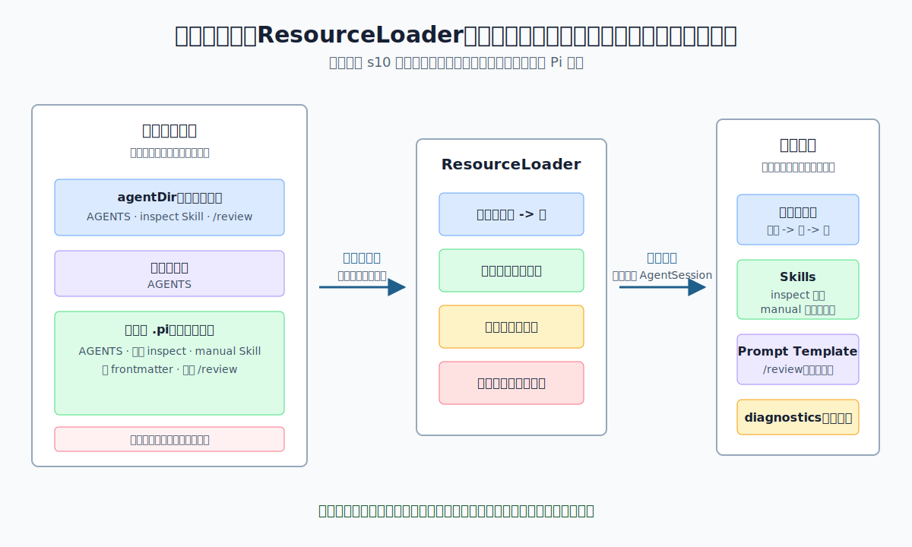

# s10：资源加载器（ResourceLoader）- 来源决定顺序，冲突留下诊断

[← s09 会话压缩](../s09-session-compaction/README.md) · [返回首页](../../README.md) · s11 扩展运行时（规划中）

> **核心结论**：Pi 把上下文文件、技能（Skills）和提示词模板（Prompt Templates）当作有来源、有范围的资源来加载；它按既定顺序保留第一个同名资源，并把碰撞和格式问题作为诊断留下，而不是悄悄覆盖。

推荐前置：已完成 `learn-claude-code` 的 Skill Loading 与 System Prompt 基础，并读过本项目 [s07 编码智能体 SDK](../s07-coding-agent-sdk/README.md)。本课不重新实现“扫描一个目录、读一份 Markdown”，而是关注 Pi 怎样决定**哪些目录有资格参与、谁先加载、冲突怎么解释**。

---

## 这节只学什么

本课只解决：**宿主启动一个 Pi Coding Agent 前，怎样确定上下文文件、技能和提示词模板的范围、顺序与可检查的错误。**

| 本课会看到 | 读者已经掌握 | 本课暂不解决 |
| --- | --- | --- |
| agent 配置、父目录、子项目的上下文文件顺序 | Skill 与系统提示能影响一次 Agent 运行 | 模型怎样使用这些文字回答问题 |
| 同名 Skill/Prompt 的赢家与 collision 诊断 | Markdown frontmatter 的基本用途 | Extension 怎样注册工具和事件，留给 s11 |
| `noSkills`、`noPromptTemplates`、`noContextFiles` 的加载边界 | SDK 可注入自定义 `ResourceLoader` | 包安装、信任确认和远程资源下载 |

本课只有一条主规则：**资源来源决定加载顺序；同名资源不互相覆盖，问题通过 diagnostics 暴露。**

## 问题

一个真实项目往往同时有多份说明：工具的 agent 配置目录有通用规则，项目根目录有团队规则，子目录又有局部规则。与此同时，两个目录可能各有一个叫 `inspect` 的 Skill，两个位置也可能都有 `/review` 提示词模板。

如果启动时只“把找到的文件全拼起来”，至少会留下三个无法回答的问题：

1. 父规则与子规则谁先进入系统提示？
2. 两个同名 `inspect`，模型或命令实际会使用哪一个？
3. 一个 Skill 的 frontmatter 写坏了，为什么资源列表突然少了一项？

Pi 不能把这些选择藏在文件遍历的偶然顺序里。它需要让资源有清晰来源、稳定顺序和可读取的诊断。

## 解决方案



*图：临时 agent 配置、父目录和子项目提供资源。ResourceLoader 根据各类资源的规则合并它们；赢家进入可用结果，碰撞和格式错误仍保留为 diagnostics。*

本课在操作系统临时目录创建一个完全隔离的小项目。临时 `agentDir` 模拟“用户范围”，项目目录包含父级和子级说明；代码从不读取真实用户目录、`~/.pi`、工作区历史或 `.env`。

| 资源 | 本课的来源顺序 | 同名时的结果 |
| --- | --- | --- |
| 上下文文件 | 临时 `agentDir` -> 父目录 -> 子目录 | 不按名字去重，三份按范围从外到内保留 |
| Skills | 临时 `agentDir/skills` -> 子项目 `.pi/skills` | 第一个 `inspect` 保留，项目同名项形成 collision |
| Prompt Templates | 显式路径列表：agent 范围 -> 项目范围 | 第一个 `/review` 保留，后一个形成 collision |

本课的可复述规则：**上下文文件允许叠加；命名资源需要唯一，Pi 选择先到者并报告后到者。**

## 工作原理

完整教学代码在 [`code.ts`](code.ts)。它是一次本地资源发现演示，不会创建 Agent、不会调用模型，也不需要 API Key。`finally` 块会删除整个临时项目目录。

### 第 1 步：上下文文件按“配置 -> 父 -> 子”排列

```ts
const contextFiles = loadProjectContextFiles({
  cwd: fixture.cwd,
  agentDir: fixture.agentDir,
});
```

课程写入三份 `AGENTS.md`：临时 agent 配置中的“全局”、项目父目录中的“父”、子目录中的“子”。`loadProjectContextFiles()` 先读取显式 `agentDir`，再从当前目录向上找说明文件，最后把祖先列表反转为从父到子的顺序。

因此步骤 1 的结果稳定为：

```text
全局 -> 父 -> 子
```

这里没有“同名只能保留一个”的规则，因为上下文文件的目的正是按范围叠加规则。子目录的内容位于最后，因而在阅读时最接近当前工作目录。

### 第 2 步：同名 Skill 保留先到者，手动 Skill 不进入系统提示

```ts
const skillResult = loadSkills({
  cwd: fixture.cwd,
  agentDir: fixture.agentDir,
  skillPaths: [],
  includeDefaults: true,
});
```

临时 agent 配置和子项目都定义了名为 `inspect` 的 Skill。`loadSkills()` 先扫描 agent 配置下的技能，再扫描项目 `.pi/skills`；它用 Skill 名建立映射，因此先读到的 `inspect(user)` 成为赢家，第二个不会覆盖它，而是产生一条 collision diagnostic。

课程还放入两条边界数据：

```text
manual  -> disable-model-invocation: true
broken  -> 无法解析的 frontmatter
```

`formatSkillsForPrompt()` 会排除 `manual`，所以它不写入模型可见的 `<available_skills>`。这不表示 Skill 被删除：它仍在已加载列表中，可供显式 `/skill:manual` 路径使用。`broken` 则不会伪装成正常 Skill，而是留下 warning diagnostic。

### 第 3 步：同名 Prompt Template 也遵守“第一个保留”

```ts
const promptLoader = new DefaultResourceLoader({
  cwd: fixture.cwd,
  agentDir: fixture.agentDir,
  settingsManager: SettingsManager.inMemory(),
  additionalPromptTemplatePaths: [agentPrompts, projectPrompts],
  noPromptTemplates: true,
  noContextFiles: true,
});

await promptLoader.reload();
```

这段代码特意关闭默认提示词发现，再显式给出两个临时目录。这样读者可以清楚看到两件事：

1. `noPromptTemplates` 关闭的是默认发现，不会否定调用方明确传入的临时路径。
2. 两个目录都有 `review.md` 时，先列出的 agent 范围 `/review(user)` 保留，项目同名模板变为 collision diagnostic。

`DefaultResourceLoader` 不直接把模板内容塞进模型请求。它先向宿主提供可用模板列表；之后的 `AgentSession` 才会在用户输入 `/review 参数` 时处理展开。这就是“资源加载”与“模型调用”必须分开的原因。

### 第 4 步：禁用默认发现时，结果可以为空

```ts
const disabledLoader = new DefaultResourceLoader({
  cwd: fixture.cwd,
  agentDir: fixture.agentDir,
  settingsManager: SettingsManager.inMemory(),
  noSkills: true,
  noPromptTemplates: true,
  noContextFiles: true,
});
```

没有额外路径时，步骤 4 读到的 contexts、skills、prompts 都是 0。这证明禁用选项是宿主的边界，而不是事后把已加载资源偷偷隐藏。

另一方面，步骤 3 已经展示：宿主明确传入 `additionalPromptTemplatePaths` 时，即使默认发现关闭，那个显式来源仍可被加载。**“禁用默认”不等于“拒绝一切显式资源”。**

> **可复述的规则**：`ResourceLoader` 负责发现并排序资源；同名命名资源由先到者负责，后到者变成诊断；宿主通过默认开关和显式路径决定资源边界。

## 试一下

本课需要 Node.js `>=22.19.0`。它只在临时目录读写教学文件，不读取用户 Pi 状态，也不调用模型。

```bash
npm run lesson -- s10
```

输出应为：

```text
[步骤 1/4] 在临时项目范围内发现上下文文件：agentDir 优先，项目目录从父到子追加。
[步骤 1/4] 上下文顺序：全局 -> 父 -> 子
[步骤 2/4] 技能加载：inspect(user) -> manual(project)
[步骤 2/4] 同名技能诊断 1 条；坏 frontmatter 诊断 1 条。
[步骤 2/4] 会写入系统提示的技能：inspect
[步骤 3/4] 提示词模板：/review(user)
[步骤 3/4] 同名提示词诊断 1 条；第一个 review 保留。
[步骤 4/4] 禁用默认上下文、技能和模板后：contexts=0, skills=0, prompts=0
[步骤 4/4] 禁用的是默认发现；显式传入的临时路径仍可由调用方单独允许。
```

观察问题：为什么上下文文件的同名 `AGENTS.md` 可以叠加，而 `inspect` 和 `/review` 不可以？前者没有命名命令空间，后两者会被命令或模型按名字引用，因此必须有唯一赢家。

再运行离线验证：

```bash
npm run test:lesson -- s10
```

测试覆盖：

1. agent 配置、父目录、子目录的加载顺序。
2. 同名 Skill 的去重、坏 frontmatter 的 warning，以及仅手动 Skill 不进入系统提示。
3. 同名 Prompt Template 的 collision，以及全部默认资源禁用后的空结果。

可以把 `code.ts` 中两个 `additionalPromptTemplatePaths` 的顺序调换，再运行观察赢家变化；或去掉项目的同名 `inspect`，观察 collision diagnostic 消失。

## 接下来

现在宿主已经能确定“哪些说明、技能和模板可以进入运行时”。但这些资源还不会自己执行事件处理、注册工具或处理错误。

s11 扩展运行时将研究 Extension 如何在这套资源边界之后注册生命周期事件、工具与命令，以及 handler 错误为什么也必须变成可诊断结果。完整顺序见 [课程路线图](../../COURSE_PLAN.md#s11-扩展运行时extension-runtime)。

<details>
<summary>深入 Pi 源码</summary>

以下对应均固定在 Pi `v0.80.6` 提交 [`2b3fda9921b5590f285165287bd442a25817f17b`](https://github.com/earendil-works/pi/tree/2b3fda9921b5590f285165287bd442a25817f17b)。课程代码只使用 `pi-coding-agent` 包根公开导出：`loadProjectContextFiles()`、`loadSkills()`、`formatSkillsForPrompt()`、`DefaultResourceLoader` 与 `SettingsManager.inMemory()`。

| 课程中的观察 | Pi 生产实现中的同一职责 |
| --- | --- |
| 步骤 1 的 `全局 -> 父 -> 子` | [`loadProjectContextFiles()`](https://github.com/earendil-works/pi/blob/2b3fda9921b5590f285165287bd442a25817f17b/packages/coding-agent/src/core/resource-loader.ts#L85-L120) 先读 `agentDir`，再收集祖先目录并从外到内放入结果。 |
| `inspect(user)` 赢得同名冲突 | [`loadSkills()`](https://github.com/earendil-works/pi/blob/2b3fda9921b5590f285165287bd442a25817f17b/packages/coding-agent/src/core/skills.ts#L387-L486) 依次加入默认用户和项目 Skills；同名时保留已有资源并添加 collision diagnostic。 |
| `manual` 不进入模型可见列表 | [`formatSkillsForPrompt()`](https://github.com/earendil-works/pi/blob/2b3fda9921b5590f285165287bd442a25817f17b/packages/coding-agent/src/core/skills.ts#L328-L361) 过滤 `disableModelInvocation=true` 的 Skills。 |
| `/review(user)` 赢得同名冲突 | [`DefaultResourceLoader` 的 prompt 路径合并](https://github.com/earendil-works/pi/blob/2b3fda9921b5590f285165287bd442a25817f17b/packages/coding-agent/src/core/resource-loader.ts#L416-L470) 处理禁用开关与显式路径；[`dedupePrompts()`](https://github.com/earendil-works/pi/blob/2b3fda9921b5590f285165287bd442a25817f17b/packages/coding-agent/src/core/resource-loader.ts#L912-L936) 保留第一个模板、记录后续 collision。 |
| 步骤 4 的三个零 | 同一 `reload()` 路径在 `noContextFiles` 时直接返回空上下文；没有显式 skill/prompt 路径时，`noSkills` 与 `noPromptTemplates` 会使对应加载结果为空。 |

### 诊断不是异常替代品

本课的坏 `SKILL.md` 前置块不会让整个资源加载中断。Skill 解析器将它作为 warning diagnostic 返回；同名资源也以 collision diagnostic 返回。宿主可以在 UI、日志或测试中展示它们，而不是等到模型行为异常才猜测是哪份文件生效。

需要区分两类“问题”：本课展示的是资源内容或名字冲突的诊断；不可恢复的文件系统错误、包解析、信任策略和 Extension 加载错误还有各自的错误路径，不应混为一个“资源加载失败”。

### 教学边界

本课把所有范围映射到一个临时目录，且以 `SettingsManager.inMemory()` 避免读写真实设置。生产 Pi 还会结合 settings、已安装包、CLI 显式路径、项目可信状态和 Extension 提供的资源元数据；这些来源仍会进入相同的优先级与诊断机制，但不属于本课的最小因果链。

</details>
