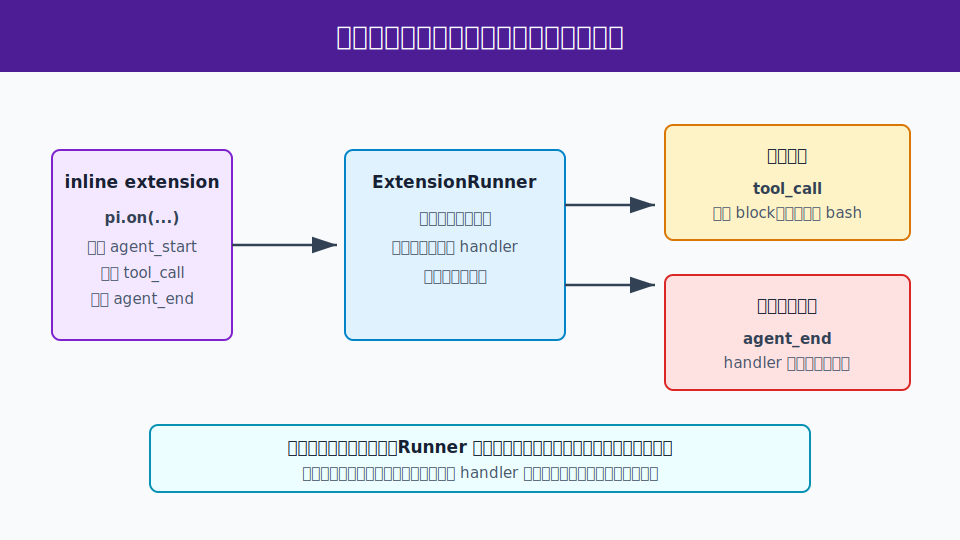

# s11：扩展运行时（Extension Runtime）- 规则注册与执行隔离

[← s10 资源加载器](../s10-resource-loader/README.md) · [返回首页](../../README.md) · [s12 嵌入式运行框架 →](../s12-embedded-harness/README.md)

> **核心结论**：扩展（Extension）只通过 API 登记事件处理器和规则；扩展运行器（`ExtensionRunner`）在正确的生命周期点调用它们，并把普通 handler 的异常转为诊断，而不是直接击穿宿主运行时。

推荐前置：已完成 `learn-claude-code` 的 Hooks、工具调用与 MCP/Plugin 基础。这里不重新解释“为什么要有钩子”，而是研究 Pi 怎样把扩展的注册、事件分发、工具拦截和错误隔离组织成一个运行时。

---

## 这节只学什么

本课只解决“宿主怎样允许扩展插入 Agent 生命周期，同时不让一个扩展的普通错误拖垮整个应用”这个问题。

| 本课会看到 | 本课暂不展开 |
| --- | --- |
| inline extension 通过 `pi.on()` 登记处理器 | 从磁盘发现所有扩展目录和热重载策略 |
| `ExtensionRunner` 分发生命周期事件与工具调用 | 交互式 UI、命令面板和快捷键完整实现 |
| 危险工具调用被拦截，`agent_end` handler 失败变成诊断 | 工具进程已经启动后如何撤销外部副作用 |

本课只有一条主规则：**扩展声明规则；运行时统一决定调用时机，并保留可诊断的失败边界。**

## 问题

一个 Coding Agent 往往允许用户和团队增加审计、权限策略、命令和自定义工具。若这些逻辑直接散落在模型循环、工具实现和终端界面里，会出现两个问题：

1. 扩展无法知道自己应在“工具执行前”还是“Agent 结束后”运行。
2. 一个非关键扩展抛错时，宿主可能丢失整个会话或把错误误当作模型失败。

Pi 怎样让扩展表达“我想监听什么、我想阻止什么”，又保留宿主对生命周期和错误处理的控制？

## 解决方案



*图：扩展工厂只登记规则。`ExtensionRunner` 创建上下文、分发事件；工具调用可以返回控制流结果，普通生命周期 handler 的异常进入诊断通道。*

本课在临时目录写入一个 inline extension 文件，再通过公开的 `discoverAndLoadExtensions()` 装载它。该扩展登记三条规则：

| 登记的规则 | 运行时发生的事 | 可观察结果 |
| --- | --- | --- |
| `agent_start` | Runner 分发生命周期事件 | trace 记录 `agent_start` |
| `tool_call` + 危险 `bash` | handler 返回 `{ block: true, reason }` | 工具在执行前被拒绝 |
| `agent_end` | handler 故意抛错 | Runner 捕获并输出 `agent_end` diagnostic |

这是一个完全本地、确定性的运行时课程：不需要模型，也不会读取读者已安装的 Pi extension、`~/.pi` 或项目配置。

## 工作原理

完整教学代码在 [`code.ts`](code.ts)。它只使用 `pi-coding-agent` 包根公开的扩展 API；动态写出的 extension 文件只是让读者看到真实的“扩展工厂接收 `pi`”形状，生产运行时仍由 Pi 自己装载和分发。

### 第 1 步：扩展只登记 handler，不直接运行 Agent

```js
export default function auditExtension(pi) {
  pi.on("agent_start", () => {
    trace().push("agent_start");
  });
}
```

扩展工厂拿到的是 `ExtensionAPI`。它调用 `pi.on()` 把 handler 挂到事件类型上；它不拥有 Agent，也不能自己决定何时开始一轮模型请求。

### 第 2 步：发现器创建扩展和共享运行时

```ts
const loaded = await discoverAndLoadExtensions([fixture.extensionPath], fixture.cwd, fixture.agentDir);
const runner = new ExtensionRunner(loaded.extensions, loaded.runtime, fixture.cwd, sessionManager, modelRegistry);
```

`discoverAndLoadExtensions()` 负责执行扩展工厂并收集登记结果；`ExtensionRunner` 持有这些结果和 Extension Runtime，随后在宿主真正进入某个生命周期点时创建上下文、调用对应 handler。

### 第 3 步：工具调用可返回拦截结果

```js
pi.on("tool_call", (event) => {
  if (event.toolName === "bash" && event.input.command.includes("rm -rf")) {
    return { block: true, reason: "教学策略：禁止破坏性 bash 命令" };
  }
});
```

课程调用 `runner.emitToolCall()` 时，Runner 把 handler 返回的 `{ block: true }` 交还给宿主。宿主随后可以阻止工具执行，并将 `reason` 写成可审计的拒绝结果。这里没有真正启动 shell 命令。

### 第 4 步：普通生命周期 handler 的失败进入诊断通道

```js
pi.on("agent_end", () => {
  throw new Error("教学扩展的故意失败");
});
```

`runner.emit()` 在调用普通 lifecycle handler 时捕获异常，并通知 `runner.onError()`。本课故意抛错后仍正常返回，证明这类扩展失败被记录为 `agent_end` diagnostic，而不是直接使宿主进程终止。

> **可复述的规则**：扩展 API 用于登记；`ExtensionRunner` 用于分发；工具拦截是返回值，普通 handler 异常是诊断。

## 试一下

本课需要 Node.js `>=22.19.0`，不需要 API Key，也不发送模型请求。

```bash
npm run lesson -- s11
```

输出是确定性的：

```text
[步骤 1/4] 在临时目录加载 inline extension，不读取用户扩展或全局配置。
[步骤 2/4] runner 分发 agent_start：扩展只记录生命周期事件，不参与 Agent 状态归约。
事件记录：agent_start
[步骤 3/4] runner 分发危险 bash 调用：扩展返回 block，工具不会进入执行阶段。
拦截结果：教学策略：禁止破坏性 bash 命令
[步骤 4/4] agent_end 处理器故意抛错：ExtensionRunner 捕获它并转成诊断，而不是让运行时崩溃。
诊断：agent_end:教学扩展的故意失败
```

离线测试：

```bash
npm run test:lesson -- s11
```

测试证明：

1. inline extension 确实接收到 `agent_start`、`tool_call` 和 `agent_end`。
2. 危险 bash 调用返回阻止原因，没有进入真实工具执行。
3. `agent_end` handler 的异常被转换为诊断，`runLesson()` 仍正常返回。

## 接下来

扩展运行时解决了“在哪里插入规则、怎样隔离 handler”。但一个应用还需要明确装配模型、会话、资源、扩展和工具的边界。

s12 嵌入式运行框架会将这些部件作为显式依赖交给宿主，而不是重新实现 Pi CLI。

<details>
<summary>深入 Pi 源码</summary>

以下链接固定在 Pi `v0.80.6` 提交 [`2b3fda9921b5590f285165287bd442a25817f17b`](https://github.com/earendil-works/pi/tree/2b3fda9921b5590f285165287bd442a25817f17b)。

| 课程动作 | Pi 生产实现中的同一职责 |
| --- | --- |
| `pi.on()` 登记三个 handler | [`ExtensionAPI.on()`](https://github.com/earendil-works/pi/blob/2b3fda9921b5590f285165287bd442a25817f17b/packages/coding-agent/src/core/extensions/types.ts#L1163-L1211) 将事件类型和 handler 纳入扩展契约。 |
| `discoverAndLoadExtensions()` | [发现器](https://github.com/earendil-works/pi/blob/2b3fda9921b5590f285165287bd442a25817f17b/packages/coding-agent/src/core/extensions/loader.ts#L651-L695) 收集项目、用户和显式路径的 extension，再建立运行时。 |
| `new ExtensionRunner(...)` | [构造函数与 `bindCore()`](https://github.com/earendil-works/pi/blob/2b3fda9921b5590f285165287bd442a25817f17b/packages/coding-agent/src/core/extensions/runner.ts#L295-L355) 将扩展、运行时与宿主提供的操作连接起来。 |
| `runner.emitToolCall()` 返回 block | [`emitToolCall()`](https://github.com/earendil-works/pi/blob/2b3fda9921b5590f285165287bd442a25817f17b/packages/coding-agent/src/core/extensions/runner.ts#L875-L897) 在第一个 `{ block: true }` 后停止分发。 |
| `agent_end` handler 异常成为 diagnostic | [`emit()`](https://github.com/earendil-works/pi/blob/2b3fda9921b5590f285165287bd442a25817f17b/packages/coding-agent/src/core/extensions/runner.ts#L750-L778) 捕获普通 handler 异常并调用错误监听器。 |

课程没有深度导入 loader 或 runner 的内部文件；README 链接只用于公开核查，运行代码只使用包根 exports。

### 教学边界

本课直接调用 `ExtensionRunner` 的公开分发方法，没有启动完整 `AgentSession`、CLI、TUI 或真实工具执行。生产 Coding Agent 会把 Runner 绑定到 session、模型、资源加载器和终端界面；s12 继续解释这些组件怎样由宿主显式装配。

</details>
