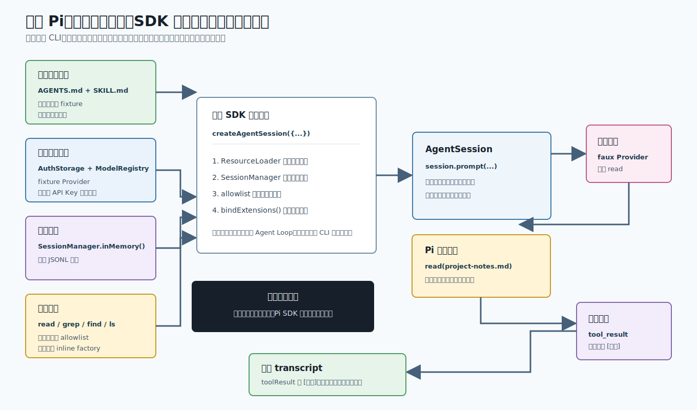

# s12：嵌入式运行框架（Embedded Harness）- 应用提供边界，Pi 负责把部件跑起来

[s09 会话压缩](../s09-session-compaction/README.md) → s10-s11（计划中） → **s12 嵌入式运行框架** → [s13 运行模式路由](../s13-runtime-modes/README.md)

> **嵌入 Pi 时，宿主程序不必重写 CLI 或 Agent Loop；它只要明确提供模型、会话、资源、扩展和工具边界，再交给 `createAgentSession()` 组合。**

推荐前置：完成 `learn-claude-code` 的 Tool Use、Skills 与 Hooks，并学习本项目的 s07 编码智能体 SDK 和 s09 会话压缩。s07 已验证真实模型可以进入一个最小、无工具的受控会话；本课继续验证一个应用怎样把受控资源、审计扩展和只读工具一起交给 SDK。

---

## 这节只学什么

本课只解决“一个应用怎样嵌入 Pi，同时让每个外部能力都来自自己明确提供的依赖”这个问题。

| 本课会看到 | 读者已经掌握 | 本课暂不解决 |
| --- | --- | --- |
| 临时项目资源、内存模型目录、内存会话、审计扩展和只读工具如何汇合成一个 `AgentSession` | 模型流、工具调用和会话树的基本行为 | 多用户共享、持久化恢复、真实 Provider 的认证和生产权限策略 |

本课唯一主规则：**宿主负责提供可替换的依赖和权限边界；Pi SDK 负责在这些边界内编排运行。**

## 问题

假设你在编辑器或内部知识工具中加了“研究当前项目”功能。这个功能需要读一份项目笔记，也希望项目的 `AGENTS.md` 和 Skill 能参与系统提示；同时，它必须留下审计记录，且绝不能改文件、启动 shell，或顺手读取用户已有的 Pi 认证和会话。

一种做法是自己拼模型请求、系统提示、工具、扩展回调、消息保存和空闲等待。但这样做实际上又造了一套脆弱的 CLI 运行器。

另一种做法是直接调用 `createAgentSession()` 而不传依赖。SDK 会合理地创建默认实现，但默认实现可能使用文件型认证、模型目录、资源发现和会话存储。嵌入式应用需要的不是“少写几行代码”，而是明确回答：**这一次运行的模型、文件、扩展和工具从哪里来？**

## 解决方案



*图 1：宿主把五类依赖交给公开 SDK。模型只请求 `read`；Pi 执行受控只读工具，审计扩展改写工具结果，所有消息只留在内存会话中。*

本课的宿主是一个临时、离线的研究助手：

| 依赖 | 宿主传入的实现 | 可观察结果 |
| --- | --- | --- |
| 模型与认证 | faux Provider、`AuthStorage.inMemory()`、`ModelRegistry.inMemory()` | 不读取 `.env`、API Key 或用户认证文件 |
| 会话 | `SessionManager.inMemory()` | `sessionFile` 为 `undefined`，不会产生 JSONL |
| 资源 | 受控的 `DefaultResourceLoader` | 只加载临时 `AGENTS.md` 与指定 Skill |
| 扩展 | 内联审计扩展（inline extension） | `tool_result` 将 `read` 结果加上 `[审计]` |
| 工具 | `tools: ["read", "grep", "find", "ls"]` | `write`、`edit`、`bash` 不会进入工具注册表 |

离线模型只固定“先请求 `read`，再给最终回复”这两条模型输出。它**不**模拟资源加载、工具执行、工具结果写回、扩展事件或会话收束；这些都由真实 Pi SDK 完成。因此，这个 Demo 验证的是装配与边界，而不是某个真实模型的能力。

## 工作原理

课程入口是 [`code.ts`](code.ts)。它的所有文件都在运行时创建到临时目录，并在结束时删除；不会依赖已有项目、用户目录、API Key 或之前课程产生的状态。

### 第 1 步：创建一份最小、可检查的项目资源

```ts
const agentsPath = join(cwd, "AGENTS.md");
const skillPath = join(cwd, "skills", "fixture-research", "SKILL.md");
const notePath = join(cwd, "project-notes.md");

await Promise.all([
  writeFile(agentsPath, AGENTS_CONTENT),
  writeFile(skillPath, SKILL_CONTENT),
  writeFile(notePath, NOTE_CONTENT),
]);
```

这里创建的是一次运行专属的 fixture：`AGENTS.md` 要求只读，Skill 描述研究流程，`project-notes.md` 是唯一允许模型读取的笔记。它们不是仓库的真实项目资源，也不会污染读者的目录。

### 第 2 步：模型、认证和会话都换成内存实现

```ts
const authStorage = AuthStorage.inMemory();
authStorage.setRuntimeApiKey(faux.getModel().provider, "fixture-token");
const modelRegistry = ModelRegistry.inMemory(authStorage);

sessionManager: SessionManager.inMemory(fixture.cwd),
```

`fauxProvider()` 提供一个确定性的本地模型服务；它不访问网络。认证 token 只存在内存 auth storage 中，模型则显式登记到内存模型目录（`ModelRegistry`）。因此 SDK 走的是正常的“从模型目录找到 Provider，再请求模型”的路径，但没有读取环境变量或用户配置。

`SessionManager.inMemory()` 保留 Pi 的消息条目、当前状态和生命周期，却没有会话文件。用它可以测试完整的 `AgentSession`，而不生成 JSONL 历史。

### 第 3 步：资源加载器只发现 fixture，扩展在同一处注册

```ts
const resourceLoader = new DefaultResourceLoader({
  cwd: fixture.cwd,
  agentDir: fixture.agentDir,
  settingsManager,
  additionalSkillPaths: [fixture.skillPath],
  extensionFactories: [{ name: "audit", factory: createAuditExtension(auditLog) }],
  noExtensions: true,
  noSkills: true,
  noPromptTemplates: true,
  noThemes: true,
});
await resourceLoader.reload();
```

`DefaultResourceLoader` 仍执行 Pi 的真实资源装配流程，但它的工作目录、agent 目录和显式 Skill 路径都由宿主控制。`noExtensions`、`noSkills` 等开关关闭默认发现；内联审计扩展仍由本课明确传入。

审计扩展不是打印一行教学文字就结束。它订阅 `tool_result`，将 `read` 的文本改写为带 `[审计]` 前缀的工具结果；离线测试会检查这个改写后的结果确实进入第二次模型请求。

### 第 4 步：一次公开 SDK 调用汇合全部依赖

```ts
const { session } = await createAgentSession({
  cwd: fixture.cwd,
  agentDir: fixture.agentDir,
  model,
  authStorage,
  modelRegistry,
  sessionManager: SessionManager.inMemory(fixture.cwd),
  settingsManager,
  resourceLoader,
  tools: READ_ONLY_TOOLS,
});
await session.bindExtensions({ mode: "print" });
```

`createAgentSession()` 创建真正的 Pi `AgentSession`，而不是本课自制的替代品。它把资源汇入系统提示，把 allowlist 用于工具注册表，并维护 Agent、事件和消息记录。

`bindExtensions()` 是不能省略的一步：它发送 `session_start`，再把扩展发现的新资源接进 session。本课的输出中，`extension:session_start` 就是这一步已发生的证据。

### 第 5 步：模型只决定意图，Pi 完成工具和扩展的后续链路

```ts
await session.prompt("请读取 project-notes.md，并简短说明宿主提供了什么能力。");
await session.waitForIdle();
```

固定模型的第一条 assistant 消息请求 `read(project-notes.md)`。接下来不是教学代码直接读文件：Pi 从只读工具注册表找到 `read`，执行它，产出 `toolResult`，再运行扩展的 `tool_result` 处理器。第二次模型请求因此会看到：

```text
[审计] 研究结论：嵌入式宿主应显式提供运行依赖。
风险：不要启用写入工具。
```

这也是本课的关键边界：模型可以提出工具意图，**能否执行、读到哪里、结果怎样被审计**由宿主传入的 SDK 依赖决定。

### 第 6 步：释放短生命周期的宿主资源

```ts
session.dispose();
modelRegistry.unregisterProvider(sourceModel.provider);
await rm(fixture.cwd, { recursive: true, force: true });
```

释放顺序先断开会话，再注销临时 Provider，最后删除 fixture。它不回收读者的 Pi 配置，因为本课从未使用那些配置。

> **可复述的规则**：嵌入式宿主明确交出模型、会话、资源、扩展和工具；Pi 用 `createAgentSession()` 在这些边界内完成真实运行。

## 试一下

本课是完全离线的确定性 Demo，不需要 `.env`、`ANTHROPIC_API_KEY` 或网络连接：

```bash
npm run lesson -- s12
```

输出应为下面的形状：

```text
[步骤 1/5] 创建临时项目：只放入一份 AGENTS、一个 Skill 和一份研究笔记。
[步骤 2/5] 宿主注入内存认证、模型目录、会话和资源加载器；不读取用户配置。
[步骤 3/5] SDK 只启用只读工具：read, grep, find, ls；并绑定审计扩展。
[步骤 4/5] 离线模型请求 read；Pi 执行真实只读工具，扩展为结果加上审计标记。
[步骤 5/5] 验证：资源和 Skill 已进入系统提示，read 结果经过扩展审计，内存会话随后释放。
资源: AGENTS.md；Skill: fixture-research
审计: extension:session_start -> extension:agent_start -> extension:tool_call:read -> extension:tool_result:read -> extension:agent_end
最终回复: 研究完成：已读取项目笔记，宿主只提供了可审计的只读能力。
```

再运行离线测试：

```bash
npm run test:lesson -- s12
```

测试覆盖：

1. fixture `AGENTS.md`、Skill、审计扩展和四个只读工具都实际进入同一 `AgentSession`。
2. 即使环境里有 `ANTHROPIC_API_KEY`，本课仍使用 fixture Provider；资源路径都在临时项目中，`write` 和 `edit` 不会被启用。
3. 审计后的 `read` 结果进入下一次模型请求；运行结束后临时项目会被删除。

可以尝试把 [`code.ts`](code.ts) 中的 `READ_ONLY_TOOLS` 改成只保留 `"read"`，再运行。模型仍能完成当前流程，但 `grep`、`find`、`ls` 会从 session 的可用工具中消失。反过来，直接把 `"write"` 放回 allowlist 并不是“只改变模型提示”，而是在扩大宿主授予的权限。

## 接下来

现在我们已经有一个可嵌入的 Pi 运行框架：宿主负责装配，`AgentSession` 负责工作。

但同一套运行时还要服务交互终端、一次性文本输出、JSON 和 RPC。s13 会从 CLI 参数和终端状态出发，解释 Pi 怎样在启动时只选择一个正确的运行模式，而不是在一个入口中混用所有界面。

<details>
<summary>深入 Pi 源码</summary>

以下链接固定到 Pi `v0.80.6` 提交 [`2b3fda9921b5590f285165287bd442a25817f17b`](https://github.com/earendil-works/pi/tree/2b3fda9921b5590f285165287bd442a25817f17b)。`code.ts` 只使用 `@earendil-works/pi-coding-agent` 和 `@earendil-works/pi-ai` 的公开导出；这里把每个可观察结果对回生产职责。

| 课程中可观察的动作 | Pi 生产实现中的对应职责 |
| --- | --- |
| 传入 `authStorage`、`modelRegistry`、`resourceLoader`、`sessionManager` 和 `tools` | [`CreateAgentSessionOptions`](https://github.com/earendil-works/pi/blob/2b3fda9921b5590f285165287bd442a25817f17b/packages/coding-agent/src/core/sdk.ts#L34-L82) 明确列出这些可注入依赖；[装配后的 `AgentSession`](https://github.com/earendil-works/pi/blob/2b3fda9921b5590f285165287bd442a25817f17b/packages/coding-agent/src/core/sdk.ts#L385-L406) 持有它们。 |
| fixture AGENTS 与 Skill 进入系统提示 | [`_rebuildSystemPrompt()`](https://github.com/earendil-works/pi/blob/2b3fda9921b5590f285165287bd442a25817f17b/packages/coding-agent/src/core/agent-session.ts#L983-L1017) 从 `ResourceLoader` 读取 context files、skills 和工具摘要，再交给系统提示构造器。 |
| `noSkills` 仍可配合指定 Skill，内联扩展由宿主传入 | [`DefaultResourceLoader` 的选项](https://github.com/earendil-works/pi/blob/2b3fda9921b5590f285165287bd442a25817f17b/packages/coding-agent/src/core/resource-loader.ts#L120-L156) 与 [reload 的 Skill 路径合并](https://github.com/earendil-works/pi/blob/2b3fda9921b5590f285165287bd442a25817f17b/packages/coding-agent/src/core/resource-loader.ts#L400-L421) 区分默认发现和显式路径。 |
| `await session.bindExtensions(...)` 后出现 `extension:session_start` | [`bindExtensions()`](https://github.com/earendil-works/pi/blob/2b3fda9921b5590f285165287bd442a25817f17b/packages/coding-agent/src/core/agent-session.ts#L2176-L2224) 应用宿主绑定、发送 `session_start`，并允许扩展继续提供资源。 |
| 只读工具 allowlist | [`_refreshToolRegistry()`](https://github.com/earendil-works/pi/blob/2b3fda9921b5590f285165287bd442a25817f17b/packages/coding-agent/src/core/agent-session.ts#L2397-L2488) 先按 allowlist 过滤内建和扩展工具，才组成 Agent 真正可调用的工具表。 |
| `sessionFile === undefined` | [`SessionManager.inMemory()`](https://github.com/earendil-works/pi/blob/2b3fda9921b5590f285165287bd442a25817f17b/packages/coding-agent/src/core/session-manager.ts#L1478-L1481) 使用不持久化的会话后端。 |

### 两个容易误读的边界

1. **离线模型不等于假运行时。**faux Provider 只固定 assistant 的 Tool Call 和最终文本；`AgentSession`、`read`、工具结果写回、扩展 `tool_result` 回调、会话事件与清理由 Pi 的真实实现执行。
2. **工具 allowlist 不是提示词建议。**不在 `tools` 列表中的工具不会进入 session 工具注册表；即使模型试图调用 `write`，也没有可执行的工具定义。生产权限还应叠加文件路径、用户授权与审计策略。

### 为什么这里不用真实 Anthropic 模型？

s07 已让真实 Anthropic-compatible Provider 经过最小的 `AgentSession` 装配。本课需要同时证明资源、Skill、扩展、工具过滤和清理都发生；若由真实模型决定是否调用 `read`，课程的关键观察会变成不稳定、会额外消耗费用。故本课把模型输出固定在离线边界，而没有把 Pi 的运行时替换成 mock。

生产宿主可以沿用同一装配方式，将 faux Provider 换成显式注册的真实 Provider；同时仍应保留内存或受控存储、受限 `ResourceLoader` 和最小工具 allowlist。

</details>
