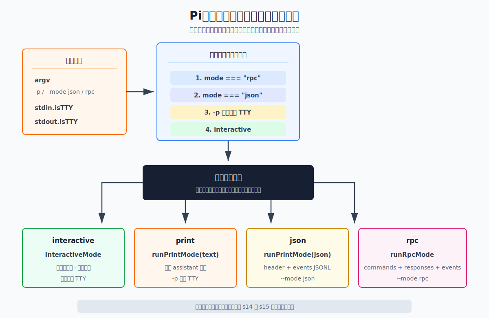
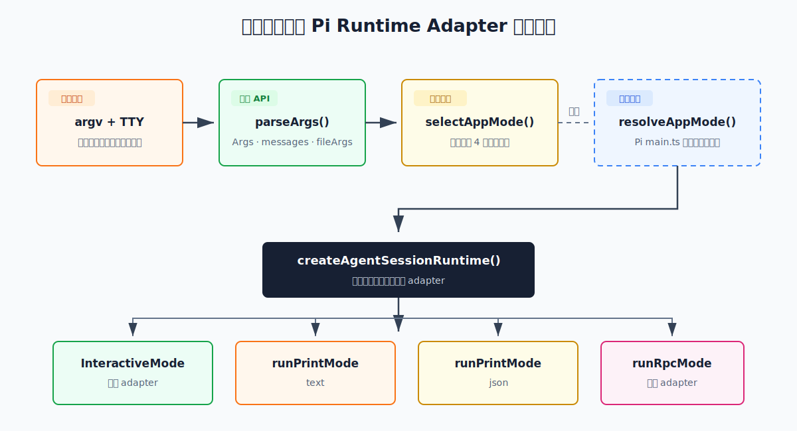

# s13：Runtime Modes — 同一个 Runtime，四种 Adapter

s12 Embedded Harness · [返回首页](../../README.md) · [s14 TUI Diff Render →](../s14-tui-diff-render/README.md)

> **核心结论**：Pi 只装配一次 `AgentSessionRuntime`，interactive、text、JSON 和 RPC 的差异发生在最后一层 adapter，而不是 Agent 内核。

推荐前置：`learn-claude-code` 已经解释过 Agent Loop，本项目 s12 已经展示如何嵌入 Pi SDK。本课不再实现 Agent，也不复述 CLI 基础，只研究 Pi 怎样把同一个 runtime 接到四种输入输出协议。

---

## 问题

同一个 Coding Agent 可能被四种宿主使用：

1. 开发者在终端中持续对话
2. CI 脚本发出一次请求，只读取最终答案
3. 日志处理程序消费每一个 Agent 事件
4. IDE 或桌面应用跨进程控制 Pi

如果为每种场景分别创建 Agent、工具、Session 和 Extension Runtime，会出现四套逐渐分叉的实现。修复一次会话错误，可能需要同步修改四条执行链。

Pi 如何复用同一个已装配 runtime，同时让四种宿主得到不同的交互方式？

---

## 解决方案



*图：左侧输入只决定最末端 adapter；中间的单一 runtime 是固定上游调用链的结构结论，而非本课代码伪造的运行对象。*

Pi 先解析 CLI 参数和 stdin/stdout 的 TTY 状态，确定 app mode；runtime 创建完成后，才把它交给对应 adapter：

| App mode | 触发条件 | Adapter | 对外协议 |
| --- | --- | --- | --- |
| `interactive` | 默认，stdin/stdout 都是 TTY | `InteractiveMode` | 终端组件树 |
| `print` | `-p`，或 stdin/stdout 任一不是 TTY | `runPrintMode(..., { mode: "text" })` | 最终 assistant 文本 |
| `json` | `--mode json` | `runPrintMode(..., { mode: "json" })` | Session header 与事件 JSONL |
| `rpc` | `--mode rpc` | `runRpcMode()` | 双向命令、响应与事件 JSONL |

最重要的结构不是“四种模式”，而是中间只有一个：

```text
createAgentSessionRuntime(...) -> runtime
                                  ├── InteractiveMode(runtime)
                                  ├── runPrintMode(runtime, text)
                                  ├── runPrintMode(runtime, json)
                                  └── runRpcMode(runtime)
```

因此模型、工具、会话、资源和扩展不需要为输出方式重新装配。

本课的 `code.ts` 只验证上图左侧的“参数和 TTY 如何选 adapter”，不虚构一个 `AgentSessionRuntime` 再把名称打印出来。Pi 确实只创建一次 runtime 的证据在折叠区固定源码调用链；真实 adapter 的行为分别由 s14 和 s15 运行。

---

## 工作原理

课程代码入口在 [`code.ts`](code.ts)。它刻意不装配 runtime 或接管终端，只验证公开 `parseArgs()` 和上游同样的 mode 优先级。下面按实际执行顺序来看。

### 第 1 步：显式提供 argv 与 TTY 状态

```ts
const scenario = {
  label: "单次文本",
  argv: ["-p", "总结当前项目"],
  io: { stdinIsTTY: true, stdoutIsTTY: true },
};
```

真实 CLI 读取 `process.argv`、`process.stdin.isTTY` 和 `process.stdout.isTTY`。本课把三者作为普通数据传入，因此测试不需要真实终端，也不会接管 stdin/stdout。

### 第 2 步：调用 Pi 公开的 parseArgs()

```ts
const parsed = parseArgs(argv);
```

这不是课程自制参数解析器。`parseArgs()` 来自 `@earendil-works/pi-coding-agent` 包根，实际识别 `-p`、`--mode`、`@file`、消息和 diagnostics。

例如：

```ts
parseArgs(["-p", "总结当前项目"])
```

会得到：

```text
print = true
messages = ["总结当前项目"]
```

### 第 3 步：按上游优先级选择 app mode

```ts
if (parsed.mode === "rpc") return "rpc";
if (parsed.mode === "json") return "json";
if (parsed.print || !stdinIsTTY || !stdoutIsTTY) return "print";
return "interactive";
```

上游 `resolveAppMode()` 没有从 package root 导出。本课只复制这六行决策，包装成可测试的薄教学 router；参数结构和 adapter 仍使用公开 API。

顺序很重要：

- `--mode rpc` 优先级最高
- `--mode json` 其次
- `-p` 或非 TTY 再进入 print
- 其余情况才进入 interactive

所以即使 stdout 被重定向，显式 `--mode json` 仍然选择 JSON，而不会退化成最终文本。

### 第 4 步：把 mode 映射到公开 adapter

```ts
const ADAPTERS = {
  interactive: InteractiveMode.name,
  print: `${runPrintMode.name}({ mode: "text" })`,
  json: `${runPrintMode.name}({ mode: "json" })`,
  rpc: runRpcMode.name,
};
```

本课只读取公开 adapter 的名称，不真正启动它们：

- `InteractiveMode` 会拥有真实终端生命周期
- print/json 会接管 stdout
- RPC 会长期读取 stdin 并保持子进程运行

这些行为分别在 s14 和 s15 展开。本课只验证 Pi 特有的 adapter 路由，不引入 TTY、网络、认证或用户设置。

### 第 5 步：观察五种输入得到的决定

```ts
const decisions = evaluateDefaultModeScenarios();
```

课程代码同时演示：默认 TTY、`-p`、JSON、RPC 和管道输入。每种场景都输出 mode、公开 adapter 和协议；至于这些 adapter 如何接到同一个 runtime，由下方固定源码链和 s14/s15 的真实运行分别证明。

### 第 6 步：在进入 RPC 前拒绝 @file

```ts
if (appMode === "rpc" && parsed.fileArgs.length > 0) {
  diagnostics.push("Error: @file arguments are not supported in RPC mode");
}
```

RPC 使用 stdin 传输 JSONL 命令，不能同时沿用 CLI 的 `@file` 初始消息语法。上游 `main()` 在创建 RPC loop 前执行相同检查。



*图：课程只执行参数路由；runtime 的一次装配和三个 mode runner 的分发位置由固定源码链接证明。*

---

## 试一下

本课需要 Node.js `>=22.19.0`，不需要 API Key，不访问网络，也不读取用户 Pi 配置。

运行课程：

```bash
npm run lesson -- s13
```

你会看到：

```text
本课观察: argv 与 TTY 如何选择 adapter；不启动 AgentSessionRuntime。
默认交互: "检查当前项目" -> interactive -> InteractiveMode -> 终端组件树
单次文本: "-p" "总结当前项目" -> print -> runPrintMode({ mode: "text" }) -> 最终 assistant 文本
事件 JSON: "--mode" "json" "检查测试" -> json -> runPrintMode({ mode: "json" }) -> Session header + AgentSessionEvent JSONL
双向 RPC: "--mode" "rpc" -> rpc -> runRpcMode -> 命令、响应与事件 JSONL
管道输入: "总结标准输入" -> print -> runPrintMode({ mode: "text" }) -> 最终 assistant 文本
边界检查: Error: @file arguments are not supported in RPC mode
```

再运行测试：

```bash
npm run test:lesson -- s13
```

观察重点：

1. argv 与 TTY 只决定最后一层 adapter，不会改变模型、会话或工具的装配规则
2. JSON 与 text 都由 `runPrintMode()` 实现，只是输出粒度不同
3. 非 TTY 自动选择 print，适合 shell 管道和 CI
4. RPC 不接受 CLI `@file` 参数

可以尝试：

1. 将 JSON 场景同时加上 `-p`，确认显式 JSON 仍然优先
2. 把 `stdoutIsTTY` 改成 `false`，观察默认交互变成 print
3. 单独传入 `--mode text`，观察真实 TTY 中仍然进入 interactive

最后一点是 Pi `v0.80.6` 的具体行为：`text` 是 print adapter 的输出格式，不是独立进入非交互模式的开关。需要单次文本时应使用 `-p` 或管道。

---

## 接下来

现在我们知道 runtime adapter 怎样被选中，但还没有解释 interactive adapter 为什么可以频繁更新终端而不整屏闪烁。

s14 TUI Diff Render 将进入 `pi-tui`：Component 生成完整文本帧，TUI 比较前后状态，只把变化区间写给终端。

<details>
<summary>深入 Pi 源码</summary>

### 课程代码与生产职责的对照

以下对应均固定在 Pi `v0.80.6` 提交 [`2b3fda9921b5590f285165287bd442a25817f17b`](https://github.com/earendil-works/pi/tree/2b3fda9921b5590f285165287bd442a25817f17b)。先把教学 router 的每个决定对回真实 CLI：

| `code.ts` 中读者看到的动作 | Pi 生产实现中的同一职责 |
| --- | --- |
| `parseArgs(argv)` | 解析 `-p`、`--mode`、`@file`、初始消息和 diagnostics。 |
| `selectAppMode(parsed, io)` | `main.ts` 的内部 `resolveAppMode()` 按 RPC、JSON、print、interactive 的同一优先级选择模式。 |
| RPC 的 `@file` 拒绝 | `main()` 在进入 RPC loop 前做同样的边界检查，避免 CLI 文件参数与 JSONL stdin 混用。 |
| `ADAPTERS[mode]` | 主程序只创建一次 `AgentSessionRuntime`，再把同一个实例交给 interactive、print/json 或 RPC adapter。 |

**教学版只把“如何选最后一层 adapter”压缩成六行；生产版在这之后才装配 runtime 并执行 adapter。**

### 公开 API 与教学实现边界

本课使用的以下能力都由 `@earendil-works/pi-coding-agent` 包根公开导出：

- `parseArgs()`
- `InteractiveMode`
- `runPrintMode()`
- `runRpcMode()`

上游 `resolveAppMode()` 是 `main.ts` 内部函数。本课的 `selectAppMode()` 只复现其决策顺序，没有复制 runtime 创建、Session 选择、资源加载或 adapter 实现。

以下链接用于核查上表的职责边界：

- [`Args` 与公开 `parseArgs()`](https://github.com/earendil-works/pi/blob/2b3fda9921b5590f285165287bd442a25817f17b/packages/coding-agent/src/cli/args.ts#L10-L207)
- [package root 公开导出 modes](https://github.com/earendil-works/pi/blob/2b3fda9921b5590f285165287bd442a25817f17b/packages/coding-agent/src/index.ts#L324-L342)
- [内部 `resolveAppMode()` 与 `toPrintOutputMode()`](https://github.com/earendil-works/pi/blob/2b3fda9921b5590f285165287bd442a25817f17b/packages/coding-agent/src/main.ts#L100-L115)
- [`parseArgs()` 后执行路由和 RPC 文件检查](https://github.com/earendil-works/pi/blob/2b3fda9921b5590f285165287bd442a25817f17b/packages/coding-agent/src/main.ts#L508-L548)
- [只创建一次 `AgentSessionRuntime`](https://github.com/earendil-works/pi/blob/2b3fda9921b5590f285165287bd442a25817f17b/packages/coding-agent/src/main.ts#L690-L750)
- [同一个 runtime 分发给三个 mode runner](https://github.com/earendil-works/pi/blob/2b3fda9921b5590f285165287bd442a25817f17b/packages/coding-agent/src/main.ts#L800-L858)
- [`runPrintMode()` 的 text 与 JSON 分支](https://github.com/earendil-works/pi/blob/2b3fda9921b5590f285165287bd442a25817f17b/packages/coding-agent/src/modes/print-mode.ts#L17-L158)
- [`runRpcMode()` 的 stdin/stdout 协议入口](https://github.com/earendil-works/pi/blob/2b3fda9921b5590f285165287bd442a25817f17b/packages/coding-agent/src/modes/rpc/rpc-mode.ts#L1-L61)
- [`InteractiveMode` 接收 runtime](https://github.com/earendil-works/pi/blob/2b3fda9921b5590f285165287bd442a25817f17b/packages/coding-agent/src/modes/interactive/interactive-mode.ts#L467-L500)

### 为什么 text 与 JSON 共用 runPrintMode()

`runPrintMode()` 在两种输出下都调用同一个 `session.prompt()`：

- text：等待结束后，只读取最后一条 assistant message 的 text block
- JSON：订阅 session，把 header 与全部事件逐行写到 stdout

因此 JSON mode 不是另一个 Agent Loop，只是保留了更多运行过程。

### 为什么 RPC 不复用 runPrintMode()

print/json 都是“输入有限，处理完成后退出”。RPC 则需要：

- 持续读取 stdin 的 JSONL 命令
- 用 `id` 关联响应
- 同时广播没有请求 ID 的 Agent 事件
- 支持 abort、steer、follow-up、切换 Session 等多次操作

所以 RPC 共享 runtime，但需要独立的长生命周期 adapter。具体协议由 s15 继续拆解。

### 教学代码与真实 main() 的差异

| 本课 | 真实 Pi CLI |
| --- | --- |
| argv 和 TTY 状态作为普通参数 | 读取 process argv/stdin/stdout |
| 只输出路由决定 | 真正创建 services、session 与 runtime |
| 不启动 adapter | adapter 接管终端或进程 IO |
| 不读取配置 | 处理 settings、auth、resources 和 project trust |
| 不访问网络 | 可能进行 provider 请求和版本检查 |

本课刻意停在 adapter 边界，因为 runtime 装配已由 s12 负责，TUI 与 RPC 的内部机制分别由 s14、s15 负责。

</details>
