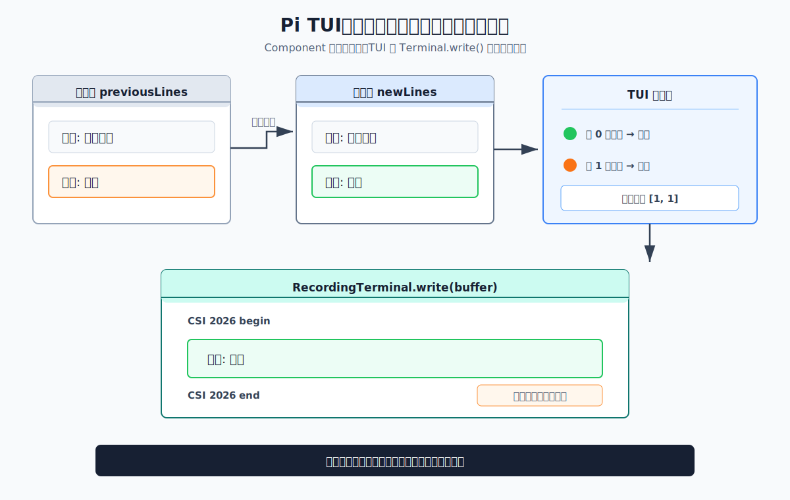
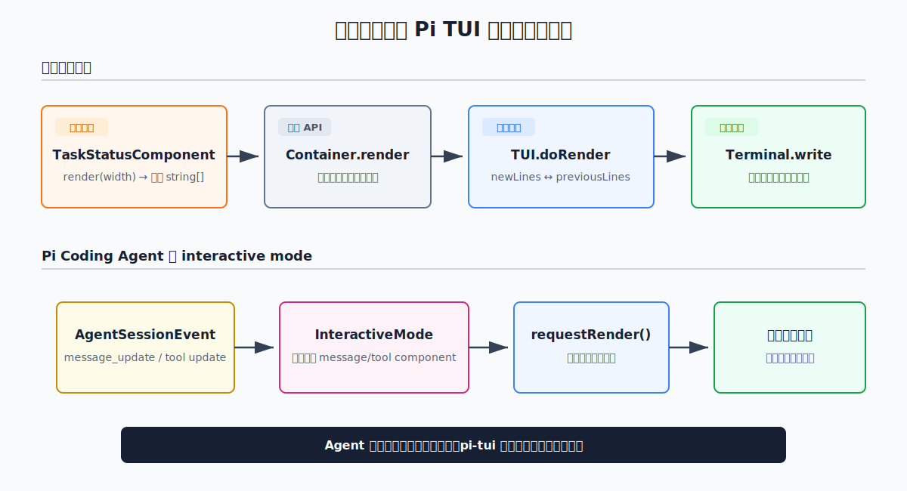

# s14：终端差分渲染（TUI Diff Render）— 状态变化不等于整屏重绘

[← s13 运行模式路由](../s13-runtime-modes/README.md) · [返回首页](../../README.md) · [s15 RPC 的逐行 JSON 通道 →](../s15-rpc-jsonl/README.md)

> **核心结论**：终端界面组件（`Component`）每次都生成完整文本帧；Pi 的终端界面系统（`TUI`）比较前后两帧后，只把变化的行写给终端。

推荐前置：已完成 s13，知道命令行会选择不同运行入口。本课不重新讲通用 UI 组件，而是专门解释 Pi 如何把频繁的 Agent 状态更新变成稳定的终端差分写入。

---

## 这节只学什么

本课只解决“状态只变了一行时，终端为何不用重写整屏”这个问题。

| 本课会看到 | 本课暂不展开 |
| --- | --- |
| 组件生成完整帧、TUI 比较帧、终端只收到变化行 | 键盘输入、焦点、编辑器和完整聊天组件树 |
| 中文字符按终端列宽截断 | 跨进程 RPC，留给 s15 |

---

## 问题

Pi 正在分析代码，终端已经显示：

```text
任务: 分析代码
状态: 等待
```

当 Agent 开始工作时，只有第二行需要变成：

```text
状态: 完成
```

模型流式输出、工具进度和状态指示器都会频繁变化。如果每次变化都清空终端，再重写全部聊天历史，界面会闪烁，长会话还会产生大量无意义输出。

但终端不是浏览器，没有 DOM 可以局部更新。Pi 怎样知道哪几行真的变了？

---

## 解决方案



*图：组件先投影完整帧；TUI 比较旧帧和新帧，只把需要刷新的行写回终端设备（`Terminal`）。*

Pi 把一次界面更新拆成三个边界：

| 边界 | 输入 | 输出 |
| --- | --- | --- |
| `Component.render(width)` | 当前状态和终端宽度 | 完整的 `string[]` 帧 |
| `TUI` | `previousLines` 与 `newLines` | 第一处和最后一处变化的位置 |
| `Terminal.write()` | 变化区间和 ANSI 控制序列 | 真正发送给终端的字符 |

本课的两帧是：

```text
上一帧                    新一帧
任务: 分析代码            任务: 分析代码   相同
状态: 等待                状态: 完成       变化
```

因此第二次 `Terminal.write()` 包含 `状态: 完成`，不再包含 `任务: 分析代码`。

这里必须区分两件事：

- Component **仍然生成完整新帧**，没有自行判断哪一行变化
- 节省写入发生在 `TUI` 和 `Terminal` 的边界

---

## 工作原理

课程入口和本课新增实现都在 [`code.ts`](code.ts)。下面严格按实际执行顺序拆解。

### 运行准备：用内存终端替代真实终端

```ts
export class RecordingTerminal implements Terminal {
  readonly writes: string[] = [];
  readonly kittyProtocolActive = false;

  constructor(
    readonly columns: number,
    readonly rows: number,
  ) {}

  write(data: string): void {
    this.writes.push(data);
  }
}
```

这一步只是让结果可检查，不是本课的差分机制。终端设备（`Terminal`）是 `pi-tui` 的公开边界。生产环境使用 `ProcessTerminal` 操作标准输入/输出；本课实现同一个接口，但只把 `write()` 参数保存在数组中。

这样既能运行真实 `TUI` 差分逻辑，又不会开启 raw mode、读取键盘或改动用户终端。

### 第 1 步：组件将状态投影为完整帧

```ts
export class TaskStatusComponent implements Component {
  constructor(
    private readonly task: string,
    private status: string,
  ) {}

  setStatus(status: string): void {
    this.status = status;
  }

  render(width: number): string[] {
    return [
      truncateToWidth(`任务: ${this.task}`, width),
      truncateToWidth(`状态: ${this.status}`, width),
    ];
  }

  invalidate(): void {}
}
```

`render(width)` 不写终端，只返回文本行。无论状态是否变化，它都返回任务行和状态行组成的完整帧。

这里使用 `truncateToWidth()`，而不是 JavaScript 的 `slice()`。终端按列宽排版，通常一个中文字符占两列；字符串长度并不等于终端可见宽度。

### 第 2 步：用容器（`Container`）组成组件树

```ts
const component = new TaskStatusComponent("分析代码", "等待");
const layout = new Container();
layout.addChild(component);

const tui = new TUI(terminal);
tui.addChild(layout);
```

`Container.render(width)` 会按顺序收集子组件的行。真实 Pi 交互界面也用多个容器组织标题、聊天、待处理消息、状态、编辑器和页脚；本课只保留能观察差分机制的两行状态。

### 第 3 步：首帧必须完整写入

```ts
tui.start();
await settleRender();
```

第一次没有 `previousLines` 可比较，`TUI` 会把两行都写入内存终端：

```text
任务: 分析代码
状态: 等待
```

本课同时读取公开的 `tui.fullRedraws`。首帧完成后它是 `1`。

### 第 4 步：更新状态并请求下一帧

```ts
component.setStatus("完成");
tui.requestRender();
await settleRender();
```

`TUI` 再次调用组件树的 `render(width)`，得到完整新帧，然后比较：

```text
第 0 行：任务: 分析代码 === 任务: 分析代码
第 1 行：状态: 等待     !== 状态: 完成
```

变化区间只有 `[1, 1]`，所以第二个同步输出缓冲区只包含新状态行。`fullRedraws` 仍然是 `1`，说明这次没有退回全量重绘。

### 第 5 步：相同帧不产生写入

```ts
const before = terminal.frameWrites.length;
tui.requestRender();
await settleRender();

const added = terminal.frameWrites.length - before;
```

状态没有再次改变，比较结果找不到变化行，`TUI` 直接结束这次渲染。`added` 因此是 `0`。



*图：教学代码只用内存 Terminal 替代设备；帧比较和 ANSI 写入判断仍由 Pi `pi-tui` 的真实实现完成。*

---

## 试一下

本课需要 Node.js `>=22.19.0`，不需要 API Key，也不会读取用户全局 Pi 配置。

运行课程：

```bash
npm run lesson -- s14
```

你会看到：

```text
[步骤 1/3] 第一次渲染：没有旧帧，终端必须收到完整帧。
终端宽度: 24 列
首帧: 任务: 分析代码 | 状态: 等待
首帧包含全部两行: 是
[步骤 2/3] 状态只改变一行：终端只收到变化区间。
更新帧: 任务: 分析代码 | 状态: 完成
差分写入包含未变化任务行: 否
差分写入包含新状态行: 是
全量重绘次数: 1 -> 1
[步骤 3/3] 再渲染相同状态：没有变化就不写入终端。
相同帧新增写入: 0
首帧可见宽度: 14, 10（上限 24）
```

再运行测试：

```bash
npm run test:lesson -- s14
```

观察重点：

1. 更新前后，Component 都产生两行完整帧
2. 第二次终端缓冲区只包含变化后的状态行
3. `fullRedraws` 没有增加
4. 完全相同的帧不会产生新的同步输出

可以尝试：

1. 将 `columns` 改成 `12`，观察中文任务行怎样被截断
2. 同时修改任务和状态，观察变化区间怎样扩大
3. 在任务行与状态行之间增加一行不变文本，观察两端都变化时中间行也会进入写入区间

---

## 接下来

现在我们知道 interactive mode 如何把频繁状态变化稳定地写到终端，但它仍要求宿主进程直接拥有终端。

s15 RPC 的逐行 JSON 通道将跨过进程边界：外部程序通过标准输入/输出发送带 `id` 的命令，同时异步接收 Agent 事件。

<details>
<summary>深入 Pi 源码</summary>

### 课程代码与生产职责的对照

以下对应均固定在 Pi `v0.80.6` 提交 [`2b3fda9921b5590f285165287bd442a25817f17b`](https://github.com/earendil-works/pi/tree/2b3fda9921b5590f285165287bd442a25817f17b)。课程没有自己实现 diff；它只把终端设备换成内存记录器：

| `code.ts` 中读者看到的动作 | Pi `pi-tui` 中对应的职责 |
| --- | --- |
| Component 根据状态返回完整文本帧 | `TUI.doRender()` 递归渲染组件树，先得到完整 `newLines`。 |
| `ui.requestRender()` | 合并短时间内的更新，再触发下一次 render。 |
| 首帧写入所有行 | 没有 `previousLines` 时走完整绘制路径。 |
| 改变一行状态后渲染 | 普通尺寸稳定的更新寻找 `firstChanged`、`lastChanged`，只写变化区间。 |
| 相同状态再次渲染 | 新旧帧相同，不向 Terminal 写新的帧缓冲。 |

一句话：**组件始终投影完整帧；是否只写局部是 TUI 根据新旧帧作出的决定。**

### 公开 API 与内部实现

本课课程代码只从 `@earendil-works/pi-tui` 包根导入公开 API：

- `Component`
- `Container`
- `TUI`
- `Terminal`
- `truncateToWidth()`
- `visibleWidth()`

`previousLines`、`doRender()`、`firstChanged` 和 `lastChanged` 都是内部实现。本课只解释并链接它们，不从依赖的内部 `src/` 路径导入。

以下链接用于核查上表的公开边界和内部决策：

- [`pi-tui` 包根公开导出](https://github.com/earendil-works/pi/blob/2b3fda9921b5590f285165287bd442a25817f17b/packages/tui/src/index.ts#L1-L114)
- [`Terminal` 接口与 `ProcessTerminal`](https://github.com/earendil-works/pi/blob/2b3fda9921b5590f285165287bd442a25817f17b/packages/tui/src/terminal.ts#L50-L110)
- [`Component`、`Container` 与 `TUI`](https://github.com/earendil-works/pi/blob/2b3fda9921b5590f285165287bd442a25817f17b/packages/tui/src/tui.ts#L61-L334)
- [`requestRender()` 的 16ms 合并调度](https://github.com/earendil-works/pi/blob/2b3fda9921b5590f285165287bd442a25817f17b/packages/tui/src/tui.ts#L712-L758)
- [`doRender()` 生成新帧并选择渲染路径](https://github.com/earendil-works/pi/blob/2b3fda9921b5590f285165287bd442a25817f17b/packages/tui/src/tui.ts#L1254-L1402)
- [只写 `firstChanged` 到 `lastChanged`](https://github.com/earendil-works/pi/blob/2b3fda9921b5590f285165287bd442a25817f17b/packages/tui/src/tui.ts#L1480-L1549)
- [`visibleWidth()` 的 ANSI 与中文宽度处理](https://github.com/earendil-works/pi/blob/2b3fda9921b5590f285165287bd442a25817f17b/packages/tui/src/utils.ts#L213-L267)
- [`truncateToWidth()`](https://github.com/earendil-works/pi/blob/2b3fda9921b5590f285165287bd442a25817f17b/packages/tui/src/utils.ts#L905-L985)
- [上游单行变化的差分渲染测试](https://github.com/earendil-works/pi/blob/2b3fda9921b5590f285165287bd442a25817f17b/packages/tui/test/tui-render.test.ts#L485-L540)

### `doRender()` 的真实决策顺序

内部实现并非永远走差分路径。它先生成完整 `newLines`，再按条件选择：

1. 首帧：完整写入
2. 终端宽度变化：清屏并完整重绘，因为换行位置全部可能改变
3. 终端高度变化：通常完整重绘，以重新对齐 viewport
4. 内容缩短且启用 `clearOnShrink`：完整重绘以清除残留行
5. 普通更新：寻找 `firstChanged` 与 `lastChanged`
6. 完全相同：不写新的帧缓冲区
7. 存在变化：使用 CSI 2026 synchronized output 包裹变化区间，一次写入终端

因此本课结论是“普通稳定尺寸下只写变化区间”，不是“Pi 在任何情况下都绝不全量重绘”。

### Coding Agent 如何使用这套机制

Pi Coding Agent 的 interactive mode：

1. 创建 `TUI(new ProcessTerminal())`
2. 建立 chat、status、editor、footer 等 Container
3. 订阅 `AgentSessionEvent`
4. `message_update` 到来时更新 assistant component
5. 调用 `ui.requestRender()`
6. `pi-tui` 决定最终写入哪些行

固定源码：

- [`InteractiveMode` 创建 TUI 和 Container](https://github.com/earendil-works/pi/blob/2b3fda9921b5590f285165287bd442a25817f17b/packages/coding-agent/src/modes/interactive/interactive-mode.ts#L467-L500)
- [interactive mode 组装组件树](https://github.com/earendil-works/pi/blob/2b3fda9921b5590f285165287bd442a25817f17b/packages/coding-agent/src/modes/interactive/interactive-mode.ts#L726-L746)
- [AgentSessionEvent 到组件更新与 `requestRender()`](https://github.com/earendil-works/pi/blob/2b3fda9921b5590f285165287bd442a25817f17b/packages/coding-agent/src/modes/interactive/interactive-mode.ts#L2820-L3039)

### 教学实现与生产实现的差异

| 本课 | 真实 interactive mode |
| --- | --- |
| 两行 `TaskStatusComponent` | 多种消息、工具、状态、editor 和 footer 组件 |
| `RecordingTerminal` 保存字符串 | `ProcessTerminal` 控制真实 stdin/stdout |
| 固定 24 列、8 行 | 响应终端 resize |
| 不处理输入与焦点 | raw input、焦点、IME cursor 和 keybindings |
| 不渲染图片或 overlay | 支持 Kitty/iTerm2 图片和 overlay 合成 |

本课没有替换差分算法。被替换的只有终端设备和复杂组件树，`TUI` 的帧生成、比较与写入路径仍然来自真实 `pi-tui@0.80.6`。

</details>
