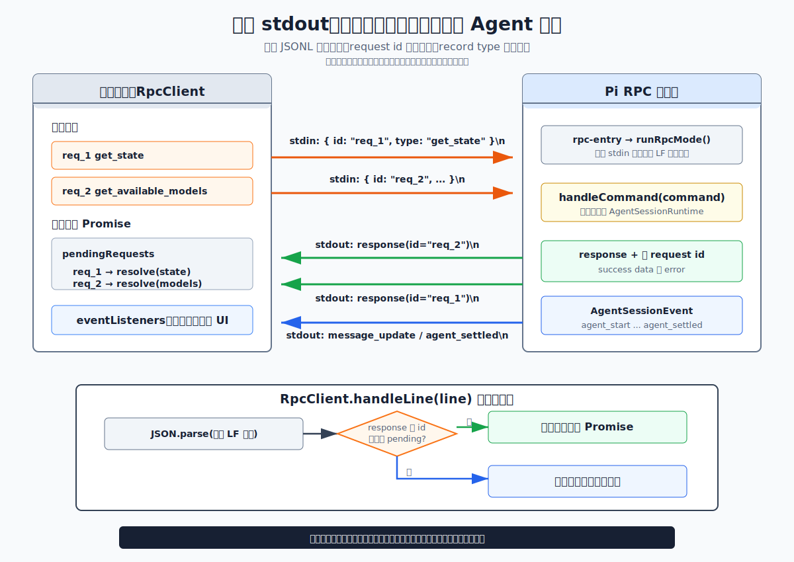
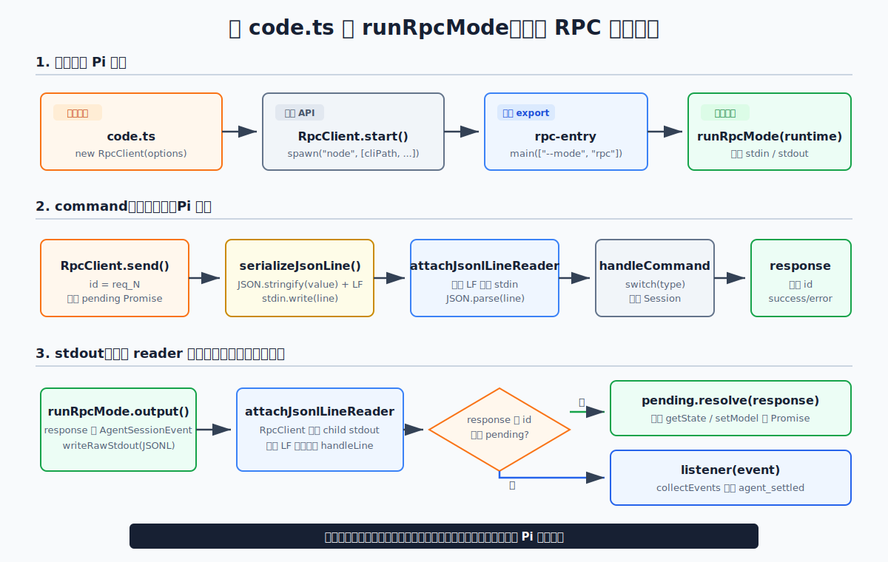

# s15：RPC JSONL — 一条输出流，怎样同时返回响应和事件

[← s14 TUI Diff Render](../s14-tui-diff-render/README.md) · [返回首页](../../README.md)

> **核心结论**：`RpcClient` 给每条命令分配唯一 `id`；stdout 中带匹配 `id` 的 `response` 只完成对应 Promise，其余 Agent 记录异步交给事件监听器。

推荐前置：已完成 s13，知道 RPC 是 `AgentSessionRuntime` 的一个 adapter。本课不重新实现 JSON 协议，也不复述通用的 Agent Loop；只观察 Pi 如何让一个宿主进程可靠地控制独立的 RPC 子进程。

---

## 问题

假设 IDE 同时向 Pi 查询两件事：

```text
get_state
get_available_models
```

两条命令都写入子进程的 stdin，两个答案却从同一条 stdout 回来。它们不保证按发送顺序出现：先写出的 `get_state`，不代表一定先读到它的 response。

随后 IDE 再发送 prompt。此时 stdout 又会连续出现 `agent_start`、`message_update`、`agent_settled` 等过程事件。prompt 的 response 只说明 Pi 已接受输入，并不表示模型已经完成。

所以宿主不能把“stdout 的下一行”当作“刚才那条命令的答案”。它必须同时解决两个问题：

1. 两个并发查询怎样各自回到发起它的 Promise
2. 一条 prompt 怎样在很早收到接受响应后，仍持续收到 Agent 过程事件

此外，JSON 字符串可以包含 `U+2028` 和 `U+2029`。它们看起来像换行，但不是 JSONL 的记录边界；错误的 line reader 会把一条合法 JSON 误切成多条。本课把这个协议边界放在离线测试中验证，主线先解决更容易观察到的“响应和事件共用一条输出流”。

---

## 解决方案



*图：`req_2` 先返回只是协议允许的一种交错顺序，实际先后取决于命令耗时。无论顺序怎样，响应按 request id 回到对应 Promise；Agent 事件继续流向监听器。*

Pi 把同一条 stdout 当作两种用途不同的记录流：

| stdout 中读到的记录 | `RpcClient` 如何判断 | 交给谁 |
| --- | --- | --- |
| `response` 且 `id` 仍在 `pendingRequests` | 这是某条尚未完成命令的答案 | 该 `id` 对应的 Promise |
| `agent_start`、`message_update`、`agent_settled` 等 Agent 记录 | 它不是等待中的 response | 事件监听器，例如 `collectEvents()` |

把本课的正常路径压缩成一张时序表：

```text
宿主写入                         stdout 允许返回
req_1  get_state       ───────→  response(id=req_2, models)
req_2  get_available_models ───→ response(id=req_1, state)

req_3  prompt          ───────→  response(id=req_3, success=true)
                                  agent_start
                                  message_update ...
                                  agent_settled
```

前两行展示“答案可以乱序”；后四行展示“接受 prompt”和“Agent 完成”是两个不同信号。本课先等待两条查询完成，再发送 prompt，因此图中的 Agent 事件不会被拿来伪装成两条查询之间的固定输出顺序。

一句规则：**`id` 决定哪个 Promise 得到 response；事件类型描述 Agent 仍在做什么。它们共用 stdout，却不能共用同一种等待方式。**

---

## 工作原理

课程入口是 [`code.ts`](code.ts)。Provider、临时目录和子进程参数只是让这段代码能够独立、真实地运行；它们不会改变下面这条因果链。先从读者实际要观察的结果开始。

### 第 1 步：同时发出两条查询，不等待第一条才发第二条

```ts
await client.start();

const [currentState, availableModels] = await Promise.all([
  client.getState(),
  client.getAvailableModels(),
]);
```

`start()` 已经让 Pi RPC 子进程开始读取 stdin、写入 stdout。`Promise.all()` 的两个调用会立刻各自发出命令；代码不会先 `await client.getState()`，再发第二条。

因此本课输出的是已经按调用方配对的结果，而不是“stdout 第一行、第二行”的原始顺序：

```text
并发响应: get_state.sessionId=<动态 Session ID>, models=<大于 0>
```

这里保持不变的是同一个 `AgentSessionRuntime`；本课新增的是跨进程的请求关联。两个查询都只是 RPC command，真正保证不串线的决策发生在 `RpcClient` 内部。

### 第 2 步：先登记 Promise，再用 response 的 `id` 回收它

对每次 `getState()`、`getAvailableModels()` 这样的公开调用，Pi 的 `RpcClient.send()` 会依次做三件事：

```text
生成 req_N
→ pendingRequests.set(req_N, { resolve, reject })
→ 把带 req_N 的 command 写成一条 JSONL 到 stdin
```

收到 stdout 的一条记录后，它不关心这是第几行，而是检查它是不是带有仍在等待的 `id` 的 `response`：

```text
response(id=req_2) → pendingRequests.get(req_2).resolve(models)
response(id=req_1) → pendingRequests.get(req_1).resolve(state)
```

所以 `req_2` 即使先回来，也只会完成 `getAvailableModels()`；`getState()` 仍等自己的 `req_1`。这正是 `Promise.all()` 可以安全并发的原因。本课不人为延迟 Pi 命令来制造一个固定的乱序，图里的顺序只说明协议允许什么。

### 第 3 步：先安装事件收集器，再发送 prompt

```ts
const events = await client.promptAndWait(PROMPT);
const eventTypes = events.map((event) => event.type);

output.writeLine(`异步事件: ${eventTypes.join(" -> ")}`);
```

`promptAndWait()` 的实际顺序是：

1. 调用 `collectEvents()`，开始监听 Agent 事件
2. 发送 `prompt` command
3. 等待该 command 的 response，确认 prompt 已被接受
4. 继续收集，直到看到 `agent_settled`

第一步必须在第二步之前。否则模型非常快时，`agent_start` 或最早的 `message_update` 可能在监听器安装前就从 stdout 流过。

这里要分清两个结束条件：

| 信号 | 表示什么 | 本课怎么处理 |
| --- | --- | --- |
| `prompt` 的 `response(success=true)` | Pi 已接受、排队或立即处理该输入 | 继续等待 |
| `agent_settled` | Runtime 已重新空闲 | `promptAndWait()` 返回收集到的 events |

课程随后检查 assistant 的 `message_end`。若 `stopReason` 是 `error` 或 `aborted`，即使 prompt 曾被接受，也会以失败结束，避免把“没有最终文本”误报为成功。



*图：课程只装配公开入口；JSONL 分帧、pending map、命令处理和 Agent 事件均由 Pi `v0.80.6` 执行。*

### 第 4 步：过程事件用于更新，新的请求用于取最终文本

```ts
finalText = await client.getLastAssistantText();
output.writeLine(`最终文本: ${finalText ?? "(无文本)"}`);
```

`events` 适合宿主边收到边更新 UI；`getLastAssistantText()` 则再发送一条 request/response，读取已经落入 Session 的最终 assistant 文本。两者仍走同一条 RPC 通道，但一个是持续订阅，一个是有结果的查询。

同样的关联规则也处理失败响应：

```ts
try {
  await client.setModel("missing-provider", "missing-model");
} catch (error) {
  missingModelError = error instanceof Error ? error.message : String(error);
}
```

Pi 会把 `success: false` 和原 request id 一起写回。`RpcClient` 先找到正确的 pending Promise，再将它变成 JavaScript `Error`；错误不会混进 Agent 事件流。

### 第 5 步：停止子进程，再删除这次运行的临时目录

```ts
} finally {
  try {
    if (client) await client.stop();
  } finally {
    await rm(tempRoot, { recursive: true, force: true });
  }
}
```

`finally` 覆盖成功、模型失败和协议错误。`RpcClient.stop()` 先尝试 `SIGTERM`，超时后才升级 `SIGKILL`；随后课程删除临时目录。面向命令行用户的 `runLesson()` 还会把任意运行失败收束为中文诊断，不暴露原始 Provider 错误或 stack。

再压缩一次本课规则：**`RpcClient` 负责把 `id` 映射回等待中的 Promise；`AgentSession` 负责持续产生状态事件；宿主必须把“命令接受”与“Agent settled”当成两个不同节点。**

---

## 试一下

本课需要 Node.js `>=22.19.0` 和有效的 `ANTHROPIC_API_KEY`（也支持 `ANTHROPIC_OAUTH_TOKEN`）。`MODEL_ID` 未设置时使用共享 runtime 的默认模型；使用兼容服务时再设置 `ANTHROPIC_BASE_URL`。统一运行器依次尝试 `LEARN_PI_ENV_FILE`、项目根目录 `.env` 和同级 `learn-claude-code/.env`。

> **费用提示**：`npm run lesson -- s15` 会调用一次真实模型，并按你配置的 Provider 与模型价格收费。修改 prompt 或重复运行都会再次产生模型请求；只想观察确定性协议行为时，运行下面的离线测试。

运行真实课程：

```bash
npm run lesson -- s15
```

当认证、模型和 endpoint 兼容时，预期输出具有下面的结构。Session ID、模型名称、可用模型数量和中间事件数量都会随环境变化；`最终文本` 是模型实际生成的内容，本文不把它写成固定断言。

```text
RPC 子进程: 已启动（model=learn-pi-anthropic-compatible/<MODEL_ID>）
并发响应: get_state.sessionId=<动态 Session ID>, models=<大于 0>
异步事件: agent_start -> ... -> message_update -> ... -> agent_settled
最终文本: <真实模型生成的中文结果>
错误响应: Model not found: missing-provider/missing-model
清理: RPC 子进程已停止，临时配置目录已删除
```

`--offline` 只关闭版本检查、包更新等启动阶段网络行为，不会关闭这次模型请求。缺少配置或模型调用失败时，课程仍先清理，再以非零状态结束：

```text
清理: RPC 子进程已停止，临时配置目录已删除
真实模型调用未完成。请检查模型 ID、认证信息、Base URL 和 Provider 要求。
```

再运行不消耗 API 费用的确定性测试：

```bash
npm run test:lesson -- s15
```

测试把 Pi faux provider 显式注册给真实 RPC 子进程，因此不需要 API Key，也不访问模型网络。它仍然经过 `rpc-entry`、`runRpcMode()`、严格 JSONL、request id、pending map 和 Agent 事件，而不是用一个假的 RPC 客户端替代主链。测试验证：

1. `getState()` 与 `getAvailableModels()` 并发时，响应仍回到正确 Promise，不假造固定返回先后
2. prompt 会发出异步事件，并以 `agent_settled` 收束
3. `U+2028`、`U+2029` 保留在同一条 JSONL payload 中
4. 无效模型走关联的错误 response；结束后子进程与临时目录都被清理
5. 缺少认证时，课程入口只输出统一诊断并设置非零退出码

可以尝试：

1. 修改 `PROMPT`，观察最终文本变化后，事件主链是否仍以 `agent_settled` 收束
2. 在 `Promise.all()` 中再加入一次 `client.getState()`，确认三条查询仍不会串线
3. 只修改测试的 `unicodePrompt`，加入普通 `\n`，比较 JSON 字符串内的转义换行与 JSONL 记录末尾 LF

观察重点：**prompt 的 response 通常很早返回；真正能说明本次 Agent 工作结束的是 `agent_settled`。**

---

## 接下来

s13 把同一个 runtime 分给不同 adapter，s14 展示 interactive adapter 怎样更新终端，本课则让外部程序跨进程控制 Pi。到这里，Runtime/UI 主线已经闭合：

```text
AgentSessionRuntime
├── InteractiveMode → TUI 差分渲染
├── Print/JSON Mode → 单次输出或事件日志
└── RPC Mode → 可关联响应的双向 JSONL
```

回到自己的宿主应用时，边界应由实际需求决定：同进程 TypeScript 应用优先嵌入 `AgentSession`；需要故障隔离、语言无关接入或独立生命周期时，再选择 RPC 子进程。

<details>
<summary>深入 Pi 源码</summary>

### 课程代码与生产职责的对照

| `code.ts` 中读者看到的调用 | Pi `v0.80.6` 中对应的职责 |
| --- | --- |
| `client.start()` | 拉起带 pipe stdio 的子进程，进入 `rpc-entry` 与 `runRpcMode()` |
| `Promise.all([getState(), getAvailableModels()])` | `send()` 生成 request id、登记 pending Promise、写 JSONL；`handleLine()` 按 id 回收 response |
| `promptAndWait(PROMPT)` | 先收集 `AgentSessionEvent`，再发 prompt，直到 `agent_settled` |
| `getLastAssistantText()`、`setModel()` | 同一 request/response 通道上的状态查询与失败响应 |
| `client.stop()` | 终止子进程并拒绝尚未完成的 pending 请求 |

课程从包根导入 `RpcClient`、`RpcSessionState` 与 `AgentSessionEvent`，通过公开 `rpc-entry` 拉起进程；没有从安装依赖的内部 `src/` 深度导入。

以下链接全部固定在 Pi `v0.80.6` 对应提交 `2b3fda9921b5590f285165287bd442a25817f17b`：

- [package root 导出 `RpcClient` 与 RPC 类型](https://github.com/earendil-works/pi/blob/2b3fda9921b5590f285165287bd442a25817f17b/packages/coding-agent/src/index.ts#L324-L342)
- [package exports 中独立的 `./rpc-entry`](https://github.com/earendil-works/pi/blob/2b3fda9921b5590f285165287bd442a25817f17b/packages/coding-agent/package.json#L12-L22)
- [`rpc-entry` 固定进入 `main(["--mode", "rpc", ...])`](https://github.com/earendil-works/pi/blob/2b3fda9921b5590f285165287bd442a25817f17b/packages/coding-agent/src/rpc-entry.ts#L1-L12)
- [`RpcCommand`、`RpcSessionState` 与 `RpcResponse` 协议类型](https://github.com/earendil-works/pi/blob/2b3fda9921b5590f285165287bd442a25817f17b/packages/coding-agent/src/modes/rpc/rpc-types.ts#L16-L146)

### `RpcClient` 怎样把乱序 response 送回正确调用方

`start()` 负责子进程 stdio；`send()` 才是关联的起点：先生成递增 request id、登记 `pendingRequests`，后写 JSONL。`handleLine()` 读取 stdout 后，只在记录是 response、带 id、且该 id 仍在 pending map 时，才 resolve 或 reject 相应 Promise。否则记录进入事件监听器。

- [`start()` 拉起带 pipe stdio 的 Node 子进程](https://github.com/earendil-works/pi/blob/2b3fda9921b5590f285165287bd442a25817f17b/packages/coding-agent/src/modes/rpc/rpc-client.ts#L70-L139)
- [`send()` 生成递增 request id，登记 pending Promise 后写入 JSONL](https://github.com/earendil-works/pi/blob/2b3fda9921b5590f285165287bd442a25817f17b/packages/coding-agent/src/modes/rpc/rpc-client.ts#L531-L580)
- [`handleLine()` 将匹配 response 与异步 event 分流](https://github.com/earendil-works/pi/blob/2b3fda9921b5590f285165287bd442a25817f17b/packages/coding-agent/src/modes/rpc/rpc-client.ts#L499-L518)
- [子进程退出时拒绝进行中的请求](https://github.com/earendil-works/pi/blob/2b3fda9921b5590f285165287bd442a25817f17b/packages/coding-agent/test/rpc-client-process-exit.test.ts#L23-L37)

这解释了为什么“下一行就是上一个请求的答案”不是 RPC 客户端可以使用的规则：回应顺序只是传输时序，`id` 才是归属。

### `prompt` 为什么有两个完成信号

`promptAndWait()` 先调用 `collectEvents()`，再发送 command。Pi 的 `runRpcMode()` 在 preflight 成功后很快发出 `prompt` 的 success response；Agent 的后续模型调用、消息更新、失败和完成则以普通事件/消息流继续。也就是说，一个 request id 不会等到 Agent 全部执行完才得到第二份成功 response。

- [`promptAndWait()` 先收集事件，再发送 prompt](https://github.com/earendil-works/pi/blob/2b3fda9921b5590f285165287bd442a25817f17b/packages/coding-agent/src/modes/rpc/rpc-client.ts#L443-L493)
- [绑定 Session 并把每个 `AgentSessionEvent` 写到 stdout](https://github.com/earendil-works/pi/blob/2b3fda9921b5590f285165287bd442a25817f17b/packages/coding-agent/src/modes/rpc/rpc-mode.ts#L312-L363)
- [`prompt` 接受响应与后续异步执行](https://github.com/earendil-works/pi/blob/2b3fda9921b5590f285165287bd442a25817f17b/packages/coding-agent/src/modes/rpc/rpc-mode.ts#L384-L415)
- [`get_state`、`set_model`、`get_available_models` 的真实处理](https://github.com/earendil-works/pi/blob/2b3fda9921b5590f285165287bd442a25817f17b/packages/coding-agent/src/modes/rpc/rpc-mode.ts#L440-L488)
- [解析失败和命令失败的错误响应路径](https://github.com/earendil-works/pi/blob/2b3fda9921b5590f285165287bd442a25817f17b/packages/coding-agent/src/modes/rpc/rpc-mode.ts#L730-L775)

### 为什么必须是严格 JSONL

Pi 的 framing 只把 LF（`\n`）视为记录边界。`U+2028`、`U+2029` 是 JSON 字符串中的合法字符，不能触发切行；CRLF 输入会移除行尾 `\r` 后兼容处理。普通 `readline` 会把 Unicode separator 当作分行，因此不符合这个 RPC 协议。

- [严格 JSONL serializer 与 LF-only reader](https://github.com/earendil-works/pi/blob/2b3fda9921b5590f285165287bd442a25817f17b/packages/coding-agent/src/modes/rpc/jsonl.ts#L4-L58)
- [Unicode separator、CRLF 和无尾 LF 的上游测试](https://github.com/earendil-works/pi/blob/2b3fda9921b5590f285165287bd442a25817f17b/packages/coding-agent/test/rpc-jsonl.test.ts#L5-L64)

这也是本课测试必须穿过真实 `RpcClient` 子进程的原因：只单测 `JSON.stringify()` 不能证明 stdin/stdout framing、请求关联和事件广播会一起正确工作。

### 真实模型配置与本课的隔离边界

这一部分是让 `code.ts` 能直接跑真实模型的运行准备，不是请求关联机制本身：

1. `createAnthropicCompatibleRuntime()` 读取 API Key、OAuth token、`MODEL_ID` 与可选的 `ANTHROPIC_BASE_URL`
2. 课程把模型公开元数据写入本次临时 `models.json`；其中 `apiKey` 只有字符串 `$ANTHROPIC_API_KEY`
3. 真实 Key 只经由 child env 传入；`cwd`、`HOME`、`PI_CODING_AGENT_DIR` 和 `PI_CONFIG_DIR` 都指向临时目录
4. `--no-session`、`--no-tools`、`--no-extensions`、`--no-skills`、`--no-context-files` 等参数把本课限定为协议观察，不读取用户的 `~/.pi`、历史会话或项目指令
5. `finally` 删除整个临时目录；`--offline` 只关闭版本检查和包更新，不拦截显式配置模型的真实网络请求

因此 API Key 不写入临时模型文件，也不会写入仓库。自定义 Anthropic-compatible 模型的 `models.json` 格式见：

- [`models.json` 合并自定义 Anthropic-compatible 模型的公开配置](https://github.com/earendil-works/pi/blob/2b3fda9921b5590f285165287bd442a25817f17b/packages/coding-agent/docs/models.md#L280-L315)

### 教学范围与生产能力

| 本课主线 | Pi RPC 完整实现 |
| --- | --- |
| 查询状态、模型列表 | 还支持 thinking、queue mode、统计和消息查询 |
| 单次 prompt 并等待 settled | 还支持 steer、follow-up、abort 和 `streamingBehavior` |
| 读取最终 assistant 文本 | 还支持 Session 新建、切换、fork、clone、tree 和 HTML 导出 |
| 无工具、无 Session 持久化 | 生产模式可执行 bash、工具和 compaction |
| 不处理 Extension UI | 协议还支持 select、confirm、input、editor、notify 等 UI 往返 |

测试中的 faux provider 只替换模型网络响应，不替换 RPC：子进程、`rpc-entry`、`runRpcMode()`、严格 JSONL、request id、pending map 和 Agent 事件仍然全部来自 Pi `v0.80.6`。

</details>
